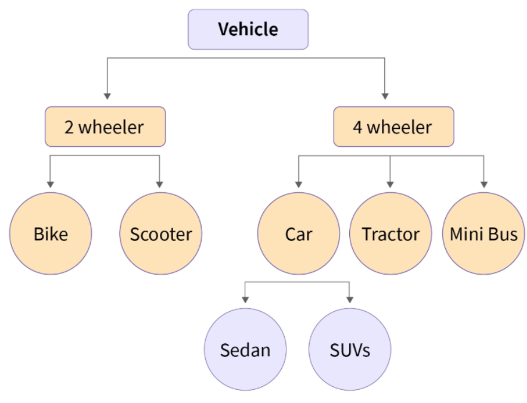
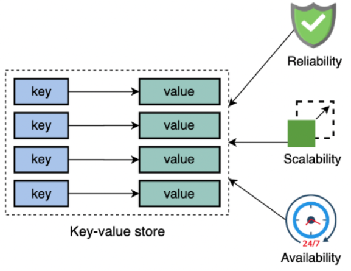
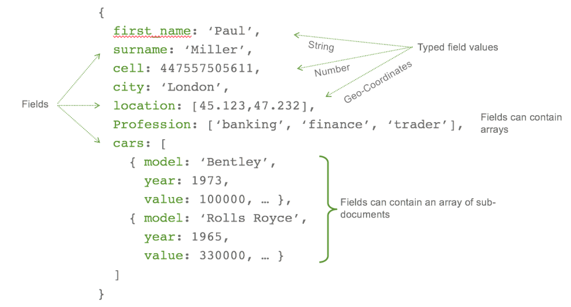
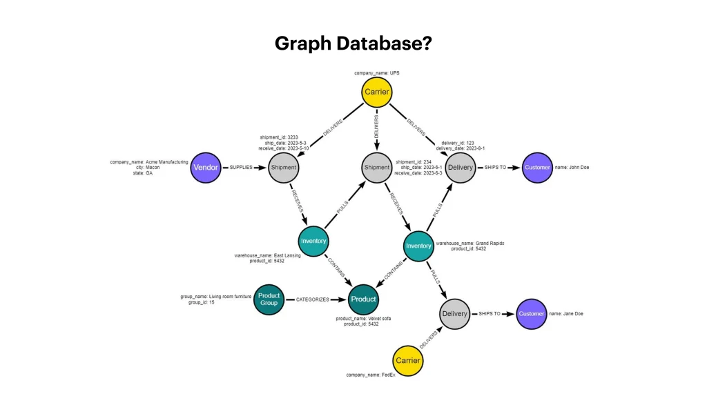

# A Guided Tour of Database Families {#sec-appB}

Chapter 1 introduced the **relational model** as today's dominant model and referenced its place in the wider family of data models. This appendix expands that reference: it surveys the main database families that exist in industry today, explains *why* each one was invented, and where each is still used.

Read it as a reference chapter. You do not need this material to follow Chapters 2–13 — the relational model carries those chapters — but when you encounter NoSQL in Part VIII, or need to justify a technology choice in a project, this tour is your map.

---

## 70 Years of Database Models

```{mermaid}
%%| eval: true
%%| echo: false
timeline
    title 70 Years of Database Models
    1960s : Flat file
          : Hierarchical (IMS)
    1970s : Network (CODASYL)
          : Relational (Codd)
    1980s : SQL standardized
          : Object-oriented
    1990s : Object-relational (ORDBMS)
          : XML databases
    2000s : NoSQL wave
          : Key-value · Document · Column-family · Graph
    2010s : NewSQL
          : Cloud-native distributed SQL
```

---

## 1. Flat File Model 

One file, one record per line, delimited columns. No relationships, no constraints.

**Real-world examples:** Excel / Google Sheets, CSV exports, `/etc/passwd`, Windows `.ini` files, small `.log` files.

**Example — `/etc/passwd` style flat file** (7 colon-separated fields: *username : password : UID : GID : full name : home directory : login shell*):

```
root:x:0:0:root:/root:/bin/bash
daemon:x:1:1:daemon:/usr/sbin:/usr/sbin/nologin
hussein:x:1000:1000:Hussein Khalidi,,,:/home/hussein:/bin/bash
ahmed:x:1001:1001:Ahmed Mansour,,,:/home/ahmed:/bin/zsh
sara:x:1002:1002:Sara Odeh,,,:/home/sara:/bin/bash
mysql:x:119:128:MySQL Server,,,:/nonexistent:/bin/false
```

Each line is one record; fields are positional and separated by `:`. There is no schema file, no type checking, no index — every lookup is a full scan, and any program that reads it must agree on the field order by convention only.

**Advantages**

- Extremely simple and human-readable
- Works in any tool (Notepad, Excel, any language's string library)

**Disadvantages**

- All the Notepad Scenario problems: no integrity, no concurrency, redundancy
- Cannot scale beyond a few thousand rows

---

## 2. Hierarchical Model 

Data is organized as a **tree** — each record has exactly **one parent**. Developed in the 1960s for mainframe systems.

```{mermaid}
%%| eval: true
%%| echo: false
flowchart TD
    U["AAUP"] --> F1["Faculty: Engineering"]
    U --> F2["Faculty: Medicine"]
    F1 --> D1["Dept: Computer Eng"]
    F1 --> D2["Dept: Civil Eng"]
    D1 --> S1["Student 001"]
    D1 --> S2["Student 002"]
    D2 --> S3["Student 101"]
```

**Real-world examples:** IBM **IMS** (still runs many banks and airlines today!), XML documents, JSON trees, LDAP directories, the Windows Registry.

**Advantages**

- Very fast for tree-shaped traversals (org charts, file systems, bill-of-materials)
- Simple, predictable navigation — follow parent/child pointers
- Enforces strict 1-to-many structure natively

**Disadvantages**

- Awkward for **many-to-many** relationships — a student enrolled in two departments would need to be duplicated
- Schema changes require rebuilding the tree
- No declarative query language — the programmer walks the hierarchy by hand

---

## 3. Network Model (CODASYL) 

Like the hierarchical model, but a record can have **many parents** — so many-to-many relationships are supported directly through explicit pointers.

{#fig-network-model width=65% fig-align="center"}

**Real-world examples:** IDMS (still running inside some European banks and insurance companies), Raima DB, older mainframe systems at airlines and telecoms.

**Advantages**

- Supports many-to-many relationships without duplication
- Very fast when the access paths are known in advance

**Disadvantages**

- No declarative query language — the programmer navigates pointers by hand
- Schema changes are extremely painful
- Largely replaced by relational databases since the 1980s

::: callout-note
Both hierarchical and network models were displaced by the relational model because Codd's math-based foundation allowed **declarative queries** ("what" instead of "how") and automatic query optimization.
:::

---

## 4. Relational Model 

Data as **tables** (rows + columns); relationships via **foreign keys**; queries via **SQL**. Invented by E.F. Codd in 1970, still the #1 database model today.

**Real-world examples:** Facebook (MySQL), Instagram (PostgreSQL), Booking.com (Oracle + MySQL), Uber's core services (PostgreSQL + MySQL), most banks worldwide, AAUP's own student portal.

**Advantages**

- Declarative SQL — you say *what*, the database figures out *how*
- Strong ACID guarantees (safe for money, grades, medical records)
- Huge ecosystem: tools, drivers, hosting, experts everywhere

**Disadvantages**

- Rigid schema — changing columns on a live table is expensive
- Joins get slow on very large datasets
- Not ideal for deeply nested JSON or graph-shaped data

This is the model that dominates **Parts III – VII** of this book.

---

## 5. Object-Oriented (OODB) 

Stores objects exactly as they exist in a Java / C++ / C# program — no mapping to tables.

{#fig-oodb-model width=55% fig-align="center"}

**Real-world examples:** ObjectDB (used inside some CAD and telecom systems), db4o (embedded in apps), Gemstone/S (financial trading). Niche today.

**Advantages**

- No impedance mismatch between code and database
- Natural fit for inheritance and complex nested types

**Disadvantages**

- No dominant query language (OQL never caught on)
- Tiny ecosystem; lost the market to **relational + ORM** (Hibernate, Django ORM, Entity Framework)

---

## 6. Object-Relational (ORDBMS) 

A relational database with object-like extras: user-defined types, arrays, JSON columns, spatial types, inheritance.

**Real-world examples:** **PostgreSQL** (the gold standard — used by Apple, Instagram, Reddit), Oracle Database, modern SQL Server and MySQL (JSON columns, `GEOMETRY`, arrays).

**Advantages**

- Keeps SQL + ACID but adds rich types (`JSONB`, `ARRAY`, `GEOMETRY`, `UUID`)
- Single database can handle both traditional and document-style data

**Disadvantages**

- Extensions are vendor-specific — moving from Oracle to PostgreSQL is harder than moving pure SQL

---

## 7. NoSQL Models 

A family of **non-relational** databases born in the 2000s at web-scale companies (Google, Amazon, Facebook) to handle data volumes and write rates that single-server relational databases could not match. Four main sub-families:

### 7a. Key-Value Stores 

A giant distributed hash table: `get(key)` / `put(key, value)`. The simplest NoSQL model.

{#fig-key-value-store width=55% fig-align="center"}

**Real-world examples:** **Redis** (Twitter timeline cache, Stack Overflow, GitHub, Shopify), **Memcached** (Facebook), **Amazon DynamoDB** (Amazon's own shopping cart, Lyft, Airbnb sessions), etcd (inside Kubernetes).

**Advantages**

- Blazingly fast (often in-memory, microsecond latency)
- Scales horizontally to millions of operations per second

**Disadvantages**

- No queries across values — you can only fetch by key
- No joins, no `WHERE`, no rich schema

### 7b. Document Stores 

Store self-contained **JSON-like documents**; each document can have a different shape. Query on any nested field.

{#fig-document-store width=70% fig-align="center"}

**Real-world examples:** **MongoDB** (The New York Times, Forbes, eBay, Adobe), **Couchbase** (LinkedIn, PayPal), **Firebase Firestore** (many mobile apps), Amazon DocumentDB.

**Advantages**

- Flexible schema — add fields without migrations
- Natural fit for JSON from web and mobile APIs
- Good horizontal scalability

**Disadvantages**

- Cross-document joins are awkward (or absent)
- Easy to end up with inconsistent document shapes over time

MongoDB is covered in depth in **Chapter 15**.

### 7c. Column-Family (Wide-Column) Stores 

Data is stored by **column families** rather than whole rows; optimized for huge, sparse tables and write-heavy workloads. Inspired by Google's **Bigtable** paper (2006).

{#fig-wide-column width=70% fig-align="center"}

**Real-world examples:** **Apache Cassandra** (Netflix viewing history, Apple iCloud, Instagram messaging), **HBase** (Facebook Messenger, Pinterest), **Google Bigtable** (Google Search, Gmail, Google Analytics), **ScyllaDB** (Discord messages).

**Advantages**

- Massive write throughput — millions of writes/sec across a cluster
- Linear horizontal scaling by adding nodes
- Great for time-series, IoT, logs

**Disadvantages**

- Ad-hoc queries are limited — you must design around known access patterns
- No joins, weaker consistency by default

### 7d. Graph Databases 

First-class support for **nodes** (entities) and **edges** (relationships). Queries are traversals like *"friends of friends within 3 hops"*.

{#fig-graph-database width=70% fig-align="center"}

**Real-world examples:** **Neo4j** (NASA's lessons-learned graph, eBay delivery routing, UBS fraud detection), **Amazon Neptune** (Amazon product recommendations), **TigerGraph** (Jaguar, China Mobile), LinkedIn's own social graph engine.

**Advantages**

- Relationship queries are orders of magnitude faster than SQL joins
- Natural fit for social networks, recommendations, fraud detection, knowledge graphs

**Disadvantages**

- Poor fit for plain tabular analytics
- Smaller ecosystem than relational or document stores

---

## 8. NewSQL & Cloud-Native Distributed SQL 

A 2010s answer to: *"Can we get NoSQL's horizontal scalability **and** relational SQL + ACID?"* Yes — at the cost of more complex infrastructure.

**Real-world examples:** **Google Spanner** (Google Ads, Gmail metadata), **CockroachDB** (DoorDash, Netflix billing), **YugabyteDB**, **TiDB** (Shopee, Bank of China), **Amazon Aurora** (most large AWS customers).

**Advantages**

- Standard SQL and ACID transactions
- Scales horizontally across regions / continents
- No need to re-learn a new query language

**Disadvantages**

- Operationally complex — more moving parts than a single MySQL server
- Young ecosystem; fewer DBAs with deep experience
- Cross-region writes still have latency costs

---

## Side-by-Side Comparison

| Family | Shape of data | Query style | ACID | Horizontal scale | Example |
|---|---|---|---|---|---|
| Flat file | Rows in one file | Parse by hand | ❌ | ❌ | CSV |
| Hierarchical | Tree (one parent) | Navigate | Partial | Limited | IBM IMS, XML |
| Network (CODASYL) | Graph via pointers | Navigate | Partial | Limited | IDMS |
| **Relational** | Tables + FKs | **SQL (declarative)** | **✅** | Medium | MySQL, Postgres, Oracle |
| Object-oriented | Objects | OQL / API | Partial | Limited | ObjectDB |
| Object-relational | Tables + rich types | SQL + extensions | ✅ | Medium | PostgreSQL |
| Key-value | `(key, value)` blobs | `get` / `put` | Per-key | ✅✅✅ | Redis, DynamoDB |
| Document | JSON documents | Query DSL over JSON | Per-document | ✅✅ | **MongoDB** |
| Column-family | Sparse wide rows | CQL / API | Tunable | ✅✅✅ | Cassandra, HBase |
| Graph | Nodes + edges | Cypher / Gremlin | ✅ | ✅ | Neo4j |
| NewSQL | Tables + FKs | SQL | ✅ | ✅✅✅ | Spanner, CockroachDB |

::: callout-tip
##  How to choose (rule of thumb)

- **Tabular data with real relationships?** → Relational (start here by default).
- **Each record is a self-contained document with nested fields?** → Document (MongoDB).
- **Distributed cache or session store?** → Key-value (Redis).
- **Relationships between entities are the main query pattern?** → Graph (Neo4j).
- **Petabyte-scale writes, time series, telemetry?** → Column-family (Cassandra).
- **SQL + ACID *and* global horizontal scale?** → NewSQL (Spanner, CockroachDB).

Modern systems often combine **several** of these — this is called **polyglot persistence**. The AAUP portal might use PostgreSQL for grades, Redis for sessions, and Elasticsearch for search, all in the same application.
:::

NoSQL families are covered in depth in **Part VIII (Chapters 14–15)**.
