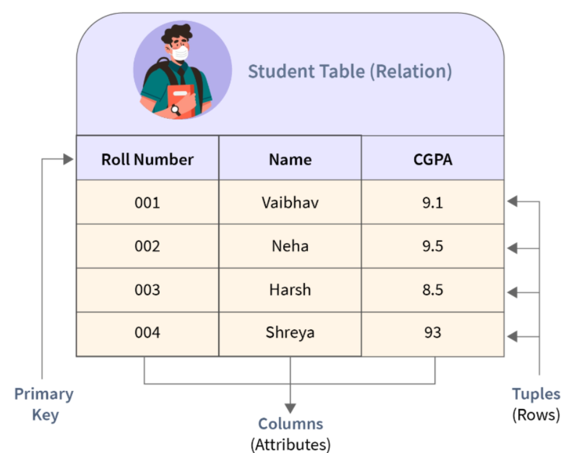



## Motivation: Why Not Just Use a Text File?

You have data. Lots of it. Where do you put it?

Before databases existed, every programmer answered that question the same way: a text file. It seems reasonable — open Notepad, type your records, save. Let us follow that decision to its natural conclusion.

::: callout-note
## The Notepad Scenario

Imagine you are building a simple student-grade system for your department. You create three text files:

 **`students.txt`**
```
001, Ahmed Khalidi, Computer_Eng
002, Sara Hasan,    Computer_Eng
003, Omar Zayed,    Information_Sys
```

 **`grades.txt`**
```
001, Database, 92
001, Networks, 85
002, Database, 78
003, Database, 90
```

 **`departments.txt`**
```
Computer_Eng,    Dr_Mansour, Building_A
Information_Sys, Dr_Younis,  Building_B
```

Simple. Clean. Until it is not.
:::

### The Six Problems That Appear Immediately

::: callout-important
##  Problem 1 — Search is [O(n)]{fg="#c0392b" .bold}

To find Ahmed's grades, your program reads every line of `grades.txt` from top to bottom until it finds `001`. With 1,000 students that is manageable. With 1,000,000 students — a national exam registry — that scan takes several *seconds* per query, every query.

**Search flow — how the scan actually works:**

```{mermaid}
%%| eval: true
%%| echo: false
flowchart TD
    A([Start]) --> B[Open file]
    B --> C{End of file?}
    C -- Yes --> G([Not found — exit])
    C -- No --> D[Search by Student ID]
    D --> E{Match?}
    E -- Yes --> H([Return record — exit])
    E -- No --> F[Read next line]
    F --> C
    style C fill:#fff4d6,stroke:#b7791f
    style E fill:#fde2e2,stroke:#c0392b
```

**Pseudocode — linear search:**

```
Algorithm LINEAR_SEARCH(file, key):
    open file
    for each line in file:                 // worst case: N iterations
        fields ← split(line, ",")
        if fields[0] == key:
            output line                    // match found
    close file
    // Cost:  best = O(1), average = O(N/2), worst = O(N)
    // 1 M rows × ~1 µs/row  ≈  1–3 seconds PER QUERY
```
:::

::: callout-important
##  Problem 2 — Updates break [consistency]{fg="#c0392b" .bold}

Ahmed transfers departments. You update `students.txt`. Two weeks later someone notices a derived report still shows the old department. You forgot to update another file that duplicated the value.

**Example — the real issue:**

 `students.txt` *(updated — new department)*
```
001, Ahmed Khalidi, Information_Sys
```

 `enrollment_report.txt` *(stale — still says old department)*
```
001, Ahmed Khalidi, Computer_Eng, Database, 92
```

Two files, [two truths]{bg="#f39c12" fg="#000000"}, no way for the system to detect the conflict.
:::

::: callout-important
##  Problem 3 — Concurrent access [destroys data]{fg="#c0392b" .bold}

Two users edit `grades.txt` at the same time. The last save wins — the earlier save is silently overwritten.

**Example — the real issue:**

| Time | Registrar | Secretary |
|------|-----------|-----------|
| 09:00 | opens `grades.txt` (10 rows) | opens `grades.txt` (10 rows) |
| 09:05 | adds row 11, **saves** | editing row 4... |
| 09:06 | — | **saves** (only 10 rows) |
| 09:07 | Registrar's row 11 is **gone**. No error. No warning. |

**Timeline of the Lost Update:**

```{mermaid}
%%| eval: true
%%| echo: false
sequenceDiagram
    autonumber
    participant R as Registrar
    participant F as grades.txt
    participant S as Secretary

    Note over F: initial state: 10 rows
    R->>F: 09:00 open (reads 10 rows into memory)
    S->>F: 09:00 open (reads 10 rows into memory)
    Note right of R: adds row 11 locally
    Note left of S: edits row 4 locally
    R->>F: 09:05 SAVE (writes 11 rows)
    Note over F: file now has 11 rows
    S->>F: 09:06 SAVE (writes 10 rows — its stale copy)
    Note over F: file overwritten — back to 10 rows
    Note over R,S: Registrar's row 11 is silently LOST ❌
```

This is the classic [Lost Update]{fg="#c0392b" .bold} anomaly — one transaction's work vanishes because another transaction overwrote the same file.
:::

::: callout-important
##  Problem 4 — Relationships require [40+ lines of code]{fg="#c0392b" .bold}

"List all students in Building A with a grade above 80."

**Example — the real issue:**

```python
# 1. Find departments in Building A
depts = []
for line in open("departments.txt"):
    name, head, bld = [x.strip() for x in line.split(",")]
    if bld == "Building_A":
        depts.append(name)

# 2. Find students in those departments
students = {}
for line in open("students.txt"):
    sid, name, dept = [x.strip() for x in line.split(",")]
    if dept in depts:
        students[sid] = name

# 3. Cross-reference grades
for line in open("grades.txt"):
    sid, course, grade = [x.strip() for x in line.split(",")]
    if sid in students and int(grade) > 80:
        print(students[sid], course, grade)
```

Three nested loops, three file opens, manual joins. In SQL this is **one line**.
:::

::: callout-important
##  Problem 5 — No types, no [validation]{fg="#c0392b" .bold}

Nothing prevents a user from typing garbage into the grade column. Every variant crashes or silently corrupts your analytics.

**Example — the real issue:**

 `grades.txt`
```
001, Database, 92
002, Database, 92.5
003, Database, 92,5        ← comma used as decimal separator
004, Database, ninety-two  ← text instead of number
005, Database, N/A         ← missing value sentinel
006, Database,             ← empty field
```

```python
avg = sum(int(row.split(",")[2]) for row in open("grades.txt")) / 6
# ValueError: invalid literal for int() with base 10: ' 92.5'
```

One malformed record kills the whole report.
:::

::: callout-important
##  Problem 6 — Crashes leave [corrupt files]{fg="#c0392b" .bold}

Power is cut in the middle of a batch update. Half the file is in the new format; half is in the old. There is no recovery log.

**Example — the real issue:**

 `grades.txt` *(mid-write, power cut here ↯)*
```
001, Database, 92          ← old row, untouched
002, Database, 78          ← old row, untouched
003, Database, 90          ← partially rewritten
003, Database, 9           ← truncated! file ends here
```

The file is now [permanently inconsistent]{fg="#c0392b" .bold}. No transaction log, no rollback, no way to know which rows were supposed to change.
:::


### "OK, I Will Write a Program to Handle All That"

You can. In fact, that is exactly what engineers did for 20 years before the database was invented — custom file-management programs for every application. The result:

- Every new question required a new program.
- No shared query language — each programmer invented their own.
- Security was enforced only by OS file permissions (all-or-nothing).
- No reuse: the inventory system could not share data with the payroll system even when they stored the same employee records.

Consider the contrast. Answering *"find all employees earning more than 65,000 who work in the IT department"* in a file system requires ~50 lines of parsing code. In a database, it is one line:

```sql
SELECT Fname, Lname FROM Employee WHERE Salary > 65000 AND Dno = 6;
```

That one line is the reason the database query language was invented.

### The Art of Solution: The DBMS

Every one of the six problems above has a specific, engineered solution inside a **Database Management System (DBMS)**:

| Text-file problem | DBMS solution | Covered in |
|------------------|--------------|------------|
| Line-by-line scan — O(n) | **B+ tree index** — O(log n) lookup | Chapter 10 |
| Inconsistency across files | **Foreign keys** + single authoritative schema | Chapter 5 |
| Lost concurrent updates | **Transactions + locking** | Chapter 12 |
| Manual join code | **SQL JOIN** with referential integrity | Chapter 7 |
| No type enforcement | **Typed schema via DDL** (`INT`, `DATE`, `CHECK`) | Chapter 7 |
| Corrupt files after crash | **Write-Ahead Log (WAL) + recovery** | Chapter 12 |
| Bespoke query programs | **SQL** — declarative, reusable, standard | Chapter 7 |

::: callout-tip
## Numbers That Put This in Perspective

- **Search speed:** Scanning 1 million rows sequentially → ~1–3 seconds. Finding the same row via a B+ tree index → ~0.1 milliseconds. That is a **10,000× speedup**.
- **Integrity:** A foreign-key violation is caught at `INSERT` time — not discovered in a bug report two weeks later.
- **Code volume:** One SQL `SELECT` with a `WHERE` clause replaces approximately 50 lines of Python file-parsing code.
:::

This engineered solution — the DBMS — is what this book is about. Every chapter builds one part of that solution, starting with the most fundamental question: what *is* a database, and how is it structured?

---

## What Is a Database?

A **database** is an organized collection of interrelated data that models some aspect of the real world. A **Database Management System (DBMS)** is the software layer that manages, stores, retrieves, and controls access to that data.

::: callout-note
The combination of a database and its DBMS is called a **database system**. In everyday speech, people often say "database" when they mean the entire system.
:::

### The Database Is Just Files — The DBMS Is the *Container*

::: callout-important
##  A database is, literally, a set of files on disk

When you run `CREATE DATABASE company;` in MySQL, the server simply [creates a folder on disk]{fg="#c0392b" .bold} named `company/`. When you run `CREATE TABLE employee (...)`, MySQL writes files like `employee.ibd` into that folder. Your rows, indexes, and even the data dictionary all live on disk as **bytes in files** — nothing magical.

**Proof you can verify on your own laptop:**

```bash
# On a default MySQL install (Linux)
$ ls /var/lib/mysql/company/
db.opt  employee.ibd  department.ibd  project.ibd

# On Windows
C:\ProgramData\MySQL\MySQL Server 8.0\Data\company\
```

So *if* a database is just files, why did we spend the whole Notepad Scenario arguing against files? Because **raw files are dead bytes**. Making those bytes behave like a reliable, fast, multi-user, crash-safe system requires an entire **runtime/container** around them — that runtime is the [DBMS]{fg="#2980b9" .bold}.
:::

Think of it exactly like programs and operating systems:

- A `.exe` file on disk is just bytes — it cannot "run" anything by itself. The **operating system** loads it into memory, gives it CPU time, manages its files, and protects it from other programs.
- A `.ibd` / `.frm` / `.mdf` database file on disk is just bytes — it cannot "query" anything by itself. The **DBMS** loads pages into a buffer cache, schedules queries, isolates transactions, and protects data from other users.

**What the DBMS adds on top of the raw files:**

|  Concern | What "just files" give you | What the DBMS gives you |
|---|---|---|
| **OS integration** | Raw `read`/`write` syscalls | Buffered, page-aligned I/O; direct-I/O for WAL; `fsync` for durability |
| **Memory / cache** | Nothing — every read hits disk | **Buffer pool** — hot pages stay in RAM (thousands of times faster than disk) |
| **Concurrency** | OS advisory file locks (all-or-nothing) | Row/page/table locks, MVCC, isolation levels, deadlock detection |
| **User management** | OS file permissions only | `CREATE USER`, `GRANT`/`REVOKE` at database / table / column / row level |
| **Security** | Bytes on disk, readable by anyone with file access | Authentication, encryption-at-rest, audit logs, TLS for client connections |
| **Crash safety** | Half-written file after a crash | Write-Ahead Log + rollback/redo → ACID durability |
| **Query processing** | You write the scan / join / sort code | SQL parser → optimizer → executor picks the best plan automatically |
| **Self-description** | You remember what columns exist | **Data dictionary** — the database describes itself |
| **Networking** | Local access only | TCP listener, connection pool, client drivers (JDBC/ODBC) |

::: callout-tip
##  The one-sentence summary

A **database** is where your data *lives* (on disk). A **DBMS** is the [runtime container]{bg="#f39c12" fg="#000000"} that turns those dead bytes into a reliable, fast, multi-user, queryable service — exactly like an operating system turns a `.exe` file into a running program.
:::

### Key properties of a database

- **Self-describing**: The database stores a description of its own structure — called the **catalog** (or *data dictionary*) — alongside the data itself. Unlike a text file, the database knows what columns exist, what types they have, and what constraints apply.
- **Insulation between programs and data**: Application programs do not need to know *how* data is physically stored. Changing storage details does not require rewriting application code (**data abstraction**).
- **Support for multiple views**: Different users see different tailored views of the same underlying data. The payroll clerk sees salary columns; the student portal sees only name and grade.
- **Sharing and multiuser transaction processing**: Multiple users and programs access data concurrently while the DBMS guarantees that their actions do not interfere with each other.

::: callout-note
## Real-World Analogy

Think of the DBMS as a well-organized university library. The catalog (data dictionary) describes every book. The librarians (transaction manager) ensure two people cannot check out the same physical copy simultaneously. The restricted-archive rules (access control) determine who can read sensitive records. You never touch the shelves directly — you always go through the library system.
:::

The database model introduced in this chapter becomes your foundation. All the tools you will build later — ER diagrams, relational algebra, SQL, indexes, transactions — are ways of working with precisely this structure.

---

## Data Models

A **data model** is a collection of concepts for describing the structure of a database — including the data types, relationships among data, and constraints that must hold on the data.

Think of a data model as a *language* for talking about data structure. Different problems call for different languages, just as blueprints, circuit diagrams, and prose all describe the same building from different perspectives.

### Classification of Data Models

```{mermaid}
%%| eval: true
%%| echo: false
flowchart TD
    DM["Data Models"]
    C["Conceptual<br/>(High-level)"]
    R["Representational<br/>(Implementation-level)"]
    P["Physical<br/>(Low-level)"]
    SD["Self-describing"]

    ER["Entity-Relationship Model<br/>Chapters 3–4"]
    REL["Relational Model<br/>Chapter 5"]
    ST["Storage structures,<br/>file organization — Chapter 10"]
    XML["XML"]
    NOSQL["NoSQL — JSON documents,<br/>key-value, graph — Chapters 14–15"]

    DM --> C --> ER
    DM --> R --> REL
    DM --> P --> ST
    DM --> SD --> XML
    SD --> NOSQL
```

### The Relational Model (Briefly)

Proposed by **E.F. Codd in 1970** [@codd1970relational], the relational model represents data as a collection of **tables (relations)**, each with named columns of fixed types. It remains the dominant model in enterprise software more than 50 years later.

{#fig-relational-model-table width=70% fig-align="center"}

::: callout-note
## Fun Fact

Codd's 1970 paper, *"A Relational Model of Data for Large Shared Data Banks"*, is one of the most cited papers in computer science. He later defined **Codd's 12 Rules** as a checklist for what makes a system truly relational — only a handful of commercial databases satisfy all 12.
:::

The relational model is elegant because it is mathematically grounded in **set theory** and **first-order logic**. That foundation is what makes SQL queries predictable and composable — and what makes relational algebra (Chapter 6) a rigorous optimization tool.

The relational model is not the only data model in use. A wider ecosystem of database *families* has grown up around it — hierarchical and network models that predate it, object-oriented and object-relational extensions that generalize it, and the NoSQL and NewSQL families that answer modern scale and flexibility requirements.

You do not need a complete tour of those families to follow the rest of this book. A short preview follows here; the full guided tour — with industry examples, advantages, and disadvantages of every family — lives in **Appendix B: A Guided Tour of Database Families** ([`@sec-appB`](../appendix/appendixB-database-families.qmd)).

::: callout-note
##  Quick preview

- **Relational** (MySQL, PostgreSQL, Oracle) — tables + foreign keys + SQL. Dominant in enterprise software; the model used in Parts III–VII of this book.
- **Document** (MongoDB) — JSON-shaped records with flexible schemas. Covered in Chapter 15.
- **Key-value** (Redis, DynamoDB) — fast `get`/`put` on a distributed hash table.
- **Column-family** (Cassandra, HBase) — huge sparse tables optimized for write throughput.
- **Graph** (Neo4j) — nodes and edges; fast relationship traversal.
- **NewSQL** (Spanner, CockroachDB) — SQL + ACID at global scale.

Real systems often combine several of these — called **polyglot persistence**.
:::

---

## Database Schema vs. Instance

Every database has two faces at any moment in time: its *structure* and its *current data*.

| Concept | Definition | Analogy |
|---------|-----------|---------|
| **Schema** (intension) | The description/structure of the database — table names, column names, types, constraints | A class definition in object-oriented programming |
| **Instance** (extension) | The actual data stored at a specific point in time | An object instantiated from that class |

A schema changes rarely — only when the structure of the problem changes (a new column is added, a table is split). An instance changes constantly — with every `INSERT`, `UPDATE`, and `DELETE`.

::: callout-important
**Common mistake:** Students sometimes say "the database has 30 employees" when describing the *schema*. The count 30 is an *instance* fact. The schema only says: "there is a table called `Employee` with columns `Ssn`, `Fname`, `Salary`, …". Tomorrow the instance might have 31 employees; the schema is unchanged.
:::

### Worked Example

**Schema** (permanent structure):
```
Employee(Ssn, Fname, Lname, Salary, Dno)
Department(Dnumber, Dname, Mgr_ssn)
```

**Instance** (data at one point in time):
```
Employee:  ('001', 'Ahmed', 'Khalidi', 62000, 1)
           ('002', 'Sara',  'Hasan',   59000, 2)
           …30 rows total…
```

If we add a column `Email` to `Employee`, the *schema* changes. The existing rows get a NULL email until populated — the *instance* changes only when we insert or update data.

The distinction between schema and instance is the first of several **abstraction layers** in database systems. A DBMS actually separates *three* layers — the user's view, the logical tables, and the physical storage — so that each can evolve independently. This three-schema architecture and the **data independence** it provides are central to how databases are designed, so they are treated in full in [Chapter 2, §Three-Schema Architecture](../part-01-foundations/ch02-concepts-architecture.qmd#sec-three-schema).

To communicate with a DBMS — to define those schemas and manipulate that data — we need a language.

---

## Database Languages

A DBMS provides structured languages for every interaction. Modern SQL unifies all of these into a single language, but the conceptual separation matters for understanding what each statement is doing.

| Language | Abbreviation | Purpose | SQL examples |
|----------|-------------|---------|-------------|
| **Data Definition Language** | DDL | Define and modify schemas, tables, constraints | `CREATE TABLE`, `ALTER TABLE`, `DROP TABLE` |
| **Data Manipulation Language** | DML | Insert, retrieve, update, delete data | `SELECT`, `INSERT`, `UPDATE`, `DELETE` |
| **Data Control Language** | DCL | Grant and revoke access privileges | `GRANT`, `REVOKE` |
| **Transaction Control Language** | TCL | Manage transaction boundaries | `COMMIT`, `ROLLBACK`, `SAVEPOINT` |

::: callout-note
In SQL, all four sub-languages coexist in the same client session. `CREATE TABLE` is DDL; `SELECT` is DML; `GRANT SELECT ON Employee TO alice` is DCL; `COMMIT` is TCL.
:::

With a language defined, we need to understand who uses it.

---

## Database Users and Administrators

Different people interact with a database system in fundamentally different ways, with different tools, different technical knowledge, and different responsibilities.

| Role | Description | Typical tool |
|------|-------------|-------------|
| **Naive / parametric users** | Use pre-built forms and apps; unaware of DBMS internals | Web form, mobile app |
| **Application programmers** | Write and maintain programs that access the DB via SQL embedded in code | Python, Java, PHP |
| **Sophisticated users** | Write ad-hoc SQL queries directly; data analysts, researchers | SQL client, Jupyter |
| **DBA (Database Administrator)** | Manages the entire database system | Command-line, admin console |

### DBA Responsibilities

- **Schema definition** — creates the initial structure using DDL
- **Storage structure decisions** — decides which indexes to build, which storage engine to use
- **Authorization management** — grants and revokes privileges to users and roles
- **Routine maintenance** — backups, performance monitoring, query tuning
- **Schema evolution** — modifies the schema safely as requirements change

With users and roles defined, we can look inside the DBMS to understand the software components that serve all of them.

---

## Where Does the DBMS Run?

Before diving into the internals, it is worth asking a simpler question: *where does the DBMS actually run relative to the user?* Your MySQL CLI session on your laptop, MySQL Workbench connecting to a lab server, and a student logging into the AAUP portal from Chrome are three very different arrangements — classically called **1-tier**, **2-tier**, and **3-tier** deployments. Each adds a network hop, a security boundary, and an independent scaling point.

Because deployment architecture is really an engineering trade-off rather than a foundational concept, the full treatment — with AAUP lab / Workbench / portal walkthroughs, trade-offs, connection pooling, and cloud/serverless variants — lives in [Chapter 2, §DBMS Deployment Architecture](../part-01-foundations/ch02-concepts-architecture.qmd#sec-deployment).

---

## Advantages of Using a DBMS

::: callout-tip
## Key Advantages (exam-ready list)

1. **Controlling data redundancy** — one authoritative copy; changes propagate automatically via constraints
2. **Data sharing** — concurrent access by multiple users and applications with isolation guarantees
3. **Enforcing integrity constraints** — centrally in the DBMS, not scattered across application code
4. **Restricting unauthorized access** — fine-grained user roles and privileges at table, column, and row level
5. **Providing persistent storage** — data survives program termination, process crashes, and server reboots
6. **Providing backup and recovery** — automatic crash recovery via write-ahead logging
7. **Multiple user interfaces** — forms, SQL, REST APIs, embedded queries, natural-language interfaces
8. **Representing complex relationships** — foreign keys, joins, recursive references
:::

---

## Summary

::: callout-important
## Chapter 1 — Key Takeaways

- **The core problem**: text files fail at scale — they are slow to search (O(n)), vulnerable to inconsistency, broken by concurrent access, and offer no type safety or crash recovery.
- A **database** is a self-describing, organized collection of interrelated data; a **DBMS** manages it with a data dictionary, query processor, transaction manager, and buffer manager.
- **File systems** suffer from seven classic problems: redundancy, inconsistency, isolation, integrity, atomicity, concurrency, security. A DBMS solves each with a specific mechanism.
- A **data model** (ER, relational, NoSQL) provides the vocabulary for describing data structure.
- The **three-schema architecture** (external → conceptual → internal) enables **data independence**: change one level without rewriting the others.
- **Logical independence** isolates applications from schema changes; **physical independence** isolates schemas from storage changes. Physical is easier to achieve.
- DBMS sub-languages: DDL (define), DML (manipulate), DCL (control), TCL (transactions). Modern SQL unifies all four.
- **DBMS deployment** comes in three tiers: 1-tier (all on one machine, single user), 2-tier (client + DB server via JDBC/ODBC), and 3-tier (client + app server + DB). Most modern web applications use 3-tier for security and scalability. Internal DBMS components (Query Processor, Storage Manager) are detailed in Chapter 2.
:::

---

## Review Questions

Every question below includes a collapsible **Show Answer** box so you can self-check after attempting the question.

### Conceptual

**Q1.** Define the term **database system**. Distinguish it from a *database* and from a *DBMS*, giving a concrete example of each.

<details><summary>Show Answer</summary>

- **Database** — the *collection of data itself* (the rows, tables, documents). Example: the AAUP `Student`, `Enrollment`, and `Course` tables stored on disk.
- **DBMS** — the *software* that creates, manages, queries, and protects the database. Example: MySQL, PostgreSQL, Oracle, MongoDB.
- **Database system** — the **combination of the database + DBMS + application programs + users**. Example: the entire AAUP academic information system (MySQL + portal + staff + students).

</details>

**Q2.** What is the **data dictionary** (system catalog)? What information does it store, and which DBMS component maintains it?

<details><summary>Show Answer</summary>

The **data dictionary** (a.k.a. system catalog) is a special set of tables inside the database that describes **the database's own structure** — table names, column names, data types, constraints, indexes, views, user privileges. It is maintained by the **DBMS itself** (specifically the DDL processor updates it whenever `CREATE`, `ALTER`, or `DROP` runs) and consulted by every query during parsing and optimization. This is what makes a database **self-describing**, unlike a plain text file.

</details>

**Q3.** Explain the difference between **logical data independence** and **physical data independence**. Which is harder to achieve in practice, and why?

<details><summary>Show Answer</summary>

- **Logical data independence** — the ability to change the **conceptual schema** (add a column, rename a table, split a table) **without rewriting external views or application programs**.
- **Physical data independence** — the ability to change the **internal/storage schema** (add an index, switch storage engine, re-partition) **without changing the conceptual schema**.

**Logical independence is harder.** Adding a column is safe, but splitting `Student` into `Student` + `StudentContact` or renaming `gpa` → `cumulative_gpa` forces every view, query, and application that referenced the old structure to be updated. Physical independence is easier because the DBMS already hides storage details behind SQL.

</details>

**Q4.** List the seven classic problems of using plain files instead of a DBMS, and match each one to the specific DBMS mechanism that solves it.

<details><summary>Show Answer</summary>


| Problem | DBMS solution |
|---|---|
| Data redundancy | Normalization + single authoritative schema |
| Data inconsistency | Foreign keys + referential integrity |
| Data isolation | SQL joins across tables |
| Integrity constraints scattered in code | Centralized `CHECK`, `NOT NULL`, `UNIQUE`, `FK` constraints |
| Atomicity problems on crash | Transactions + write-ahead log (WAL) |
| Concurrent access anomalies | Locking / MVCC (transaction isolation) |
| Security below file level | Role-based access control (GRANT / REVOKE) |

</details>

### Notepad Scenario (Section recap)

**Q5.** In the Notepad Scenario, why does a **linear scan** of `grades.txt` become impractical as the university grows? Give the Big-O cost and a concrete timing estimate for 1,000,000 rows.

<details><summary>Show Answer</summary>

A file scan reads every line sequentially, so cost is $O(n)$. At roughly 1 µs per row on a modern laptop, scanning 1 million rows takes **≈ 1–3 seconds per query**. With an index the same lookup becomes $O(\log n)$ ≈ 0.1 ms — about a **10,000× speedup**.

</details>

**Q6.** Two secretaries edit `grades.txt` simultaneously; the second save silently erases the first. Name this anomaly and name the DBMS mechanism that prevents it.

<details><summary>Show Answer</summary>

This is the **Lost Update** anomaly. A DBMS prevents it with **transactions** providing **isolation** via locking (or MVCC) — the second writer either waits for the first to commit or is rolled back and retried.

</details>

### Data Models

**Q7.** Classify each of the following as *conceptual*, *representational/implementation*, or *physical* data model:
(a) Entity-Relationship (ER) diagram, (b) Relational model, (c) B+ tree file organization, (d) JSON document model, (e) Storage block layout.

<details><summary>Show Answer</summary>

- (a) ER — **conceptual** (high-level, for humans)
- (b) Relational — **representational / implementation** (tables and rows)
- (c) B+ tree — **physical** (how records are stored)
- (d) JSON document — **self-describing / representational** (NoSQL)
- (e) Block layout — **physical**

</details>

### Three-Schema Architecture

**Q8.** Compare the **conceptual level** and the **external level** of the three-schema architecture. Who works at each level, and what do they see? Answer in the AAUP context.

<details><summary>Show Answer</summary>

- **Conceptual level** — the **DBA** in the AAUP IT Center. Sees the *entire* logical schema: every table (`Student`, `Course`, `Enrollment`, `Instructor`, …), every column, every FK, every constraint.
- **External level** — each end user or application. A **student** sees `my_grades_view` (her rows only); an **instructor** sees `my_sections_view`; the **Registrar** sees `enrollment_stats_view`. Each is a customized projection of the conceptual schema.

</details>

### Deployment Tiers

**Q9.** Classify each of the following as **1-tier**, **2-tier**, or **3-tier** and justify:

(a) Running `mysql -u root -p` in the Windows CMD on your own laptop against a local MySQL server.
(b) Opening **MySQL Workbench** on your laptop and connecting to `localhost:3306`.
(c) Sara opening `https://portal.aaup.edu` in Chrome to check her grades.
(d) A SQLite-backed mobile note-taking app.

<details><summary>Show Answer</summary>

- (a) **1-tier** — CLI + server + data files all on one machine, one user. (The Database Lab setup.)
- (b) **2-tier** — Workbench is a separate client process that speaks the MySQL protocol over TCP (port 3306) to `mysqld`. Same architecture whether the server is on the same laptop or a remote lab server.
- (c) **3-tier** — Browser (Presentation) → AAUP web/app server (Application, enforces auth + business rules) → MySQL database (Data, firewalled from the Internet).
- (d) **1-tier** — SQLite is a library linked into the app; no separate server process.

</details>

**Q10.** Why is a 3-tier architecture preferred over 2-tier for a public-facing system like the AAUP portal? Give **three reasons**.

<details><summary>Show Answer</summary>

1. **Security** — the database is never exposed to the Internet; the attacker must first compromise the app server.
2. **Scalability** — app servers can be replicated horizontally behind a load balancer independently of the DB.
3. **Centralized authorization** — business rules ("students see only their rows") live in one trusted tier, not scattered across every client.

(Also acceptable: maintainability, DB portability, clean separation of UI / logic / data.)

</details>

### Data Languages

**Q11.** Match each statement to the correct sub-language (**DDL / DML / DCL / TCL**):
(a) `CREATE TABLE Student(...)`, (b) `SELECT * FROM Student`, (c) `GRANT SELECT ON Student TO dr_smith`, (d) `COMMIT`, (e) `UPDATE Student SET gpa = 3.9 WHERE id = '001'`, (f) `ROLLBACK`.

<details><summary>Show Answer</summary>

- (a) **DDL** — defines structure
- (b) **DML** — reads data
- (c) **DCL** — grants privileges
- (d) **TCL** — commits a transaction
- (e) **DML** — modifies data
- (f) **TCL** — undoes uncommitted work

</details>

### True / False (with explanation)

**Q12.** *"A database schema changes every time a new row is inserted."*

<details><summary>Show Answer</summary>

**False.** Inserting a row changes the **data**, not the **schema**. The schema (tables, columns, types, constraints) only changes when you run DDL such as `ALTER TABLE`.

</details>

**Q13.** *"Physical data independence means that application programs do not need to know which disk the data is stored on."*

<details><summary>Show Answer</summary>

**True, but the phrasing is narrow.** Physical independence means the **entire internal storage level** (file organization, indexes, disk location, block size) can change without affecting the conceptual schema or applications — the disk name is just one example.

</details>

**Q14.** *"A naive user can interact with a DBMS only by writing SQL queries."*

<details><summary>Show Answer</summary>

**False.** Naive (end) users typically interact through **forms, menus, mobile apps, or canned reports** that issue SQL on their behalf. They rarely write SQL themselves — that is the job of application programmers and DBAs.

</details>

**Q15.** *"The data dictionary is stored separately from the database it describes."*

<details><summary>Show Answer</summary>

**False.** The data dictionary is stored **inside the same database** as a set of special system tables (e.g., `information_schema.tables` in MySQL, `pg_catalog` in PostgreSQL). This is exactly what makes the DB *self-describing*.

</details>

### Multiple Choice

**Q16.** Which DBMS sub-language is used to define tables, columns, and constraints?

(a) DML  (b) DCL  (c) DDL  (d) TCL

<details><summary>Show Answer</summary>

**(c) DDL** — Data Definition Language.

</details>

**Q17.** Which property of a database distinguishes it from a plain text file?

(a) It can store text
(b) It is self-describing
(c) It requires an internet connection
(d) It can only be accessed by one user at a time

<details><summary>Show Answer</summary>

**(b) It is self-describing.** The database stores its own schema (the data dictionary) alongside the data — a plain text file does not.

</details>

**Q18.** Physical data independence means you can change:

(a) application programs without changing the schema
(b) external views without changing the conceptual schema
(c) the internal storage structure without changing the conceptual schema
(d) the conceptual schema without changing external views

<details><summary>Show Answer</summary>

**(c)** — change the internal (storage) layer without touching the conceptual schema. Option (d) would be *logical* independence.

</details>

**Q19.** Which component of a DBMS is responsible for ensuring that a partially completed transaction is rolled back after a crash?

(a) Query optimizer
(b) Buffer manager
(c) Transaction/recovery manager
(d) Data dictionary

<details><summary>Show Answer</summary>

**(c) Transaction / recovery manager** — uses the write-ahead log (WAL) to undo incomplete transactions after a crash.

</details>

### Design Exercise

**Q20.** A small clinic stores patient records in three CSV files: `patients.csv`, `appointments.csv`, and `doctors.csv`. Identify **three specific anomalies or risks** and, for each, name the DBMS feature that would eliminate it.

<details><summary>Show Answer</summary>

Any three of the following:

1. **Referential integrity violated** — an appointment can reference a non-existent patient id. Fix: **foreign key** from `appointments.patient_id` → `patients.id`.
2. **Lost updates** — two receptionists edit `appointments.csv` simultaneously and one save overwrites the other. Fix: **transactions with locking / MVCC**.
3. **No type enforcement** — `date` column can contain `"2026-04-17"`, `"17/4/26"`, or `"N/A"`. Fix: **typed schema** (`DATE NOT NULL`).
4. **Slow search** — linear scan through 100,000 appointments to find one doctor's schedule. Fix: **B+ tree index** on `doctor_id`.
5. **No security granularity** — OS file permissions are all-or-nothing. Fix: **GRANT/REVOKE** at table, column, or row level.
6. **Crash corruption** — power cut mid-write leaves a half-written CSV. Fix: **write-ahead logging + crash recovery**.

</details>

### SQL / Query Preview

**Q21.** Given a table `Grades(StudentId, StudentName, Course, Grade)`, write a SQL query to retrieve the names of all students with a grade above 80. Explain in one sentence why this replaces tens of lines of file-parsing code.

<details><summary>Show Answer</summary>

```sql
SELECT DISTINCT StudentName
FROM   Grades
WHERE  Grade > 80;
```

SQL is **declarative** — you state *what* you want; the DBMS's query optimizer decides *how* to fetch it (scan vs. index, which order, which join method). All the file-opening, line-splitting, type-parsing, filtering, and de-duplication that you would hand-write in Python is handled once, correctly, by the engine.

</details>

**Q22.** What SQL sub-language command would you use to:

(a) Create the `Grades` table?
(b) Insert a new grade record?
(c) Allow user `dr_smith` to read from `Grades` but not modify it?
(d) Undo all changes made in the current session?

<details><summary>Show Answer</summary>

- (a) **DDL** — `CREATE TABLE Grades (...);`
- (b) **DML** — `INSERT INTO Grades VALUES (...);`
- (c) **DCL** — `GRANT SELECT ON Grades TO dr_smith;`
- (d) **TCL** — `ROLLBACK;`

</details>

