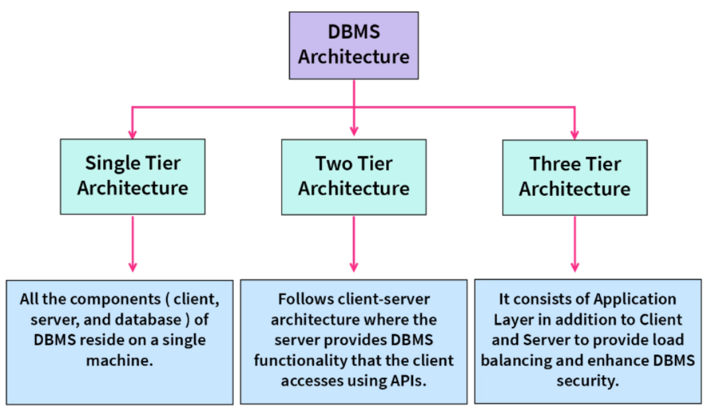
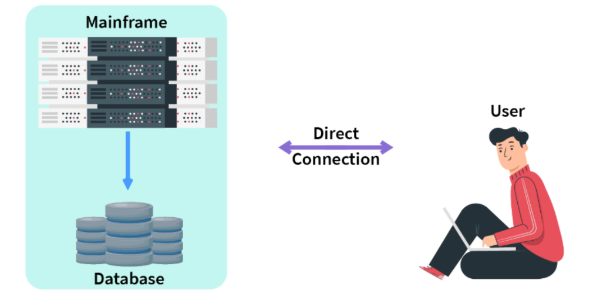
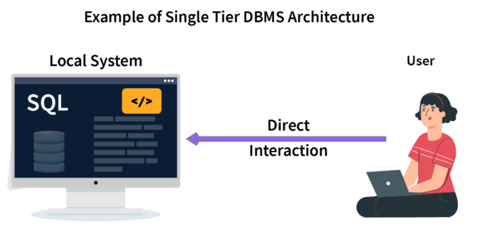
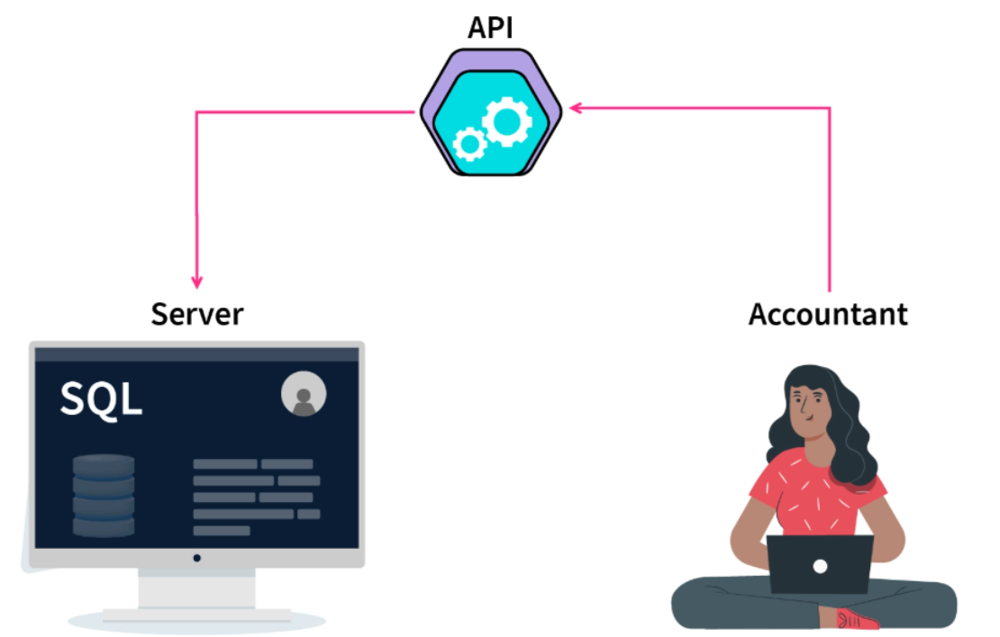
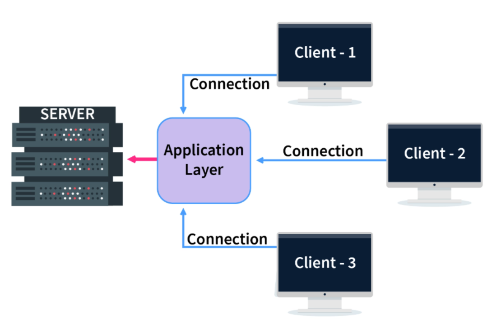

## Motivation: Why Not Just Use a Text File?

You have data. Lots of it. Where do you put it?

Before databases existed, every programmer answered that question the same way: a text file. It seems reasonable — open Notepad, type your records, save. Let us follow that decision to its natural conclusion.

::: callout-note
## The Notepad Scenario

Imagine you are building a simple student-grade system for your department. You create three text files:

**`students.txt`**
```
001 Ahmed Khalidi  Computer_Eng
002 Sara Hasan     Computer_Eng
003 Omar Zayed     Information_Sys
```

**`grades.txt`**
```
001 Database 92
001 Networks 85
002 Database 78
003 Database 90
```

**`departments.txt`**
```
Computer_Eng      Dr_Mansour  Building_A
Information_Sys   Dr_Younis   Building_B
```

Simple. Clean. Until it is not.
:::

### The Six Problems That Appear Immediately

::: callout-important
**Problem 1 — Search is O(n).**
To find Ahmed's grades, your program reads every line of `grades.txt` from top to bottom until it finds `001`. With 1,000 students that is manageable. With 1,000,000 students — a national exam registry — that scan takes several *seconds* per query, every query.

**Problem 2 — Updates break consistency.**
Ahmed transfers departments. You update `students.txt`. Two weeks later someone notices `grades.txt` still refers to the old department in a derived report. You forgot to update the second file. Your data now contradicts itself and you have no automatic way to detect the conflict.

**Problem 3 — Concurrent access destroys data.**
The registrar and the department secretary both open `grades.txt` at 9:00 AM to add grades. The registrar saves at 9:05. The secretary saves at 9:06 — overwriting the registrar's changes entirely. One transaction is silently **lost**.

**Problem 4 — Relationships require 40 lines of code.**
"List all students in Building A with a grade above 80." To answer that, you must open `departments.txt`, find Building A entries, open `students.txt`, filter by department, open `grades.txt`, cross-reference by ID, filter by grade. That is a dedicated Python script for a question a manager asks in 10 seconds.

**Problem 5 — No types, no validation.**
Nothing stops someone from typing `"92.5"`, `"92,5"`, `"ninety-two"`, or `"N/A"` into the grade column. Your code must handle every variant. One malformed record crashes the parser.

**Problem 6 — Crashes leave corrupt files.**
Power cuts exactly when you are writing a 200-record batch update. Half the file is in the new format; half is in the old format. There is no recovery log. Data is permanently corrupted.
:::

### "OK, I Will Write a Program to Handle All That"

You can. In fact, that is exactly what engineers did for 20 years before the database was invented — custom file-management programs for every application. The result:

- Every new question required a new program.
- No shared query language — each programmer invented their own.
- Security was enforced only by OS file permissions (all-or-nothing).
- No reuse: the inventory system could not share data with the payroll system even when they stored the same employee records.

Consider the contrast. Answering *"find all employees earning more than 65,000 who work in the IT department"* in a file system requires ~50 lines of parsing code. In a database, it is one line:

```sql
SELECT Fname, Lname FROM Employee WHERE Salary > 65000 AND Dno = 6;
```

That one line is the reason the database query language was invented.

### The Art of Solution: The DBMS

Every one of the six problems above has a specific, engineered solution inside a **Database Management System (DBMS)**:

| Text-file problem | DBMS solution | Covered in |
|------------------|--------------|------------|
| Line-by-line scan — O(n) | **B+ tree index** — O(log n) lookup | Chapter 10 |
| Inconsistency across files | **Foreign keys** + single authoritative schema | Chapter 5 |
| Lost concurrent updates | **Transactions + locking** | Chapter 12 |
| Manual join code | **SQL JOIN** with referential integrity | Chapter 7 |
| No type enforcement | **Typed schema via DDL** (`INT`, `DATE`, `CHECK`) | Chapter 7 |
| Corrupt files after crash | **Write-Ahead Log (WAL) + recovery** | Chapter 12 |
| Bespoke query programs | **SQL** — declarative, reusable, standard | Chapter 7 |

::: callout-tip
## Numbers That Put This in Perspective

- **Search speed:** Scanning 1 million rows sequentially → ~1–3 seconds. Finding the same row via a B+ tree index → ~0.1 milliseconds. That is a **10,000× speedup**.
- **Integrity:** A foreign-key violation is caught at `INSERT` time — not discovered in a bug report two weeks later.
- **Code volume:** One SQL `SELECT` with a `WHERE` clause replaces approximately 50 lines of Python file-parsing code.
:::

This engineered solution — the DBMS — is what this book is about. Every chapter builds one part of that solution, starting with the most fundamental question: what *is* a database, and how is it structured?

---

## What Is a Database?

A **database** is an organized collection of interrelated data that models some aspect of the real world. A **Database Management System (DBMS)** is the software layer that manages, stores, retrieves, and controls access to that data.

::: callout-note
The combination of a database and its DBMS is called a **database system**. In everyday speech, people often say "database" when they mean the entire system.
:::

### Key properties of a database

- **Self-describing**: The database stores a description of its own structure — called the **catalog** (or *data dictionary*) — alongside the data itself. Unlike a text file, the database knows what columns exist, what types they have, and what constraints apply.
- **Insulation between programs and data**: Application programs do not need to know *how* data is physically stored. Changing storage details does not require rewriting application code (**data abstraction**).
- **Support for multiple views**: Different users see different tailored views of the same underlying data. The payroll clerk sees salary columns; the student portal sees only name and grade.
- **Sharing and multiuser transaction processing**: Multiple users and programs access data concurrently while the DBMS guarantees that their actions do not interfere with each other.

::: callout-note
## Real-World Analogy

Think of the DBMS as a well-organized university library. The catalog (data dictionary) describes every book. The librarians (transaction manager) ensure two people cannot check out the same physical copy simultaneously. The restricted-archive rules (access control) determine who can read sensitive records. You never touch the shelves directly — you always go through the library system.
:::

The database model introduced in this chapter becomes your foundation. All the tools you will build later — ER diagrams, relational algebra, SQL, indexes, transactions — are ways of working with precisely this structure.

---

## File Systems vs. DBMS

The motivation section showed the problems with ad-hoc file storage through a concrete story. Here we name and formalize those problems so you can recognize them in any system you encounter:

| Problem | Description |
|---------|-------------|
| **Data redundancy** | Same data stored multiple times in different files |
| **Data inconsistency** | Updates in one file not reflected elsewhere |
| **Data isolation** | Data scattered across files; hard to retrieve across them |
| **Integrity constraints** | Enforced (or not) in scattered application code, not centrally |
| **Atomicity problems** | Partial updates due to crashes leave data inconsistent |
| **Concurrent access anomalies** | Multiple users overwrite each other's changes |
| **Security problems** | No fine-grained access control below file level |

A DBMS eliminates every one of these by providing a **unified data model**, **centralized constraint enforcement**, **transaction management**, and **role-based access control**.

Having seen *why* a DBMS is needed, we now need a vocabulary for *describing* the data it manages — that vocabulary is the data model.

---

## Data Models

A **data model** is a collection of concepts for describing the structure of a database — including the data types, relationships among data, and constraints that must hold on the data.

Think of a data model as a *language* for talking about data structure. Different problems call for different languages, just as blueprints, circuit diagrams, and prose all describe the same building from different perspectives.

### Classification of Data Models

```{mermaid}
%%| eval: true
%%| echo: false
flowchart TD
    DM["Data Models"]
    C["Conceptual<br/>(High-level)"]
    R["Representational<br/>(Implementation-level)"]
    P["Physical<br/>(Low-level)"]
    SD["Self-describing"]

    ER["Entity-Relationship Model<br/>Chapters 3–4"]
    REL["Relational Model<br/>Chapter 5"]
    ST["Storage structures,<br/>file organization — Chapter 10"]
    XML["XML"]
    NOSQL["NoSQL — JSON documents,<br/>key-value, graph — Chapters 14–15"]

    DM --> C --> ER
    DM --> R --> REL
    DM --> P --> ST
    DM --> SD --> XML
    SD --> NOSQL
```

### The Relational Model

Proposed by **E.F. Codd in 1970** [@codd1970relational], the relational model represents data as a collection of **tables (relations)**, each with named columns of fixed types. It remains the dominant model in enterprise software more than 50 years later.

::: callout-note
## Fun Fact

Codd's 1970 paper, *"A Relational Model of Data for Large Shared Data Banks"*, is one of the most cited papers in computer science. He later defined **Codd's 12 Rules** as a checklist for what makes a system truly relational — only a handful of commercial databases satisfy all 12.
:::

The relational model is elegant because it is mathematically grounded in **set theory** and **first-order logic**. That foundation is what makes SQL queries predictable and composable — and what makes relational algebra (Chapter 6) a rigorous optimization tool.

---

## Database Schema vs. Instance

Every database has two faces at any moment in time: its *structure* and its *current data*.

| Concept | Definition | Analogy |
|---------|-----------|---------|
| **Schema** (intension) | The description/structure of the database — table names, column names, types, constraints | A class definition in object-oriented programming |
| **Instance** (extension) | The actual data stored at a specific point in time | An object instantiated from that class |

A schema changes rarely — only when the structure of the problem changes (a new column is added, a table is split). An instance changes constantly — with every `INSERT`, `UPDATE`, and `DELETE`.

::: callout-important
**Common mistake:** Students sometimes say "the database has 30 employees" when describing the *schema*. The count 30 is an *instance* fact. The schema only says: "there is a table called `Employee` with columns `Ssn`, `Fname`, `Salary`, …". Tomorrow the instance might have 31 employees; the schema is unchanged.
:::

### Worked Example

**Schema** (permanent structure):
```
Employee(Ssn, Fname, Lname, Salary, Dno)
Department(Dnumber, Dname, Mgr_ssn)
```

**Instance** (data at one point in time):
```
Employee:  ('001', 'Ahmed', 'Khalidi', 62000, 1)
           ('002', 'Sara',  'Hasan',   59000, 2)
           …30 rows total…
```

If we add a column `Email` to `Employee`, the *schema* changes. The existing rows get a NULL email until populated — the *instance* changes only when we insert or update data.

The distinction between schema and instance is the first of several **abstraction layers** in database systems. The next section adds two more.

---

## Three-Schema Architecture (ANSI/SPARC)

As a database grows, different people interact with it differently: end users care about a grade-entry form; the application developer cares about the logical table structure; the storage engineer cares about disk blocks and indexes. The **three-schema architecture** separates these concerns.

```{mermaid}
%%| eval: true
%%| echo: false
flowchart TD
    U1["User A<br/>grade portal"]
    U2["User B<br/>payroll app"]
    U3["User C<br/>analytics dashboard"]

    E["External Level — Views<br/>Multiple user-specific views of the data"]
    C["Conceptual Level — Schema<br/>Complete logical structure:<br/>tables, columns, constraints, foreign keys"]
    I["Internal Level — Storage<br/>Physical files, indexes,<br/>buffer pools, block layout"]

    U1 --> E
    U2 --> E
    U3 --> E
    E <-->|mapping| C
    C <-->|mapping| I
```

- **External level**: Each user or application sees only the data it needs. A student sees their own grades; the payroll clerk sees only salary data. These are called **views**.
- **Conceptual level**: The complete logical structure of the entire database — all tables, all columns, all constraints, all relationships. This is what the DBA works with.
- **Internal level**: How data is physically stored — which file, which block, which index structure. Invisible to users and applications.

### Data Independence

The three-level separation provides **data independence** — the ability to change one level without rewriting the level(s) above it.

| Type | Definition | Example |
|------|-----------|---------|
| **Logical data independence** | Change the *conceptual* schema without rewriting external views or application programs | Add a `Phone` column to `Employee` — existing payroll application is unaffected |
| **Physical data independence** | Change the *internal* schema (e.g., add an index, switch storage engine) without changing the conceptual schema | Add a B+ tree index on `Salary` — no SQL queries need to change |

::: callout-tip
Physical independence is relatively easy to achieve (most DBMSs do it well). Logical independence is harder — adding a column is safe, but splitting a table or renaming a column requires updating views and queries that reference the old structure.
:::

The three-schema architecture explains *how* a DBMS provides data independence. To communicate with the DBMS — to define those schemas and manipulate that data — we need a language.

---

## Database Languages

A DBMS provides structured languages for every interaction. Modern SQL unifies all of these into a single language, but the conceptual separation matters for understanding what each statement is doing.

| Language | Abbreviation | Purpose | SQL examples |
|----------|-------------|---------|-------------|
| **Data Definition Language** | DDL | Define and modify schemas, tables, constraints | `CREATE TABLE`, `ALTER TABLE`, `DROP TABLE` |
| **Data Manipulation Language** | DML | Insert, retrieve, update, delete data | `SELECT`, `INSERT`, `UPDATE`, `DELETE` |
| **Data Control Language** | DCL | Grant and revoke access privileges | `GRANT`, `REVOKE` |
| **Transaction Control Language** | TCL | Manage transaction boundaries | `COMMIT`, `ROLLBACK`, `SAVEPOINT` |

::: callout-note
In SQL, all four sub-languages coexist in the same client session. `CREATE TABLE` is DDL; `SELECT` is DML; `GRANT SELECT ON Employee TO alice` is DCL; `COMMIT` is TCL.
:::

With a language defined, we need to understand who uses it.

---

## Database Users and Administrators

Different people interact with a database system in fundamentally different ways, with different tools, different technical knowledge, and different responsibilities.

| Role | Description | Typical tool |
|------|-------------|-------------|
| **Naive / parametric users** | Use pre-built forms and apps; unaware of DBMS internals | Web form, mobile app |
| **Application programmers** | Write and maintain programs that access the DB via SQL embedded in code | Python, Java, PHP |
| **Sophisticated users** | Write ad-hoc SQL queries directly; data analysts, researchers | SQL client, Jupyter |
| **DBA (Database Administrator)** | Manages the entire database system | Command-line, admin console |

### DBA Responsibilities

- **Schema definition** — creates the initial structure using DDL
- **Storage structure decisions** — decides which indexes to build, which storage engine to use
- **Authorization management** — grants and revokes privileges to users and roles
- **Routine maintenance** — backups, performance monitoring, query tuning
- **Schema evolution** — modifies the schema safely as requirements change

With users and roles defined, we can look inside the DBMS to understand the software components that serve all of them.

---

## DBMS Deployment Architecture

A DBMS does not always run on the same machine as the application that uses it. **Deployment architecture** describes how many independent layers (*tiers*) exist between the end user and the DBMS engine. More tiers increase security and scalability at the cost of added complexity.

{fig-align="center" width="80%"}

---

### 1-Tier (Single-Tier) Architecture

All components — user interface, application logic, and the DBMS — reside on a **single machine**. The user interacts directly with the database with no network involvement.

{fig-align="center" width="80%"}

{fig-align="center" width="80%"}

**When to use:** Learning environments, local development, single-user desktop tools (e.g., a SQLite-backed app, MS Access on a single laptop).

| Advantage | Disadvantage |
|-----------|-------------|
| Simple — no network needed | Single user only |
| No network latency | No isolation between app and DB |
| Full direct control | Cannot scale |

---

### 2-Tier (Client-Server) Architecture

The **client** runs the user interface and application logic; the **DBMS** runs on a separate **server**. Communication uses standard APIs (JDBC, ODBC, native drivers) over a TCP network.

```{mermaid}
%%| eval: true
%%| echo: false
flowchart LR
    C["💻 Client<br/>UI + Application Logic"]
    S["🗄️ DB Server<br/>DBMS + Database"]
    C <-->|"SQL over TCP<br/>(JDBC / ODBC)"| S
    style C fill:#e8f4fd,stroke:#2980b9,stroke-width:2px
    style S fill:#fdf2e9,stroke:#e67e22,stroke-width:2px
```

{fig-align="center" width="80%"}

**When to use:** Departmental applications, internal tools where the developer controls all clients (e.g., a bank teller terminal, a clinic management desktop app).

| Advantage | Disadvantage |
|-----------|-------------|
| Multiple concurrent users | Business logic lives on client — hard to update |
| Server handles query processing | Direct DB exposure is a security risk |
| Better performance than 1-tier | Server becomes bottleneck as clients grow |

---

### 3-Tier Architecture

An **application server** (middle tier) is inserted between the client and the DBMS. The client never communicates directly with the database — it only talks to the application server.

```{mermaid}
%%| eval: true
%%| echo: false
flowchart TD
    P["🖥️ Presentation Tier<br/>Browser · Mobile App · Desktop GUI"]
    A["⚙️ Application Tier<br/>Web Server + Business Logic<br/>Node.js · Django · Spring · Laravel"]
    D["🗄️ Data Tier<br/>DBMS Server<br/>MySQL · PostgreSQL · MongoDB"]
    P <-->|"HTTP / REST / GraphQL"| A
    A <-->|"JDBC / ODBC / DB driver"| D
    style P fill:#e8f4fd,stroke:#2980b9,stroke-width:2px
    style A fill:#eafaf1,stroke:#27ae60,stroke-width:2px
    style D fill:#fdf2e9,stroke:#e67e22,stroke-width:2px
```

{fig-align="center" width="80%"}

**When to use:** Virtually all modern web applications — e-commerce, banking portals, social media, ERP systems.

| Concern | How 3-tier addresses it |
|---------|------------------------|
| **Security** | DBMS is never directly reachable from the Internet |
| **Scalability** | App servers can be load-balanced independently of the DB |
| **Maintainability** | Business logic changes in the app tier leave the DB untouched |
| **DB portability** | Swapping MySQL for PostgreSQL requires changes only in the app tier |
| **Complexity** | More layers = harder to debug and deploy |

---

### Tier Architecture at a Glance

| | 1-Tier | 2-Tier | 3-Tier |
|--|--------|--------|--------|
| **Concurrent users** | 1 | Dozens–hundreds | Millions |
| **Security** | None | Low | High |
| **Scalability** | None | Limited | High |
| **Complexity** | Minimal | Moderate | High |
| **Typical example** | SQLite on a laptop | Bank teller app | Amazon.com |

::: callout-note
The tier architecture describes *where* the DBMS engine runs relative to the user. The **internal** components of the DBMS itself — the Query Processor, Storage Manager, and Disk Storage — are covered in detail in **Chapter 2, Section 2.4**.
:::

---

## Advantages of Using a DBMS

::: callout-tip
## Key Advantages (exam-ready list)

1. **Controlling data redundancy** — one authoritative copy; changes propagate automatically via constraints
2. **Data sharing** — concurrent access by multiple users and applications with isolation guarantees
3. **Enforcing integrity constraints** — centrally in the DBMS, not scattered across application code
4. **Restricting unauthorized access** — fine-grained user roles and privileges at table, column, and row level
5. **Providing persistent storage** — data survives program termination, process crashes, and server reboots
6. **Providing backup and recovery** — automatic crash recovery via write-ahead logging
7. **Multiple user interfaces** — forms, SQL, REST APIs, embedded queries, natural-language interfaces
8. **Representing complex relationships** — foreign keys, joins, recursive references
:::

---

## Interactive: File Scan vs. Index Lookup

::: callout-tip
Drag the slider to change the number of rows. Observe how a full file scan grows linearly while a B+ tree index lookup grows only logarithmically.
:::

```{ojs}
//| echo: false
//| eval: true
viewof rowCount = Inputs.range([1000, 1000000], {
  step: 1000,
  value: 100000,
  label: "Number of rows"
})
```

```{ojs}
//| echo: false
//| eval: true
{
  const scanMs  = (rowCount / 1e6) * 2500;
  const indexMs = Math.log2(rowCount) * 0.05;
  const fmt = v => v >= 1 ? `${v.toFixed(2)} ms` : `${(v * 1000).toFixed(1)} µs`;
  const speedup = (scanMs / indexMs).toFixed(0);

  return htl.html`
    <div style="font-family:sans-serif;max-width:520px;padding:12px;border:1px solid #ddd;border-radius:6px">
      <h4 style="margin:0 0 12px">Cost at ${rowCount.toLocaleString()} rows</h4>
      <table style="width:100%;border-collapse:collapse">
        <tr style="background:#f0f4f8">
          <th style="padding:8px;text-align:left">Method</th>
          <th style="padding:8px;text-align:right">Estimated time</th>
          <th style="padding:8px;text-align:left">Complexity</th>
        </tr>
        <tr>
          <td style="padding:8px">📄 Full file scan (no index)</td>
          <td style="padding:8px;text-align:right;color:#c0392b;font-weight:bold">${fmt(scanMs)}</td>
          <td style="padding:8px">O(n)</td>
        </tr>
        <tr style="background:#f0fff4">
          <td style="padding:8px">🌳 B+ tree index lookup</td>
          <td style="padding:8px;text-align:right;color:#27ae60;font-weight:bold">${fmt(indexMs)}</td>
          <td style="padding:8px">O(log n)</td>
        </tr>
      </table>
      <p style="margin-top:10px;font-size:0.9em;color:#444">
        Index is <strong>${speedup}×</strong> faster at this table size.
      </p>
    </div>`;
}
```

---

## Summary

::: callout-important
## Chapter 1 — Key Takeaways

- **The core problem**: text files fail at scale — they are slow to search (O(n)), vulnerable to inconsistency, broken by concurrent access, and offer no type safety or crash recovery.
- A **database** is a self-describing, organized collection of interrelated data; a **DBMS** manages it with a data dictionary, query processor, transaction manager, and buffer manager.
- **File systems** suffer from seven classic problems: redundancy, inconsistency, isolation, integrity, atomicity, concurrency, security. A DBMS solves each with a specific mechanism.
- A **data model** (ER, relational, NoSQL) provides the vocabulary for describing data structure.
- The **three-schema architecture** (external → conceptual → internal) enables **data independence**: change one level without rewriting the others.
- **Logical independence** isolates applications from schema changes; **physical independence** isolates schemas from storage changes. Physical is easier to achieve.
- DBMS sub-languages: DDL (define), DML (manipulate), DCL (control), TCL (transactions). Modern SQL unifies all four.
- **DBMS deployment** comes in three tiers: 1-tier (all on one machine, single user), 2-tier (client + DB server via JDBC/ODBC), and 3-tier (client + app server + DB). Most modern web applications use 3-tier for security and scalability. Internal DBMS components (Query Processor, Storage Manager) are detailed in Chapter 2.
:::

---

## Review Questions

### Conceptual

1. Define the term **database system**. Distinguish it from a *database* and from a *DBMS*, giving a concrete example of each.
2. What is the **data dictionary** (system catalog)? What information does it store, and which DBMS component maintains it?
3. Explain the difference between **logical data independence** and **physical data independence**. Which is harder to achieve in practice, and why?

### Short-Answer / Compare

4. A colleague proposes storing all employee records in a shared Excel spreadsheet on a network drive. List **four specific problems** that will arise when the company reaches 500 employees and 10 concurrent users. For each, name the DBMS mechanism that would prevent it.
5. Compare the **conceptual level** and the **external level** of the three-schema architecture. Who works at each level, and what do they see?
6. Compare **1-tier**, **2-tier**, and **3-tier** deployment architectures. For each, give one real-world example and identify its single most important limitation.

### True / False (with explanation)

7. *"A database schema changes every time a new row is inserted."* — True or False? Explain.
8. *"Physical data independence means that application programs do not need to know which disk the data is stored on."* — True or False? Explain precisely.
9. *"A naive user can interact with a DBMS only by writing SQL queries."* — True or False? Explain.
10. *"The data dictionary is stored separately from the database it describes."* — True or False? Explain.

### Multiple Choice

11. Which DBMS sub-language is used to define tables, columns, and constraints?
    - (a) DML   (b) DCL   **(c) DDL** ✓   (d) TCL

12. Which property of a database distinguishes it from a plain text file?
    - (a) It can store text
    - **(b) It is self-describing** ✓
    - (c) It requires an internet connection
    - (d) It can only be accessed by one user at a time

13. Physical data independence means you can change:
    - (a) application programs without changing the schema
    - (b) external views without changing the conceptual schema
    - **(c) the internal storage structure without changing the conceptual schema** ✓
    - (d) the conceptual schema without changing external views

### Design Exercise

14. A small clinic stores patient records in three CSV files: `patients.csv`, `appointments.csv`, and `doctors.csv`. Identify **three specific anomalies or risks** in this design. For each, write one sentence describing the specific DBMS feature that would eliminate it.

### SQL / Query Preview

15. Given a table `Grades(StudentId, StudentName, Course, Grade)`, write a SQL query to retrieve the names of all students with a grade above 80. Then explain in one sentence why this single statement replaces tens of lines of file-parsing code.

16. What SQL sub-language command would you use to:
    - (a) Create the `Grades` table?
    - (b) Insert a new grade record?
    - (c) Allow user `dr_smith` to read from `Grades` but not modify it?
    - (d) Undo all changes made in the current session?
