Chapter 2 placed ER modeling in the design lifecycle as the **conceptual design** step — the phase where we translate a written problem description into a precise graphical model, before touching any SQL. This chapter teaches you the full vocabulary of ER modeling: what it is, how it is drawn, and how to apply it to a real requirements document.

---

## What Is an ER Diagram?

An **Entity-Relationship (ER) diagram** is a graphical representation of a **conceptual schema** — a high-level, implementation-independent description of the data a system must store.

> **Conceptual schema**: A description of the *structure* of a database at a level that is independent of any specific DBMS, storage format, or programming language. It answers: *"What data exists, and how is it connected?"* — not *"How is it stored?"*

ER modeling was introduced by Peter Chen in 1976. Its core contribution was giving database designers a single, shared language to communicate with both business stakeholders (who understand the problem domain) and software engineers (who will implement the solution).

### Why ER First?

| If you start with… | Risk |
|--------------------|------|
| SQL tables directly | Miss relationships; duplicate data; poor constraints |
| Code first | Logic drives storage; hard to change later |
| ER diagram first | Clean conceptual model; easy to review with users; maps to any DBMS |

An ER diagram is always drawn **before** writing any SQL. It is then converted to a relational schema using a mechanical mapping process (covered at the end of this chapter).

---

## ER Notations Overview

An ER diagram is a graphical language, and like any language it comes in different dialects. Three notations are widely used; you will encounter all three in textbooks and professional tools.

| Notation | Introduced by | Where you see it |
|----------|--------------|------------------|
| **Chen** | Peter Chen, 1976 | University textbooks, academic exams, this course |
| **Min-Max** (Structural Constraints) | Various authors | Formal specifications needing exact minimum and maximum counts |
| **Crow's Foot** | Industry convention | Design tools — MySQL Workbench, Lucidchart, draw.io, Visio, ERwin |

All three notations express the same concepts — entities, attributes, relationships, cardinality, and participation — using different visual symbols. You do not need to master all three right now. The important thing is to know they exist so you can recognise a diagram regardless of the notation it uses.

::: callout-note
## Notation used in this chapter
All diagrams from here through the Worked Example are drawn in **Chen notation**. After the Worked Example, dedicated sections introduce Min-Max and Crow's Foot in detail and show how each notation represents the same Company Database.
:::

---

## Chen Notation — Symbol Reference

Chen notation is the academic standard you will use for all diagrams in this course. The table below is your reference for every symbol.

| Concept | Shape | Description |
|---------|-------|-------------|
| **Strong Entity** | Single rectangle | An object with independent existence and its own key |
| **Weak Entity** | Double rectangle | An object that depends on another entity for identification |
| **Relationship** | Single diamond | An association between two or more entities |
| **Identifying Relationship** | Double diamond | The relationship that identifies a weak entity |
| **Attribute** | Ellipse (oval) | A property of an entity or relationship |
| **Key Attribute** | Ellipse with underlined name | Uniquely identifies each entity instance |
| **Multivalued Attribute** | Double ellipse | Can hold multiple values per instance |
| **Derived Attribute** | Dashed ellipse | Computed from another stored attribute |
| **Composite Attribute** | Ellipse → child ellipses | Built from smaller sub-attributes |
| **Total Participation** | Double line | Every instance of the entity must participate |
| **Partial Participation** | Single line | Some instances may not participate |
| **Cardinality label** | 1, N, or M on the line | Placed near each entity; shows the maximum |

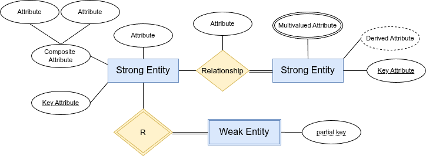{fig-align="center" width="60%"}

---

## Entities

::: callout-note
## All diagrams in this chapter use Chen notation
The sections below (Entities, Attributes, Relationships) describe and illustrate concepts using **Chen notation**: single rectangles for strong entities, double rectangles for weak entities, diamonds for relationships, and ovals for attributes. Cardinality is shown with 1, N, or M labels on the lines. If a diagram you encounter elsewhere uses pairs of numbers like $(1,N)$ or crow's foot line endings, those are Min-Max and Crow's Foot notations — both are covered in full detail after the Worked Example.
:::

### Strong Entity

A **strong entity type** (or simply *entity type*) is a real-world object or concept that:

1. Has an **independent existence** — it does not depend on another object to exist in the database.
2. Has a set of **attributes** that describe it.
3. Has at least one attribute (or combination) that **uniquely identifies** each instance — its **key attribute**.

**Notation:** A **single rectangle** labeled with the entity name (all caps by convention).

Examples: `EMPLOYEE`, `DEPARTMENT`, `PROJECT`, `STUDENT`, `PRODUCT`

**Entity type vs. Entity instance:**

| Term | Meaning | Example |
|------|---------|---------|
| Entity type | The template / class | `EMPLOYEE` |
| Entity set | All current instances | All 500 employees in the DB |
| Entity instance | One specific occurrence | Ahmed Ali, SSN=001 |

**Example — STUDENT entity with its attributes in Chen notation:**

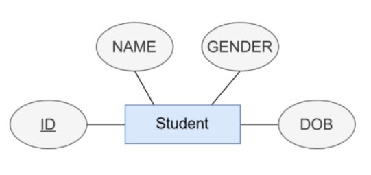{fig-align="center" width="25%"}

In this example: `Student` is the entity (rectangle), `ID` is the key attribute (underlined), and `NAME`, `GENDER`, `DOB` are simple attributes (ovals connected by lines).

### Weak Entity

A **weak entity type** has **no key attribute of its own** — it cannot be uniquely identified without reference to another entity (its **owner**).

| Feature | Strong Entity | Weak Entity |
|---------|--------------|-------------|
| Has own key? | Yes | No — only a **partial key** |
| Identified by | Own primary key | Owner's key + partial key |
| Rectangle notation | Single | **Double** |
| Identifying relationship | Single diamond | **Double diamond** |
| Participation in identifying rel. | May vary | Always **total** |

**Partial key**: The attribute(s) of a weak entity that, combined with the owner's key, uniquely identify a weak entity instance. Shown with a **dashed underline**.

::: callout-important
**Example:** `DEPENDENT` is weak under `EMPLOYEE`.

- `DEPENDENT` has a partial key: `Dependent_Name`
- Two dependents of *different* employees may share the same name — perfectly fine.
- Two dependents of the *same* employee may **not** share the same name.
- Full identifier: `(Ssn, Dependent_Name)` — a composite key where `Ssn` comes from the owner.

If an employee is deleted, all their dependents are deleted too (CASCADE). A dependent record cannot exist without an employee.
:::

**Example — Hotel (strong) and Room (weak entity) in Chen notation:**

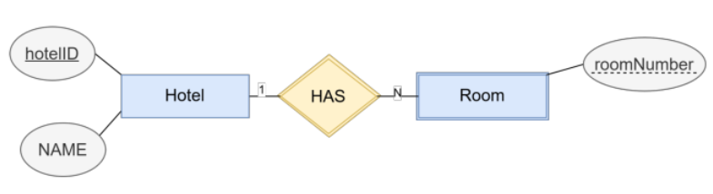{fig-align="center" width="30%"}

- `Hotel` is the **strong entity** — it has its own key (`hotelID`, underlined).
- `Room` is the **weak entity** — `roomNumber` alone is not unique across all hotels (two hotels can both have room 101). It is identified by the combination `(hotelID, roomNumber)`.
- `HAS` is the **identifying relationship** (1:N — one hotel has many rooms).

---

## Attributes

### Attribute Types

An **attribute** is a property that describes an entity type or relationship type. Quarto supports the following types:

| Type | Description | Chen Shape | Example |
|------|-------------|-----------|---------|
| **Simple** | Atomic, cannot be divided further | Plain oval | `Salary`, `Gender` |
| **Composite** | Built from smaller sub-attributes | Oval feeding child ovals | `Name → (Fname, Minit, Lname)` |
| **Multivalued** | Can hold multiple values per entity instance | **Double** oval | `Phone_Numbers`, `Dept_Locations` |
| **Derived** | Computed from another stored attribute; not physically stored | **Dashed** oval | `Age` derived from `Bdate` |
| **Stored** | Permanently stored; may be a source for derived attributes | Plain oval | `Bdate` |
| **Key** | Uniquely identifies each entity instance | Oval with **underlined** text | `Ssn`, `Dnumber` |
| **Partial key** | Identifies weak entity instances within the owner; not globally unique | Oval with **dashed underline** | `Dependent_Name` |
| **Complex** | Both composite and multivalued | Nested double oval | `{Address(Street, City, Zip)}` |
| **NULL** | Value is unknown or not applicable | — | `Super_ssn` for a top-level manager |

#### Simple (Atomic) Attribute

A **simple** attribute cannot be divided into smaller meaningful parts. It holds a single indivisible value per entity instance. All attributes in the example below — `Id`, `name`, `price`, and `quantity` — are simple; each stores one value that has no sub-components.

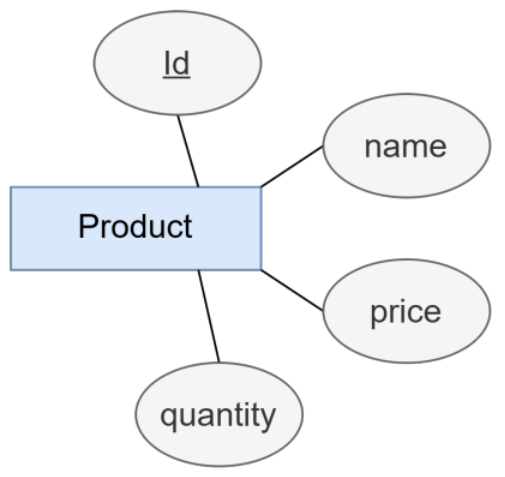{fig-align="center" width="28%"}

#### Composite Attribute

A **composite** attribute is made up of smaller, meaningful sub-attributes. The sub-attributes are shown as child ovals branching from the parent oval. In the example, `FullName` breaks down into `FirstName` and `LastName`; `Address` breaks down into `Street`, `City`, and `State`.

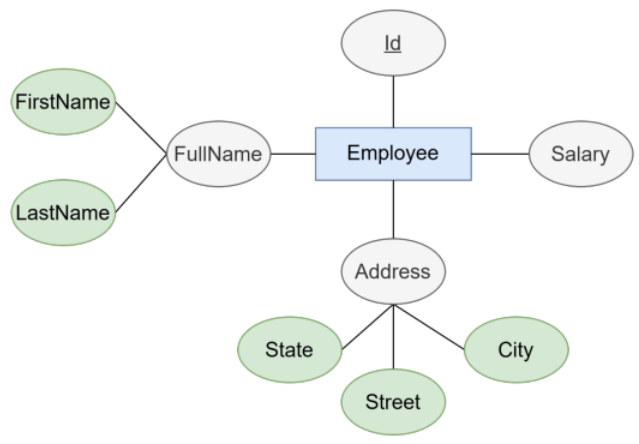{fig-align="center" width="30%"}

#### Single-Valued Attribute

A **single-valued** attribute holds exactly one value for each entity instance. Most attributes are single-valued — for example, every employee has exactly one `FullName` and one `Address`. This contrasts with multi-valued attributes that can hold several values at once.

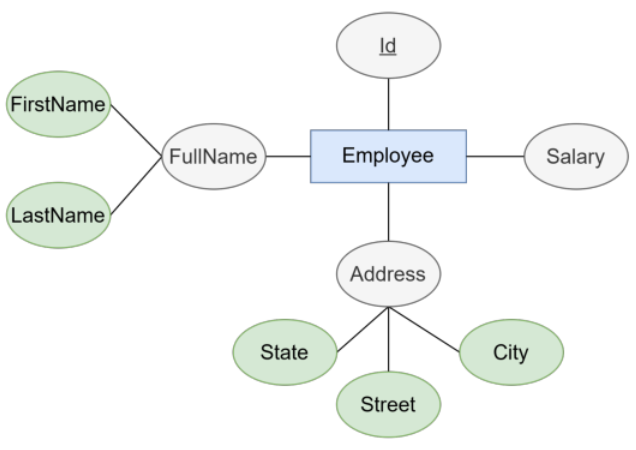{fig-align="center" width="30%"}

#### Multi-Valued Attribute

A **multi-valued** attribute can hold more than one value for the same entity instance. It is drawn as a **double oval**. In the example, an employee can have multiple `Addresses` and multiple `Skills`.

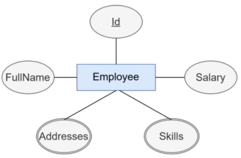{fig-align="center" width="28%"}

#### Derived Attribute

A **derived** attribute can be computed from another stored attribute; it is drawn as a **dashed oval**. Because the value can always be recalculated, it is not physically stored in the database. In the example, `Age` (dashed oval) is derived from the stored `DOB` attribute.

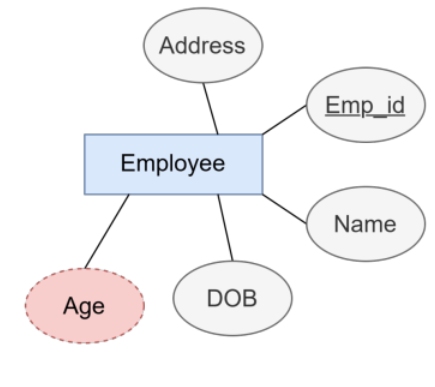{fig-align="center" width="28%"}

#### Key Attribute

A **key** attribute uniquely identifies every instance of an entity type. It is drawn as an oval with its name **underlined**. In the example, `hotelID` is underlined, meaning no two Hotel records share the same `hotelID`.

{fig-align="center" width="28%"}

::: callout-tip
**When is something an attribute vs. an entity?**

Ask: "Do I need to store multiple facts *about* this, or just one value?"
- If multiple facts → it is an entity.
- If one value → it is an attribute.

Example: `Gender` → one value per employee → **attribute**.
Example: `Department` → has a name, number, location, manager → **entity**.
:::

---

## Relationships

A **relationship type** defines an association among two or more entity types.
A **relationship instance** is one specific pairing of entity instances.

**Notation:** A **single diamond** labeled with the relationship name (verb or verb phrase).

### Degree of a Relationship

| Degree | Name | Example |
|--------|------|---------|
| 1 | Unary (recursive) | `EMPLOYEE` **Supervises** `EMPLOYEE` |
| 2 | Binary | `EMPLOYEE` **Works_For** `DEPARTMENT` |
| 3 | Ternary | `EMPLOYEE` **Supplies** `PROJECT` with `PART` |

Most real-world relationships are **binary**. Before using a ternary relationship, ask whether it can be decomposed into two binary ones without losing information.

### Cardinality Ratios

For a binary relationship, the **cardinality ratio** specifies how many instances of one entity can be related to one instance of the other. In Chen notation, the label (`1`, `N`, or `M`) is written on the relationship line **near the entity it constrains**.

#### One-to-One (1:1)

Each instance of entity A is associated with **at most one** instance of entity B, and vice versa.

- Each person has **at most one** passport — not everyone has a passport.
- Each passport belongs to **exactly one** person — every passport has an owner.

> **Reading:** "A person may have zero or one passport; a passport must be owned by exactly one person."

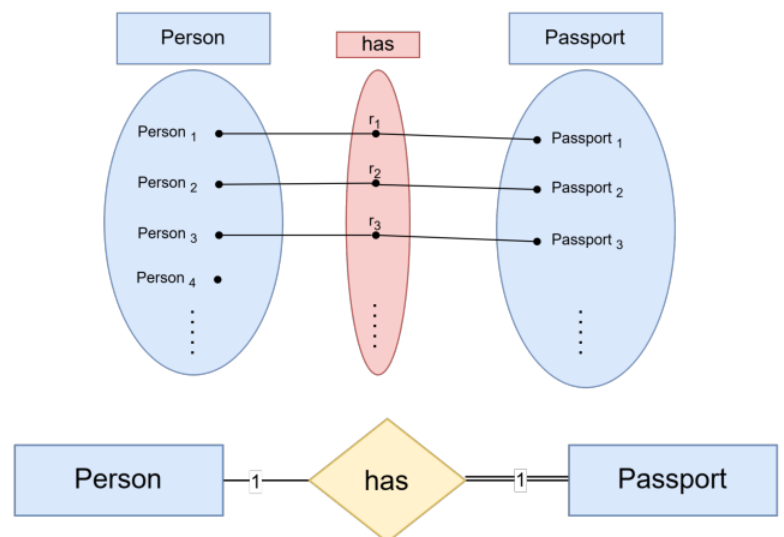{fig-align="center" width="55%"}

#### One-to-Many (1:N)

One instance of entity A is associated with **many** instances of entity B, but each B instance is associated with at most one A.

- A department can exist **without** employees (e.g., a newly created department with no staff yet) → **partial** participation of Department in the relationship.
- An employee **must** be assigned to a department → **total** participation of Employee in the relationship.

> **Left → Right (Department → Employee):** One department employs zero or more employees.  
> **Right → Left (Employee → Department):** Each employee works for exactly one department.

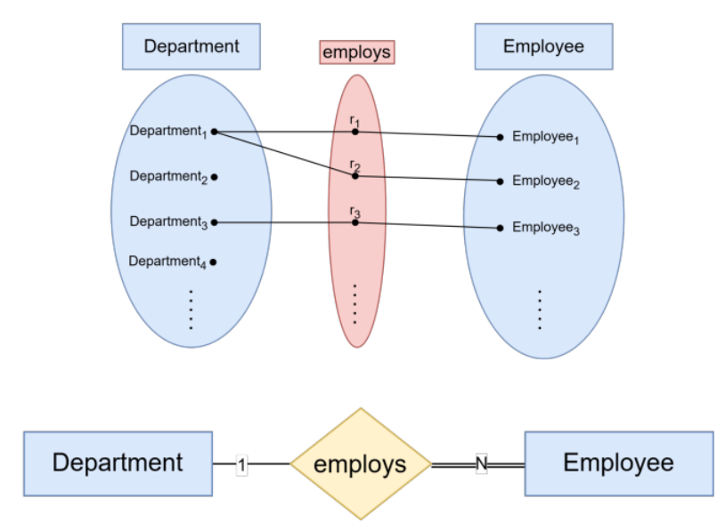{fig-align="center" width="55%"}

#### Many-to-Many (M:N)

Each instance of entity A can be associated with **many** instances of entity B, and each B can be associated with many A's.

> **Left → Right (Student → Course):** A student may enroll in zero or more courses.  
> **Right → Left (Course → Student):** A course may have zero or more students.

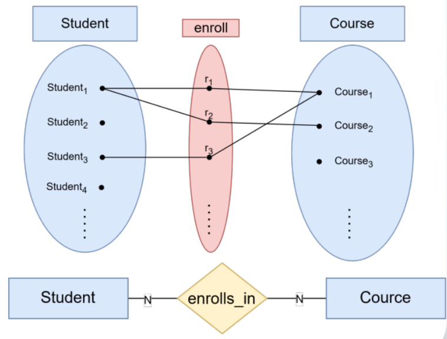{fig-align="center" width="55%"}

### Participation Constraints

Participation constraints specify whether **every** instance of an entity must participate in a relationship, or whether participation is optional.

| Line type | Name | Meaning |
|-----------|------|---------|
| Single line `─` | **Partial** participation | Some instances may not participate |
| Double line `═` | **Total** participation | *Every* instance **must** participate |

**Example — Department managedBy Employee:**

- **Department** side → **double line (total)**: every department *must* be managed by exactly one employee.
- **Employee** side → **single line (partial)**: not every employee is a manager — an employee *may* manage a department, but doesn't have to.

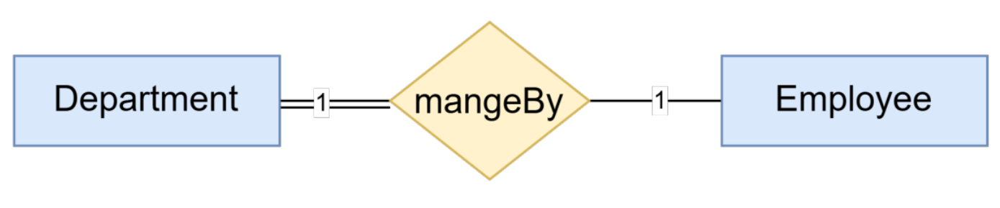{fig-align="center" width="55%"}

::: callout-note
Total participation means the entity **cannot exist** in the database without being connected to this relationship. A department record cannot be inserted unless it has a managing employee assigned to it.
:::

### Relationship Attributes

Some relationships carry their own data — a value that belongs to the **pairing** of two entities, not to either entity alone.

::: callout-important
`Hours` in *Works_On* is a **relationship attribute**: it is the number of hours *this employee* spends on *this project*.

- Storing it with `EMPLOYEE` is wrong: hours on which project?
- Storing it with `PROJECT` is wrong: hours by which employee?
- It belongs to the *combination* `(Employee, Project)` — i.e., the relationship.
:::

In Chen notation, relationship attributes are drawn as ovals attached to the diamond.

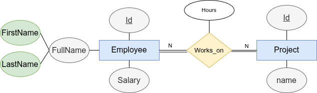{fig-align="center" width="50%"}

### Recursive (Unary) Relationships

A relationship where the **same entity type** participates more than once, in different **roles**.

The diagram below shows two versions of the same idea — the top one is **wrong**, the bottom one is **correct**:

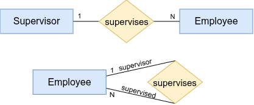{fig-align="center" width="55%"}

**Why the first diagram is wrong:** `Supervisor` is not a different kind of thing from `Employee` — a supervisor *is* an employee who happens to manage others. Drawing two separate entity boxes implies two different tables in the database, which is incorrect.

**Why the second diagram is correct:** A single `Employee` entity with a **recursive** `supervises` relationship back to itself, with two labelled roles: `supervisor` (1 side) and `supervised` (N side). One entity maps to one table — the role is just a label on the line.

**Why both sides are partial (single line):**

| Role | Min | Reason |
|------|-----|--------|
| `supervised` (N side) | 0 | Not every employee supervises anyone — a regular worker never plays the supervisor role |
| `supervisor` (1 side) | 0 | Not every employee has a supervisor — the top-level manager (CEO) has no one above them |

Both sides are $(0,N)$ and $(0,1)$ respectively — **partial participation**, shown as single lines on both ends.

### Ternary Relationships

Involve three entity types simultaneously. A `SUPPLIER` **supplies** a `PART` to a `PROJECT` — no pair alone captures the full meaning.

#### Where the 1 / N Labels Go

In a ternary relationship there is one diamond connected to **three** entities by three lines. A cardinality label (`1` or `N`) is placed on each line **at the entity end of the line — close to the entity box itself, far from the diamond**, exactly like binary relationships.

```{mermaid}
%%| eval: true
%%| echo: false
%%| fig-cap: "Ternary relationship — a DOCTOR prescribes a DRUG for a PATIENT. Label near each entity answers: *'given one specific pair of the other two, how many of me?'*"
flowchart LR
    DOCTOR["DOCTOR"]
    DRUG["DRUG"]
    PATIENT["PATIENT"]
    PRESC{"Prescribes"}

    DOCTOR ---|1|PRESC
    DRUG ---|N|PRESC
    PATIENT ---|N|PRESC
```

#### How to Read the Labels — the "Fix Two, Count the Third" Rule

> **For each entity, mentally fix one specific instance of the other two and ask:
> *"How many instances of this entity can participate?"***
> The label answers that question.

| Label | Fixed | Question | Answer |
|-------|-------|----------|--------|
| **1** near `DOCTOR` | a specific (Drug, Patient) pair | How many doctors prescribed *this* drug to *this* patient? | **1** — exactly one doctor per prescription |
| **N** near `DRUG` | a specific (Doctor, Patient) pair | How many drugs does *this* doctor prescribe to *this* patient? | **N** — many drugs possible |
| **N** near `PATIENT` | a specific (Doctor, Drug) pair | How many patients receive *this* drug from *this* doctor? | **N** — many patients |

**Full reading of the diagram:** *"Each (Drug, Patient) combination is handled by exactly one Doctor; each (Doctor, Patient) pair can involve many Drugs; each (Doctor, Drug) pair can be prescribed to many Patients."*

::: callout-tip
**Quick rule:** The `1` label means "at most one" when you fix the other two. The `N` label means "potentially many."
:::

::: callout-note
Before using a ternary relationship, verify that the three-way combination is truly needed. If any pair of the three entities fully determines the third, a ternary can usually be replaced by two binary relationships.
:::

---

## Worked Example: The Company Database

We now apply everything above to a realistic requirements document. The resulting ER diagram is the **Company Database** — the running example used throughout Chapters 3–8.

### Requirements

> *"The company has several **departments**. Each department has a unique **name** and a **number**. A department is managed by exactly one **employee**, who is called the **manager**. The manager has a **start date** for their managerial role. A department may have several **locations**.*
>
> *Each employee has a unique **social security number (SSN)**, a **first name**, **middle initial**, **last name**, **date of birth**, **address**, **gender**, and **salary**. Each employee works in exactly one department but may work on several **projects**. We track the **number of hours** per week each employee works on each project. Each employee may be supervised by at most one other employee.*
>
> *Each project has a unique **name**, a **number**, and a single **location**. Each project is controlled by exactly one department.*
>
> *Employees may have **dependents**. Each dependent has a **name**, **gender**, **date of birth**, and **relationship** to the employee."*

---

### Step 1 — Extract Entities and Attributes

**Rule:** Circle all nouns. For each noun, ask: *"Does it have an independent existence and need multiple facts stored about it?"*

| Noun | Entity or Attribute? | Notes |
|------|---------------------|-------|
| Department | **Strong Entity** | Has name, number, locations — independent existence |
| Name (dept) | Attribute of DEPARTMENT | Key attribute |
| Number (dept) | Attribute of DEPARTMENT | Candidate key |
| Employee | **Strong Entity** | Has SSN, name, salary — independent existence |
| Manager | Role of EMPLOYEE, not a separate entity | Expressed via a 1:1 relationship |
| Start date (mgr) | Attribute of **Manages relationship** | Depends on the manager-department pairing |
| Location (dept) | **Multivalued attribute** of DEPARTMENT | "Several locations" |
| SSN | Attribute of EMPLOYEE | **Key attribute** |
| First/Middle/Last name | **Composite attribute** Name of EMPLOYEE | Sub-attributes |
| Date of birth | Attribute of EMPLOYEE | Stored; Age is derived from it |
| Address | Attribute of EMPLOYEE | Simple (or composite if sub-parts needed) |
| Gender, Salary | Attributes of EMPLOYEE | Simple |
| Hours | Attribute of **Works_On relationship** | Depends on Employee + Project pairing |
| Project | **Strong Entity** | Has name, number, location |
| Location (proj) | Simple attribute of PROJECT | Only one per project |
| Dependent | **Weak Entity** | No key of its own — identified via EMPLOYEE |
| Dep. name, gender, DOB, relationship | Attributes of DEPENDENT | `Dependent_Name` is partial key |

---

### Step 2 — Extract Relationships

**Rule:** Circle all verb phrases. For each, identify: which entities are involved, the cardinality, and the participation.

| Verb phrase | Entities | Cardinality | Participation |
|------------|---------|-------------|--------------|
| "works in" | EMPLOYEE ↔ DEPARTMENT | N:1 | Employee: total *("exactly one")*; Dept: partial *(text silent — assumption needed)* |
| "works on" | EMPLOYEE ↔ PROJECT | M:N | Employee: partial *("may work on several" = optional)*; Project: partial *(text silent — assumption needed)* |
| "managed by" | DEPARTMENT ↔ EMPLOYEE | 1:1 | Dept: total; Employee: partial |
| "controlled by" | PROJECT ↔ DEPARTMENT | N:1 | Project: total; Dept: partial |
| "has dependents" | EMPLOYEE ↔ DEPENDENT | 1:N | Employee: partial; Dependent: total (identifying) |
| "supervised by" | EMPLOYEE ↔ EMPLOYEE | 1:N (recursive) | Supervisee: partial; Supervisor: partial |

---

### Step 3 — ER Diagram in Chen Notation

The following diagram uses Chen notation conventions:
- **Rectangles** = strong entities
- **Double rectangles** = weak entities
- **Diamonds** = relationships
- **Double diamond** = identifying relationship
- **Ovals** = attributes
- **Double oval** = multivalued attribute
- **Dashed oval** = derived attribute
- **Underlined text in oval** = key attribute
- **Double line** = total participation; **Single line** = partial participation
- **1 / N / M labels** = cardinality at the entity end of the line

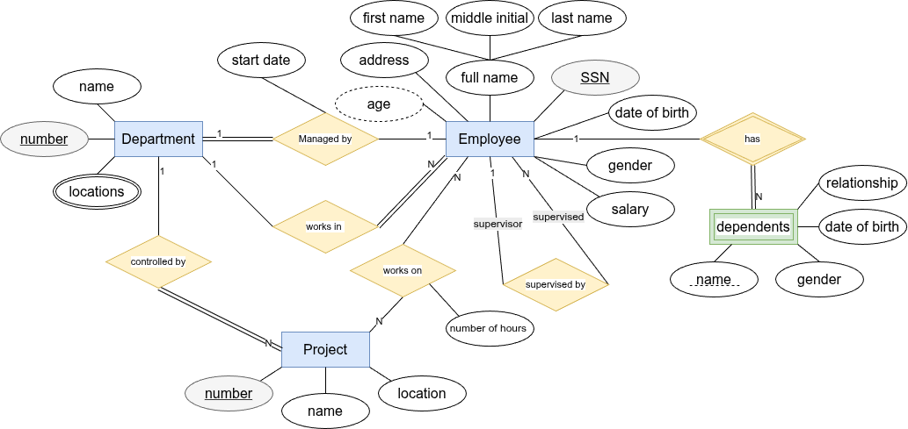{fig-align="center" width="100%"}

::: callout-note
## Reading the diagram

- **Double lines** connecting Employee to *works in* and Employee to *has* indicate **total participation**.
- **M and N labels** show cardinality: M:N for Works_On, N:1 for WorksFor, 1:1 for Manages.
- `Locations` (double oval) is a multivalued attribute of DEPARTMENT.
- `Age` (dashed oval) is derived from `Bdate`.
- `Has_Dependent` is a **double diamond** (identifying relationship).
- `DEPENDENT` is a **double rectangle** (weak entity).
- `Dep_Name` with dashed underline is the **partial key** — uniquely identifies a dependent only combined with the owner employee's key.
:::

---

### Full Constraint Summary

| Relationship | Entities | Cardinality | EMPLOYEE side | Other entity side |
|-------------|---------|-------------|--------------|------------------|
| works in | EMPLOYEE – DEPARTMENT | N:1 | $(1,1)$ total *("exactly one")* | $(0,N)$ partial *(assumption — text silent)* |
| Managed by | EMPLOYEE – DEPARTMENT | 1:1 | $(0,1)$ partial | $(1,1)$ total |
| works on | EMPLOYEE – PROJECT | M:N | $(0,N)$ partial *("may work on several")* | $(0,N)$ partial *(assumption — text silent)* |
| controlled by | PROJECT – DEPARTMENT | N:1 | $(1,1)$ total (proj) | $(0,N)$ partial |
| supervised by | EMPLOYEE – EMPLOYEE | 1:N | $(0,1)$ partial (supervisee) | $(0,N)$ partial (supervisor) |
| has | EMPLOYEE – DEPENDENT | 1:N | $(0,N)$ partial | $(1,1)$ total (identifying) |

::: callout-important
## Stated vs. Assumed Constraints

The requirements text uses **"exactly one"** only for the Employee side of *WorksFor* and for *Manages/Controls/HasDependent* — those constraints are **directly stated**.

The Department side of *WorksFor* and both sides of *WorksOn* are **not addressed by the text**. In practice you must ask the stakeholder:

- *"Can a department exist with zero employees?"* → If no → total; if yes → partial.
- *"Can a project exist with no employees assigned yet?"* → If yes → partial.
- *"Must every employee work on at least one project?"* → If no → partial.

Until answered, the correct notation is **partial** $(0,N)$ or $(0,M)$ — never assume total without evidence.
:::

---

## Min-Max Notation

**Min-Max notation** (also called *structural constraints notation*) extends the basic Chen diagram by annotating each entity's side of a relationship line with a pair of numbers: $(min, max)$.

### What Do min and max Mean?

- **min** — the minimum number of relationship instances this entity *must* participate in:
  - $min = 0$ → participation is **optional** (equivalent to a single line in Chen)
  - $min \geq 1$ → participation is **mandatory** (equivalent to a double line in Chen)
- **max** — the maximum number of relationship instances this entity *can* participate in:
  - $max = 1$ → at most one
  - $max = N$ (or $\infty$) → no upper limit

| $(min,max)$ pair | English reading | Chen equivalent |
|------------------|----------------|----------------|
| $(0,1)$ | "zero or one" | Partial, cardinality 1 |
| $(1,1)$ | "exactly one" | Total, cardinality 1 |
| $(0,N)$ | "zero or more" | Partial, cardinality N |
| $(1,N)$ | "one or more" | Total, cardinality N |
| $(4,N)$ | "at least four" | Total, cardinality N |

### Placement Rule

The $(min, max)$ pair is written on the line **next to the entity it constrains**. The general form is:

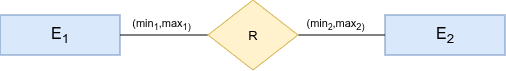{fig-align="center" width="70%"}

- An entity of type $E_1$ may be related to **at least $min_1$** and **at most $max_1$** entities of type $E_2$.
- Likewise, $min_2$ is the minimum number and $max_2$ is the maximum number of $E_1$ entities to which an $E_2$ entity is related.

**Example — EMPLOYEE and DEPARTMENT:**

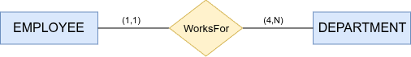{fig-align="center" width="70%"}

- $(1,1)$ next to EMPLOYEE: every employee works for **exactly one** department.
- $(4,N)$ next to DEPARTMENT: every department has **at least 4** employees (no upper limit).

### Company Database in Min-Max Notation

The table re-expresses every relationship from the Worked Example using $(min, max)$ pairs so you can compare them against the Chen diagram drawn earlier.

| Relationship | Entity A | $(min,max)$ on A | Entity B | $(min,max)$ on B |
|-------------|----------|-----------------|----------|-----------------|
| WorksFor | EMPLOYEE | $(1,1)$ | DEPARTMENT | $(4,N)$ |
| Manages | EMPLOYEE | $(0,1)$ | DEPARTMENT | $(1,1)$ |
| WorksOn | EMPLOYEE | $(1,N)$ | PROJECT | $(1,N)$ |
| Controls | PROJECT | $(1,1)$ | DEPARTMENT | $(0,N)$ |
| Supervises | EMPLOYEE (supervisee) | $(0,1)$ | EMPLOYEE (supervisor) | $(0,N)$ |
| HasDependent | EMPLOYEE | $(0,N)$ | DEPENDENT | $(1,1)$ |

::: callout-tip
**Why use Min-Max instead of Chen labels?**

Chen notation labels each relationship line with 1, N, or M — this captures the *maximum* cardinality but not the *minimum*. Min-Max adds the minimum, making it immediately clear whether participation is optional or mandatory without relying on single-vs-double lines. It is especially useful when writing precise business rules for a development team to implement.
:::

### Chen vs Min-Max: Side-by-Side Examples

Each example below shows the **same relationship drawn twice** — once in Chen notation (top) and once in Min-Max notation (bottom) — so you can see exactly how the two representations map onto each other.

---

#### Example 1 — Professor CHAIRS Department (One-to-One, partial / total)

**Business Requirements**

The university has several departments. Each department must have exactly one chairperson who must be a professor. A professor can chair at most one department. Some professors may not chair any department — the chairperson role is optional for professors. If a professor is appointed as chair, they must chair exactly one department. No department can exist without a chairperson.

::: {.callout-tip collapse="true"}
## Solution

**Relationship:** CHAIRS

| Property | Entity A — Professor | Entity B — Department |
|----------|---------------------|----------------------|
| Participation | Partial (optional) | Total (mandatory) |
| $(min,max)$ | $(0,1)$ | $(1,1)$ |
| Chen cardinality label | 1 | 1 |

**Diagram (Chen top / Min-Max bottom):**

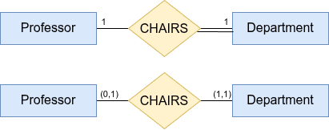{fig-align="center" width="75%"}

**Reading the relationship:**

- **Left → Right (LTR):** Each Professor chairs **0 or 1** Department.
- **Right → Left (RTL):** Each Department is chaired by **exactly 1** Professor.

**How to read — Chen (top):**

- The `1` on the Professor side and the `1` on the Department side tell us this is a **1:1** relationship.
- The **double line** on the Department side means Department participation is **total** (mandatory).
- The **single line** on the Professor side means Professor participation is **partial** (optional).

**How to read — Min-Max (bottom):**

| Pair | Placed next to | Meaning |
|------|---------------|---------|
| $(0,1)$ | Professor | A professor chairs **at most one** department — but is not required to chair any. |
| $(1,1)$ | Department | Every department has **exactly one** chair — mandatory, and only one. |

> **Key insight:** Chen told us the *ratio* (1:1) but left participation implicit in the line style. Min-Max spells out both the minimum and maximum in a single, self-documenting pair.
:::

---

#### Example 2 — Student HOLDS_PERMIT Parking_Permit (One-to-One, both partial)

**Business Requirements**

Students may obtain a parking permit from the university. A student can have at most one parking permit. Some students don't have cars and therefore have no permit. Each parking permit is assigned to exactly one student, but permits can exist in the system before being assigned. If a student leaves, their permit becomes available for reassignment.

::: {.callout-tip collapse="true"}
## Solution

**Relationship:** HOLDS_PERMIT

| Property | Entity A — Student | Entity B — Parking_Permit |
|----------|-------------------|--------------------------|
| Participation | Partial (optional) | Partial (optional) |
| $(min,max)$ | $(0,1)$ | $(0,1)$ |
| Chen cardinality label | 1 | 1 |

**Assumption:** Permits can exist unassigned; not all students need permits.

**Diagram (Chen top / Min-Max bottom):**

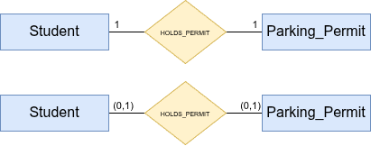{fig-align="center" width="75%"}

**Reading the relationship:**

- **Left → Right (LTR):** Each Student holds **0 or 1** Parking Permit.
- **Right → Left (RTL):** Each Parking Permit is held by **0 or 1** Student.

**How to read — Chen (top):**

- `1` on both sides → **1:1** relationship.
- **Single line** on both sides → participation is **partial** on both ends (neither student nor permit is required to be matched).

**How to read — Min-Max (bottom):**

| Pair | Placed next to | Meaning |
|------|---------------|---------|
| $(0,1)$ | Student | A student holds **at most one** parking permit — but may hold none. |
| $(0,1)$ | Parking_Permit | A parking permit is held by **at most one** student — but may be unassigned. |

> **Key insight:** Both sides are optional. Min-Max makes this unambiguous without having to check whether lines are single or double.
:::

::: {.callout-note collapse="true"}
## Representing & Implementing Reassignment ("Permit becomes available when student leaves")

The $(0,1)$:$(0,1)$ constraint captures a subtle real-world rule: a permit is **not destroyed** when a student leaves — it simply becomes unassigned and available for the next student. This must be modelled and enforced at the database level.

**Key design decisions:**

| Decision | Choice | Reason |
|----------|--------|--------|
| `student_id` nullable? | **Yes** (`NULL`) | A permit can exist without an owner |
| On student deletion | `ON DELETE SET NULL` | Permit survives; `student_id` becomes `NULL` |
| Permit lifecycle | `status` column (`AVAILABLE` / `ASSIGNED` / `SUSPENDED`) | Tracks whether permit is ready to reassign |

**SQL implementation:**

```sql
CREATE TABLE ParkingPermit (
    permit_id  VARCHAR(20)  PRIMARY KEY,
    issue_date DATE         NOT NULL,
    status     ENUM('AVAILABLE', 'ASSIGNED', 'SUSPENDED') DEFAULT 'AVAILABLE',
    student_id INT          NULL,   -- NULL = unassigned
    FOREIGN KEY (student_id) REFERENCES Student(student_id)
        ON DELETE SET NULL          -- Critical for reassignment!
);

-- When student leaves:
DELETE FROM Student WHERE student_id = 123;
-- → DB automatically sets permit.student_id = NULL via ON DELETE SET NULL
-- → Permit status can be updated to 'AVAILABLE' via trigger
```

**Why `ON DELETE SET NULL` — not `ON DELETE CASCADE`?**

- `CASCADE` would **delete** the permit when the student is removed — destroying a physical asset the university still owns.
- `SET NULL` **releases** the permit back into the pool, preserving it for the next student.

**Optionally, a trigger can automate the status reset:**

```sql
CREATE OR REPLACE FUNCTION release_permit()
RETURNS TRIGGER AS $$
BEGIN
    UPDATE ParkingPermit
    SET    status = 'AVAILABLE'
    WHERE  student_id = OLD.student_id;
    RETURN OLD;
END;
$$ LANGUAGE plpgsql;

CREATE TRIGGER trg_release_permit
AFTER DELETE ON Student
FOR EACH ROW EXECUTE FUNCTION release_permit();
```

> The ER diagram's $(0,1)$:$(0,1)$ pairs say nothing about *how* to implement reassignment — that detail lives entirely in the physical schema. This is a good example of why ER modelling and physical implementation are separate concerns.
:::

---

#### Example 3 — Department OFFERS Course (One-to-Many, both mandatory)

**Business Requirements**

Every department in the university must offer at least one course. A course must be offered by exactly one department. Departments can offer multiple courses. Courses cannot exist without being associated with a department. New departments must create at least one course within their first semester.

::: {.callout-tip collapse="true"}
## Solution

**Relationship:** OFFERS

| Property | Entity A — Department | Entity B — Course |
|----------|----------------------|------------------|
| Participation | Total (mandatory) | Total (mandatory) |
| $(min,max)$ | $(1,N)$ | $(1,1)$ |
| Chen cardinality label | N | 1 |

**Assumption:** Every department must offer courses; cross-listing handled separately.

**Diagram (Chen top / Min-Max bottom):**

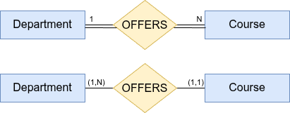{fig-align="center" width="75%"}

**Reading the relationship:**

- **Left → Right (LTR):** Each Department offers **1 or more** Courses.
- **Right → Left (RTL):** Each Course is offered by **exactly 1** Department.

**How to read — Chen (top):**

- `1` on Department, `N` on Course → **1:N** relationship.
- **Double line** on both sides → participation is **total** on both ends.

**How to read — Min-Max (bottom):**

| Pair | Placed next to | Meaning |
|------|---------------|---------|
| $(1,N)$ | Department | Every department offers **at least one** course (no upper limit). |
| $(1,1)$ | Course | Every course is offered by **exactly one** department. |

> **Key insight:** Chen's double lines on both sides simply said "mandatory on both ends." Min-Max adds the upper bound: a department can offer *many* courses, but a course belongs to *only one* department.
:::

::: {.callout-warning collapse="true"}
## Timing Constraint: "Within the first semester"

The $(1,N)$ constraint on Department enforces that every department has **at least one course in the current database state** — but it says nothing about *when* that course must be created. The "within first semester" requirement is a temporal business rule that a static ER diagram cannot capture.

It must be enforced through one of the following mechanisms:

- **Application workflow** — block department activation (e.g., status remains `PENDING`) until at least one course is created and linked.
- **Database triggers with status flags** — a `BEFORE INSERT` or `AFTER UPDATE` trigger checks the department's course count before allowing its status to change to `ACTIVE`.
- **Business process controls** — documented policy enforced by administrators; not representable in a static ER model.

```sql
-- Example: prevent activating a department with no courses
CREATE OR REPLACE FUNCTION check_dept_has_course()
RETURNS TRIGGER AS $$
BEGIN
    IF NEW.status = 'ACTIVE' THEN
        IF (SELECT COUNT(*) FROM Course WHERE dept_id = NEW.dept_id) = 0 THEN
            RAISE EXCEPTION
                'Department % cannot be activated without at least one course.', NEW.dept_id;
        END IF;
    END IF;
    RETURN NEW;
END;
$$ LANGUAGE plpgsql;

CREATE TRIGGER trg_dept_activation
BEFORE UPDATE ON Department
FOR EACH ROW EXECUTE FUNCTION check_dept_has_course();
```
:::

---

#### Example 4 — Professor ADVISES Student (One-to-Many, both partial)

**Business Requirements**

Professors may serve as academic advisors to students. A professor can advise multiple students. Some professors choose not to advise any students. A student may have at most one academic advisor. Some students, particularly freshmen, may not have an assigned advisor yet. Each advisor-student relationship is formalized through the advising system.

::: {.callout-tip collapse="true"}
## Solution

**Relationship:** ADVISES

| Property | Entity A — Professor | Entity B — Student |
|----------|---------------------|-------------------|
| Participation | Partial (optional) | Partial (optional) |
| $(min,max)$ | $(0,N)$ | $(0,1)$ |
| Chen cardinality label | N | 1 |

**Assumption:** Advising is voluntary for professors; freshmen and other students may be unassigned until they select an advisor.

**Diagram (Chen top / Min-Max bottom):**

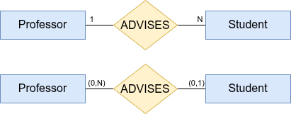{fig-align="center" width="75%"}

**Reading the relationship:**

- **Left → Right (LTR):** Each Professor advises **0 or more** Students.
- **Right → Left (RTL):** Each Student is advised by **0 or 1** Professor.

**How to read — Chen (top):**

- `1` on Professor, `N` on Student → **1:N** relationship.
- **Single line** on both sides → participation is **partial** on both ends.

**How to read — Min-Max (bottom):**

| Pair | Placed next to | Meaning |
|------|---------------|---------|
| $(0,N)$ | Professor | A professor may advise **any number** of students — or none at all. |
| $(0,1)$ | Student | A student may have **at most one** advisor — but is not required to have one. |

> **Key insight:** Chen indicated a 1:N ratio with optional participation, but gave no upper bound on the N side. Min-Max confirms there truly is no cap on how many students a professor can advise, while also confirming a student cannot have more than one.
:::

::: {.callout-note collapse="true"}
## Relationship Attributes: The ADVISES Relationship Has More to Say

The phrase *"Each advisor-student relationship is formalized through the advising system"* is a strong hint that **ADVISES is not a simple binary connection** — it carries descriptive information of its own. In ER modelling, when a relationship has data associated with it (not belonging to either entity alone), that data is modelled as **relationship attributes**.

Candidate attributes for ADVISES:

| Attribute | Type | Meaning |
|-----------|------|---------|
| `assignment_date` | DATE | When the advising relationship was established |
| `status` | ENUM(`ACTIVE`, `INACTIVE`, `PENDING`) | Current state of the advisory relationship |
| `end_date` | DATE (nullable) | When the relationship was formally terminated |
| `notes` | TEXT | Free-text notes entered by advisor or registrar |

**Revised ER diagram with relationship attributes:**

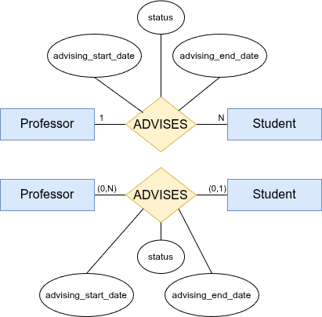{fig-align="center" width="80%"}

> **Design implication:** When a relationship has attributes, it is often a candidate for promotion to an **associative entity** (also called a relationship entity or junction table) — especially if other entities need to reference it. For example, if the advising record itself needs to be referenced by a report or an audit trail, `ADVISES` would become its own entity (e.g., `AdvisingRecord`) with a surrogate key.
:::

---

::: callout-note
**Reading template for Min-Max**

Given a pair $(min, max)$ placed next to entity $E$:

> "Each **[E]** participates in this relationship **at least $min$ time(s)** and **at most $max$ time(s)**."

When $min = 0$ the participation is **optional**; when $min \geq 1$ it is **mandatory**. When $max = N$ there is **no upper limit**; when $max = 1$ the entity participates in **at most one** instance.
:::

---

### Specific Value Constraints: $(0,3)$, $(2,5)$, and Beyond

Not every business rule fits neatly into the four standard patterns $(0,1)$, $(1,1)$, $(0,N)$, $(1,N)$. Min-Max notation allows **any non-negative integers** as the min and max values.

| Example | English meaning | Typical business rule |
|---------|----------------|-----------------------|
| $(0,3)$ | zero to three | A customer may place **at most 3** active orders at a time |
| $(2,5)$ | two to five | A project team must have **between 2 and 5** members |
| $(1,4)$ | one to four | An employee manages **at least 1, at most 4** direct reports |
| $(3,3)$ | exactly three | A committee seat is always filled by **exactly 3** co-chairs |

These constraints are **perfectly valid** at the conceptual level — they are precise expressions of real business rules that the common patterns simply cannot capture. Write them on your ER diagram exactly as you would any other $(min,max)$ pair.

::: callout-warning
**Conceptual validity ≠ automatic SQL enforcement**

Standard SQL foreign-key constraints only know how to enforce "must exist" (referential integrity). They have no mechanism to *count* how many rows a related entity participates in before accepting or rejecting a change. Specific value constraints such as $(0,3)$ or $(2,5)$ therefore **cannot be enforced by foreign keys alone**.
:::

#### How to Enforce Specific Value Constraints in the Database

Four complementary strategies exist, each with different trade-offs:

**1. `CHECK` Constraints with Subqueries**

Some DBMSs — notably **PostgreSQL** — permit a subquery inside a `CHECK` constraint, letting the database count related rows at write time.

```sql
-- PostgreSQL: enforce that a project has at most 5 members
ALTER TABLE WORKS_ON
  ADD CONSTRAINT chk_team_size
  CHECK (
    (SELECT COUNT(*)
     FROM   WORKS_ON w
     WHERE  w.pno = NEW.pno) <= 5
  );
```

> **Portability note:** MySQL, SQL Server, and SQLite do **not** support subqueries inside `CHECK` constraints. Using this approach ties the schema to a specific DBMS.

---

**2. Triggers (`BEFORE INSERT / UPDATE / DELETE`)**

Triggers fire automatically before (or after) a data-modification statement, giving you full procedural logic to count rows and raise an error.

```sql
-- PostgreSQL trigger: enforce (2,5) team size on WORKS_ON
CREATE OR REPLACE FUNCTION check_team_size()
RETURNS TRIGGER AS $$
DECLARE
  cnt INTEGER;
BEGIN
  SELECT COUNT(*) INTO cnt
  FROM   WORKS_ON
  WHERE  pno = NEW.pno;

  IF cnt >= 5 THEN
    RAISE EXCEPTION
      'Team size limit exceeded for project %: max 5 members.', NEW.pno;
  END IF;
  RETURN NEW;
END;
$$ LANGUAGE plpgsql;

CREATE TRIGGER trg_team_size_insert
BEFORE INSERT OR UPDATE ON WORKS_ON
FOR EACH ROW EXECUTE FUNCTION check_team_size();
```

```sql
-- Also enforce the minimum (2) on DELETE
CREATE OR REPLACE FUNCTION check_team_min()
RETURNS TRIGGER AS $$
DECLARE
  cnt INTEGER;
BEGIN
  -- Count remaining rows after the delete
  SELECT COUNT(*) - 1 INTO cnt
  FROM   WORKS_ON
  WHERE  pno = OLD.pno;

  IF cnt < 2 THEN
    RAISE EXCEPTION
      'Project % must retain at least 2 members.', OLD.pno;
  END IF;
  RETURN OLD;
END;
$$ LANGUAGE plpgsql;

CREATE TRIGGER trg_team_size_delete
BEFORE DELETE ON WORKS_ON
FOR EACH ROW EXECUTE FUNCTION check_team_min();
```

Triggers work across all major DBMSs (PostgreSQL, MySQL, SQL Server, Oracle) though the exact syntax differs.

---

**3. Application Logic**

Business rules that are hard to express in SQL can live in the application layer (Java, Python, Node.js, etc.). The application queries the current count before every insert or delete and rejects the operation when the constraint would be violated.

```python
# Python / SQLAlchemy example
def add_member_to_project(session, emp_ssn, proj_no):
    count = session.query(WorksOn)\
                   .filter_by(pno=proj_no)\
                   .count()
    if count >= 5:
        raise ValueError(
            f"Project {proj_no} already has the maximum of 5 members."
        )
    session.add(WorksOn(essn=emp_ssn, pno=proj_no))
    session.commit()
```

> **Caution:** Application-layer enforcement can be bypassed by direct database access tools (e.g., a DBA running a raw SQL script). Pair it with a trigger for defence-in-depth.

---

**4. Stored Procedures**

Encapsulate all insert/update/delete operations for the affected table inside stored procedures and revoke direct-write privileges from application users. The procedure performs the count check before executing the DML.

```sql
-- MySQL stored procedure enforcing (0,3) on ORDERS per CUSTOMER
DELIMITER $$
CREATE PROCEDURE add_order(IN p_cust_id INT, IN p_order_data VARCHAR(255))
BEGIN
  DECLARE v_count INT;

  SELECT COUNT(*) INTO v_count
  FROM   ORDERS
  WHERE  cust_id = p_cust_id;

  IF v_count >= 3 THEN
    SIGNAL SQLSTATE '45000'
      SET MESSAGE_TEXT =
        'Customer has reached the maximum of 3 active orders.';
  END IF;

  INSERT INTO ORDERS (cust_id, order_data)
  VALUES (p_cust_id, p_order_data);
END$$
DELIMITER ;
```

---

::: callout-note
**Summary: choosing an enforcement strategy**

| Strategy | Works in | Bypassed by direct SQL? | Notes |
|----------|----------|------------------------|-------|
| `CHECK` + subquery | PostgreSQL only | No | Least portable |
| Triggers | All major DBMSs | No | Best database-level guarantee |
| Application logic | Any | Yes (direct access) | Flexible; pair with triggers |
| Stored procedures | All major DBMSs | Only if user has direct write rights | Centralises business logic |

For production systems, **triggers** or **stored procedures** are the most reliable choices because they enforce the rule at the database level regardless of which client is writing data.
:::

---

## Crow's Foot Notation

**Crow's Foot notation** is an ER diagramming notation used to represent entities, attributes, and relationships. It is the standard notation adopted by most professional database design tools — MySQL Workbench, Lucidchart, draw.io, Visio, and ERwin — and is applicable at the **conceptual, logical, and physical** design stages, though it is most commonly encountered during logical and physical design in practice.

Entities are drawn as plain rectangular boxes; the relationship line carries small tick and arc symbols at each end. Those end symbols are called **crow's foot markers** because three diverging lines resemble a bird's foot.

### Symbol Reference

Each line end carries **two markers**. The marker *closest to the entity box* gives the **minimum**; the marker *furthest from the entity box* gives the **maximum**.

**Minimum markers (inner — nearest the entity box):**

| Symbol | Meaning |
|--------|---------|
| `|` (single vertical bar) | Mandatory — must participate ($min \geq 1$) |
| `o` (small open circle) | Optional — may not participate ($min = 0$) |

**Maximum markers (outer — away from the entity box):**

| Symbol | Meaning |
|--------|---------|
| `|` (single vertical bar) | At most one ($max = 1$) |
| `<` (three diverging lines = crow's foot) | Many — no upper limit ($max = N$) |

**Common combinations at a line end:**

| Symbol | Name | $(min,max)$ | Chen equivalent | Plain English |
|:------:|------|:-----------:|----------------|--------------|
| {width="100px"} | bar–bar `\|\|` | $(1,1)$ | Total, cardinality 1 | Exactly one |
| {width="100px"} | circle–bar `o\|` | $(0,1)$ | Partial, cardinality 1 | Zero or one |
| {width="100px"} | bar–crow's foot `\|<` | $(1,N)$ | Total, cardinality N | One or many |
| {width="100px"} | circle–crow's foot `o<` | $(0,N)$ | Partial, cardinality N | Zero or many |

### Reading Rule

Read the symbols at **entity B's end** of the line —they describe how many B instances can be associated with one A instance:

> "Each [Entity A] has **[outer marker reading]** **[inner marker reading]** [Entity B]."

**Example:** `DEPARTMENT ——|{ EMPLOYEE`

> "Each Department has **one or many** Employees." ($min = 1$, $max = N$)

### Crow's Foot Examples

Each example below shows a Crow's Foot diagram (top) alongside its Chen equivalent (bottom).

---

#### Example 1 — Person HAS Passport (One-to-One, both mandatory)

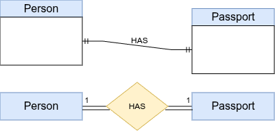{fig-align="center" width="70%"}

| End | Symbol | Reading |
|-----|--------|---------|
| Person side | `||` (bar–bar) | Every person holds **exactly one** passport. |
| Passport side | `||` (bar–bar) | Every passport belongs to **exactly one** person. |

> Both participations are total (mandatory) and the cardinality is 1:1 on both sides.

---

#### Example 2 — Employee IS ASSIGNED Office (One-to-One, Employee optional)

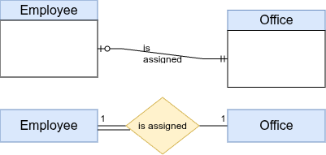{fig-align="center" width="70%"}

| End | Symbol | Reading |
|-----|--------|---------|
| Employee side | `o|` (circle–bar) | An employee may be assigned to **zero or one** office. |
| Office side | `||` (bar–bar) | Every office is assigned to **exactly one** employee. |

> Employee participation is partial (optional); Office participation is total (mandatory).

---

#### Example 3 — Customer PLACES Order (One-to-Many, both mandatory)

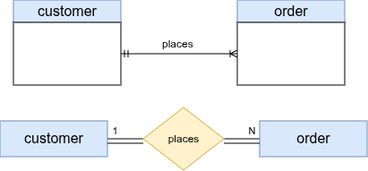{fig-align="center" width="70%"}

| End | Symbol | Reading |
|-----|--------|---------|
| Customer side | `||` (bar–bar) | Every order is placed by **exactly one** customer. |
| Order side | `|<` (bar–crow's foot) | Every customer places **one or many** orders. |

> Both participations are mandatory; cardinality is 1:N.

---

#### Textual Note — Extending Crow's Foot for Specific Upper Bounds

Standard Crow's Foot symbols can only express four combinations: $(0,1)$, $(1,1)$, $(0,N)$, $(1,N)$. When a business rule demands a **specific upper bound** (e.g., at most 3), the symbol alone is insufficient.

{fig-align="center" width="65%"}

In the diagram above, the CLASS side carries:

- The **circle–crow's foot** symbol `o<` — meaning *zero or many* in standard Crow's Foot.
- A **textual annotation** `(0,3)` written next to the symbol to narrow the upper bound to **at most 3**.

::: callout-note
**Why a textual note?**

The standard `o<` symbol means *unbounded many* ($max = N$). There is no dedicated Crow's Foot symbol for a finite upper limit such as 3. The widely adopted convention is to keep the closest-matching symbol (`o<` for zero-or-many) and add a parenthesised note — `(0,3)` — directly beside it to record the actual maximum. The `(1,1)` on the PROFESSOR side is read normally: every teaching instance belongs to exactly one professor.

This approach is also used in tools like ERwin and Visio when constraints exceed what the four standard symbols can express.
:::


::: callout-tip
**When to use which notation?**

| Situation | Best choice |
|-----------|------------|
| University course, exam, textbook exercise | **Chen** |
| Specifying precise business rules (exact min and max counts) | **Min-Max** |
| Design tool, project documentation, professional work | **Crow's Foot** |

All three notations encode the same information. Once you understand the underlying concepts, switching between notations is straightforward.
:::

---

## ER-to-Relational Mapping

Once the ER diagram is complete and verified, a **seven-step algorithm** mechanically converts every ER construct to a set of relational tables. Each step handles a specific ER construct; together they cover every legal combination.

::: callout-note
## Algorithm Overview

| Step | ER Construct | Mapping Rule |
|------|-------------|--------------|
| 1 | Strong entity type | One table per entity; flatten composites; omit derived; multivalued deferred to Step 6 |
| 2 | Weak entity type | Composite PK = owner PK + partial key; FK to owner with `ON DELETE CASCADE` |
| 3 | Binary 1:1 relationship | FK on the **total**-participation side (`NOT NULL`); both-partial → FK nullable |
| 4 | Binary 1:N relationship | FK on the **N-side**; `NOT NULL` if N-side is total, nullable if partial |
| 5 | Binary M:N relationship | Junction table; composite PK = both FKs; include relationship attributes |
| 6 | Multivalued attribute | New table; composite PK = owner FK + attribute value |
| 7 | N-ary relationship (n > 2) | New table; FKs from all $n$ participating entities; PK = all FKs |
:::

::: callout-note
## Formal Schema Notation

Each step shows the mapping result in **formal schema notation** — a compact, implementation-independent description — before the SQL. Shorthand used throughout:

| Symbol | Meaning | Example |
|--------|---------|---------|
| First attribute(s) | Primary Key (PK) — underlined in textbook diagrams | `EMPLOYEE(Ssn, ...)` |
| `NN` | `NOT NULL` | `Fname NN` |
| `U` | `UNIQUE` | `Dname NN U` |
| `CK(expr)` | `CHECK` constraint | `Salary CK(Salary >= 0)` |
| `→TABLE` | Foreign Key referencing TABLE | `Dno NN→DEPARTMENT` |
| Composite PK | Two or more leading FK attributes | `WORKS_ON(Essn→EMP, Pno→PRJ, ...)` |
:::

---

### Step 1 — Strong Entity Types

**Rule:** For each strong entity type $E$, create one relation. **Flatten** composite attributes (e.g., `Name` → `Fname`, `Minit`, `Lname`). **Omit** derived attributes — compute them at query time. Multivalued attributes are handled in Step 6.

**ER Source — Company Database:**

{fig-align="center" width="90%"}

#### Formal Schema

```text
EMPLOYEE(Ssn, Fname NN, Minit, Lname NN, Bdate,
         Address,
         Gender CK(Gender IN ('M','F')),
         Salary NN CK(Salary >= 0))
    -- Super_ssn added in Step 4b  |  Dno added in Step 4a

DEPARTMENT(Dnumber CK(Dnumber > 0), Dname NN U)
    -- Mgr_ssn and Mgr_start_date added in Step 3a

PROJECT(Pnumber CK(Pnumber > 0), Pname NN U, Plocation,
        Dnum NN→DEPARTMENT)
```

#### SQL Implementation

##### EMPLOYEE

```sql
CREATE TABLE Employee (
    ssn             CHAR(9)         PRIMARY KEY
                    CHECK (ssn ~ '^\d{9}$'),            -- fixed-length national ID, 9 digits
    fname           VARCHAR(15)     NOT NULL,
    minit           CHAR(1),                            -- nullable: not everyone has a middle initial
    lname           VARCHAR(15)     NOT NULL,
    -- composite 'Name' flattened into fname, minit, lname above ↑
    bdate           DATE,                               -- stored; derived 'Age' is omitted
    address         VARCHAR(100),                       -- single simple attribute as shown in ER diagram
    gender          CHAR(1)         CHECK (gender IN ('M', 'F')),
    salary          NUMERIC(10, 2)  NOT NULL CHECK (salary >= 0)
    -- super_ssn (self-referencing FK) added in Step 4b
    -- dno (FK to Department)        added in Step 4a
);
```

> **Derived attribute rule:** `Age` is derived from `bdate` — do **not** store it.
> Compute on demand: `EXTRACT(YEAR FROM AGE(bdate)) AS age`

##### DEPARTMENT

```sql
CREATE TABLE Department (
    dnumber         INT             PRIMARY KEY CHECK (dnumber > 0),
    dname           VARCHAR(30)     NOT NULL UNIQUE
    -- mgr_ssn and mgr_start_date added in Step 3a
);
```

##### PROJECT

```sql
CREATE TABLE Project (
    pnumber         INT             PRIMARY KEY CHECK (pnumber > 0),
    pname           VARCHAR(25)     NOT NULL UNIQUE,
    plocation       VARCHAR(30),
    dnum            INT             NOT NULL,           -- total participation → NOT NULL
    FOREIGN KEY (dnum) REFERENCES Department(dnumber)
        ON DELETE RESTRICT                             -- cannot delete dept with active projects
        ON UPDATE CASCADE
);
```

---

### Step 2 — Weak Entity Types

**Rule:** For each weak entity type $W$ with owner $E$:

- Create table $R$; include all attributes of $W$.
- Add owner's PK as a FK column (`NOT NULL`).
- PK of $R$ = **owner FK + partial key** of $W$ (composite).
- Use `ON DELETE CASCADE` — the weak entity has no independent existence.

**ER Source — DEPENDENT (weak entity, owner: EMPLOYEE):**

```{mermaid}
%%| eval: true
%%| echo: false
%%| fig-align: center
erDiagram
    EMPLOYEE {
        char_9_ Ssn PK
        varchar Fname
        varchar Lname
    }
    DEPENDENT {
        char_9_ Essn FK
        varchar Dependent_name PK
        char Gender
        date Bdate
        varchar Relationship
    }
    EMPLOYEE ||--|{ DEPENDENT : "HAS (identifying relationship)"
```

#### Formal Schema

```text
DEPENDENT(Essn NN→EMPLOYEE, Dependent_name NN,
          Gender CK(Gender IN ('M','F')),
          Bdate,
          Relationship NN CK(Relationship IN
              ('Spouse','Son','Daughter','Father','Mother','Sibling')))
    PK: (Essn, Dependent_name)       -- composite: owner FK + partial key
    ON DELETE CASCADE                -- weak entity: destroyed with its owner
```

#### SQL Implementation

```sql
CREATE TABLE Dependent (
    essn            CHAR(9)         NOT NULL,               -- owner FK (part of composite PK)
    dependent_name  VARCHAR(15)     NOT NULL,               -- partial key
    gender          CHAR(1)         CHECK (gender IN ('M', 'F')),
    bdate           DATE,
    relationship    VARCHAR(10)     NOT NULL
                    CHECK (relationship IN
                        ('Spouse', 'Son', 'Daughter', 'Father', 'Mother', 'Sibling')),
    PRIMARY KEY (essn, dependent_name),                     -- composite PK
    FOREIGN KEY (essn) REFERENCES Employee(ssn)
        ON DELETE CASCADE                                   -- employee deleted → all dependents deleted
        ON UPDATE CASCADE
);
```

::: callout-warning
**`ON DELETE CASCADE` is mandatory for weak entities.** A dependent cannot exist without its owner employee. Omitting it violates the identifying relationship semantics.
:::

---

### Step 3 — Binary 1:1 Relationships

Three participation scenarios produce different mapping decisions:

| Scenario | Mapping rule | FK nullable? |
|----------|-------------|-------------|
| **(a)** One total / one partial | FK on the **total** side; include relationship attrs | `NOT NULL` |
| **(b)** Both total | Merge tables **or** cross-FKs with `DEFERRABLE` | Both `NOT NULL` |
| **(c)** Both partial | FK on more stable entity | `NULL` allowed |

#### (a) MANAGES — Department (total) : Employee (partial)

**ER Source:**

```{mermaid}
%%| eval: true
%%| echo: false
%%| fig-align: center
erDiagram
    EMPLOYEE {
        char_9_ Ssn PK
        varchar Fname
        varchar Lname
    }
    DEPARTMENT {
        int Dnumber PK
        varchar Dname
        char_9_ Mgr_ssn FK "NOT NULL (total)"
        date Mgr_start_date
    }
    EMPLOYEE ||--o{ DEPARTMENT : "MANAGES (1:1)"
```

**Formal Schema** — FK and relationship attribute added to DEPARTMENT (total side):

```text
DEPARTMENT(Dnumber CK(Dnumber > 0), Dname NN U,
           Mgr_ssn NN→EMPLOYEE,
           Mgr_start_date NN)
    -- Mgr_ssn NOT NULL: every department must have exactly one manager (total participation)
    -- Mgr_start_date is a relationship attribute of MANAGES
```

**SQL:**

```sql
ALTER TABLE Department
    ADD COLUMN mgr_ssn          CHAR(9)  NOT NULL,          -- total → NOT NULL
    ADD COLUMN mgr_start_date   DATE     NOT NULL DEFAULT CURRENT_DATE,
    ADD CONSTRAINT fk_dept_manager
        FOREIGN KEY (mgr_ssn) REFERENCES Employee(ssn)
        ON DELETE RESTRICT                                  -- cannot delete an active manager
        ON UPDATE CASCADE;
```

#### (b) Both-Total — Person : Passport

**ER Source:**

```{mermaid}
%%| eval: true
%%| echo: false
%%| fig-align: center
erDiagram
    PERSON {
        char_14_ National_id PK
        varchar Full_name
        date Birth_date
        char_9_ Passport_number FK "NOT NULL UNIQUE"
    }
    PASSPORT {
        char_9_ Passport_number PK
        date Issue_date
        date Expiry_date
        char_2_ Country
    }
    PERSON ||--|| PASSPORT : "HAS (both total)"
```

**Formal Schema:**

```text
PASSPORT(Passport_number, Issue_date NN,
         Expiry_date NN CK(Expiry_date > Issue_date),
         Country NN)

PERSON(National_id, Full_name NN, Birth_date NN,
       Passport_number NN U→PASSPORT)
    -- NN + UNIQUE together enforce 1:1
    -- DEFERRABLE needed: Person and Passport must be inserted in a single transaction
```

**SQL:**

```sql
CREATE TABLE Passport (
    passport_number CHAR(9)     PRIMARY KEY,
    issue_date      DATE        NOT NULL,
    expiry_date     DATE        NOT NULL CHECK (expiry_date > issue_date),
    country         CHAR(2)     NOT NULL                    -- ISO 3166-1 alpha-2
);

CREATE TABLE Person (
    national_id     CHAR(14)    PRIMARY KEY,
    full_name       VARCHAR(60) NOT NULL,
    birth_date      DATE        NOT NULL,
    passport_number CHAR(9)     NOT NULL UNIQUE,            -- total → NOT NULL; UNIQUE enforces 1:1
    FOREIGN KEY (passport_number) REFERENCES Passport(passport_number)
        ON DELETE RESTRICT
        ON UPDATE CASCADE
        DEFERRABLE INITIALLY DEFERRED                       -- allow inserting both in one transaction
);
```

#### (c) Both-Partial — Employee : ParkingSpot

**ER Source:**

```{mermaid}
%%| eval: true
%%| echo: false
%%| fig-align: center
erDiagram
    EMPLOYEE {
        char_9_ Ssn PK
        int Spot_id FK "NULL (partial)"
    }
    PARKING_SPOT {
        int Spot_id PK
        varchar Location
        varchar Status
    }
    EMPLOYEE |o--o| PARKING_SPOT : "ASSIGNED_TO (both partial)"
```

**Formal Schema:**

```text
EMPLOYEE(..., Spot_id→PARKING_SPOT)
    -- Spot_id nullable: partial participation on both sides
    -- ON DELETE SET NULL: spot freed automatically when employee departs
```

**SQL:**

```sql
ALTER TABLE Employee
    ADD COLUMN spot_id INT NULL,                            -- partial → nullable
    ADD CONSTRAINT fk_emp_parking
        FOREIGN KEY (spot_id) REFERENCES ParkingSpot(spot_id)
        ON DELETE SET NULL                                  -- spot freed when employee leaves
        ON UPDATE CASCADE;
```

---

### Step 4 — Binary 1:N Relationships

**Rule:** Add the **1-side's PK** as a FK column to the **N-side** table; include any relationship attributes on the N-side.

| N-side participation | FK nullability | Typical FK action |
|---------------------|---------------|------------------|
| **Total** | `NOT NULL` | `RESTRICT` (protect parent) |
| **Partial** | `NULL` allowed | `SET NULL` or `SET DEFAULT` |

#### (a) WORKS_FOR — Department 1 : N Employee (Employee total)

**ER Source:**

{fig-align="center" width="75%"}

**Formal Schema** — FK added to EMPLOYEE (N-side, total):

```text
EMPLOYEE(Ssn, Fname NN, Minit, Lname NN, Bdate,
         Address,
         Gender    CK(Gender IN ('M','F')),
         Salary    NN CK(Salary >= 0),
         Super_ssn →EMPLOYEE,
         Dno       NN→DEPARTMENT)
    -- Dno NOT NULL: every employee must belong to exactly one department (total)
```

**SQL:**

```sql
ALTER TABLE Employee
    ADD COLUMN dno INT NOT NULL,                            -- total → NOT NULL
    ADD CONSTRAINT fk_emp_dept
        FOREIGN KEY (dno) REFERENCES Department(dnumber)
        ON DELETE RESTRICT                                  -- cannot remove dept with employees
        ON UPDATE CASCADE;
```

#### (b) SUPERVISES — Employee self-references itself (both sides partial)

**ER Source:**

```{mermaid}
%%| eval: true
%%| echo: false
%%| fig-align: center
erDiagram
    EMPLOYEE {
        char_9_ Ssn PK
        char_9_ Super_ssn FK "NULL (partial)"
        varchar Fname
        varchar Lname
    }
    EMPLOYEE }o--o| EMPLOYEE : "SUPERVISES (self-referencing 1:N)"
```

**Formal Schema:**

```text
EMPLOYEE(..., Super_ssn→EMPLOYEE)
    -- Super_ssn nullable: top executive has no supervisor (partial on both sides)
    -- ON DELETE SET NULL: subordinates become unmanaged when supervisor is removed
```

**SQL:**

```sql
ALTER TABLE Employee
    ADD COLUMN super_ssn CHAR(9) NULL,                      -- partial → nullable
    ADD CONSTRAINT fk_emp_supervisor
        FOREIGN KEY (super_ssn) REFERENCES Employee(ssn)
        ON DELETE SET NULL                                  -- supervisor deleted → subordinates unmanaged
        ON UPDATE CASCADE;
```

::: callout-note
**Self-referencing FK** — the FK points back to the same table (`Employee` references `Employee`). The root of the reporting hierarchy has `super_ssn = NULL`.
:::

#### (c) CONTROLS — Department 1 : N Project (Project total)

Already handled in Step 1: `Project.dnum NOT NULL` was declared with its FK. **No further action needed.**

---

### Step 5 — Binary M:N Relationships

**Rule:** Create a **junction table** $R$. Add both entity PKs as FK columns. PK of $R$ = combination of both FKs (both are `NOT NULL` since they form the key). Include relationship attributes as additional columns.

#### WORKS_ON — Employee M:N Project (relationship attribute: Hours)

**ER Source:**

{fig-align="center" width="75%"}

**Formal Schema:**

```text
WORKS_ON(Essn→EMPLOYEE, Pno→PROJECT,
         Hours CK(Hours >= 0 AND Hours <= 168))
    PK: (Essn, Pno)
    -- Both FKs are NOT NULL (they form the composite PK)
    -- ON DELETE CASCADE: remove assignment when employee leaves or project is cancelled
```

**SQL:**

```sql
CREATE TABLE Works_On (
    essn    CHAR(9)         NOT NULL,
    pno     INT             NOT NULL,
    hours   NUMERIC(5, 1)   CHECK (hours >= 0 AND hours <= 168),   -- max realistic work hours/week
    PRIMARY KEY (essn, pno),
    FOREIGN KEY (essn) REFERENCES Employee(ssn)
        ON DELETE CASCADE                                   -- employee leaves → remove assignments
        ON UPDATE CASCADE,
    FOREIGN KEY (pno)  REFERENCES Project(pnumber)
        ON DELETE CASCADE                                   -- project cancelled → remove assignments
        ON UPDATE CASCADE
);
```

::: callout-note
**`CASCADE` vs `RESTRICT` on junction tables:**

| Junction row has … | Recommended action |
|--------------------|--------------------|
| No independent meaning (pure association) | `CASCADE` — remove the link when either entity is removed |
| Independent business meaning (e.g., a contract, a grade) | `RESTRICT` — preserve the record even after one entity is deleted |
:::

---

### Step 6 — Multivalued Attributes

**Rule:** For each multivalued attribute $A$ on entity $E$, create a new table $R$. PK of $R$ = (owner FK + attribute value). Use `ON DELETE CASCADE`.

#### DEPT_LOCATIONS — multivalued `Locations` on Department

**ER Source:**

```{mermaid}
%%| eval: true
%%| echo: false
%%| fig-align: center
erDiagram
    DEPARTMENT {
        int Dnumber PK
        varchar Dname
    }
    DEPT_LOCATIONS {
        int Dnumber FK
        varchar Dlocation PK
    }
    DEPARTMENT ||--|{ DEPT_LOCATIONS : "has locations (multivalued)"
```

**Formal Schema:**

```text
DEPT_LOCATIONS(Dnumber→DEPARTMENT, Dlocation NN)
    PK: (Dnumber, Dlocation)     -- composite PK prevents duplicate locations per dept
    ON DELETE CASCADE
```

**SQL:**

```sql
CREATE TABLE Dept_Locations (
    dnumber     INT             NOT NULL,
    dlocation   VARCHAR(30)     NOT NULL,
    PRIMARY KEY (dnumber, dlocation),                       -- composite PK prevents duplicates
    FOREIGN KEY (dnumber) REFERENCES Department(dnumber)
        ON DELETE CASCADE                                   -- department deleted → all locations deleted
        ON UPDATE CASCADE
);
```

#### EMPLOYEE_PHONES — multivalued `Phone_numbers` on Employee

**ER Source:**

```{mermaid}
%%| eval: true
%%| echo: false
%%| fig-align: center
erDiagram
    EMPLOYEE {
        char_9_ Ssn PK
        varchar Fname
    }
    EMPLOYEE_PHONES {
        char_9_ Ssn FK
        varchar Phone_type PK
        varchar Phone_number
    }
    EMPLOYEE ||--|{ EMPLOYEE_PHONES : "has phones (multivalued)"
```

**Formal Schema:**

```text
EMPLOYEE_PHONES(Ssn→EMPLOYEE,
                Phone_type NN CK(Phone_type IN ('Mobile','Home','Work')),
                Phone_number NN CK(Phone_number ~ '^\+?[\d\s\-()]{7,20}$'))
    PK: (Ssn, Phone_type)        -- one number per type per employee
    ON DELETE CASCADE
```

**SQL:**

```sql
CREATE TABLE Employee_Phones (
    ssn          CHAR(9)        NOT NULL,
    phone_type   VARCHAR(10)    NOT NULL CHECK (phone_type IN ('Mobile', 'Home', 'Work')),
    phone_number VARCHAR(20)    NOT NULL
                 CHECK (phone_number ~ '^\+?[\d\s\-\(\)]{7,20}$'),
    PRIMARY KEY (ssn, phone_type),                          -- one number per type per employee
    FOREIGN KEY (ssn) REFERENCES Employee(ssn)
        ON DELETE CASCADE
        ON UPDATE CASCADE
);
```

---

### Step 7 — N-ary Relationships (n > 2)

**Rule:** Create a new table $R$. Add FKs from all $n$ participating entity tables. PK of $R$ = combination of all FKs. Include any relationship attributes as additional columns.

#### SUPPLY — ternary (Supplier × Project × Part)

*A supplier supplies a specific part to a specific project.*

**ER Source:**

```{mermaid}
%%| eval: true
%%| echo: false
%%| fig-align: center
erDiagram
    SUPPLIER {
        int Supplier_id PK
        varchar Sname
    }
    PROJECT {
        int Pnumber PK
        varchar Pname
    }
    PART {
        int Part_id PK
        varchar Part_name
    }
    SUPPLY {
        int Supplier_id FK
        int Project_id  FK
        int Part_id     FK
        int Quantity
        numeric Unit_price
        date Supply_date
    }
    SUPPLIER ||--o{ SUPPLY : "provides"
    PROJECT  ||--o{ SUPPLY : "receives"
    PART     ||--o{ SUPPLY : "used_in"
```

**Formal Schema:**

```text
SUPPLY(Supplier_id→SUPPLIER, Project_id→PROJECT, Part_id→PART,
       Quantity    NN CK(Quantity > 0),
       Unit_price  NN CK(Unit_price >= 0),
       Supply_date NN)
    PK: (Supplier_id, Project_id, Part_id)
    -- All three FKs are NOT NULL (they form the composite PK)
    -- ON DELETE RESTRICT: preserve supply records even if entities change
```

**SQL:**

```sql
CREATE TABLE Supply (
    supplier_id     INT             NOT NULL,
    project_id      INT             NOT NULL,
    part_id         INT             NOT NULL,
    quantity        INT             NOT NULL CHECK (quantity > 0),
    unit_price      NUMERIC(10, 2)  NOT NULL CHECK (unit_price >= 0),
    supply_date     DATE            NOT NULL DEFAULT CURRENT_DATE,
    PRIMARY KEY (supplier_id, project_id, part_id),         -- all three FKs form composite PK
    FOREIGN KEY (supplier_id) REFERENCES Supplier(supplier_id)
        ON DELETE RESTRICT ON UPDATE CASCADE,
    FOREIGN KEY (project_id)  REFERENCES Project(pnumber)
        ON DELETE RESTRICT ON UPDATE CASCADE,
    FOREIGN KEY (part_id)     REFERENCES Part(part_id)
        ON DELETE RESTRICT ON UPDATE CASCADE
);
```

---

### FK Referential Action Reference

When a referenced row is deleted or its PK is updated, the DBMS applies the declared action:

| Action | On `DELETE` | On `UPDATE` | Best for |
|--------|------------|------------|---------|
| `RESTRICT` *(default)* | Block delete if child rows exist | Block update | Records with independent business meaning |
| `CASCADE` | Delete child rows automatically | Propagate the new PK value | Weak entities; purely associative junction rows |
| `SET NULL` | Set FK column(s) to `NULL` | Set FK column(s) to `NULL` | Optional (partial) relationships |
| `SET DEFAULT` | Set FK column(s) to their declared default | Set FK column(s) to default | Reassign to a fallback/placeholder entity |
| `NO ACTION` | Like `RESTRICT` but checked at end of transaction | Same | Deferred constraint checking |

---

### NULL Summary

| Situation | FK nullable? | Typical referential action |
|-----------|-------------|--------------------------|
| Weak entity FK to owner | **NOT NULL** (part of PK) | `CASCADE` |
| 1:1 — FK on total-participation side | **NOT NULL** | `RESTRICT` |
| 1:1 — FK on partial-participation side | `NULL` allowed | `SET NULL` |
| 1:N — N-side **total** participation | **NOT NULL** | `RESTRICT` |
| 1:N — N-side **partial** participation | `NULL` allowed | `SET NULL` |
| M:N junction table FKs | **NOT NULL** (part of PK) | `CASCADE` |
| N-ary junction table FKs | **NOT NULL** (part of PK) | `RESTRICT` |
| Self-referencing FK (supervisor) | `NULL` allowed | `SET NULL` |

---

## Final Company Database Schema

### Formal Schema (Complete)

```text
EMPLOYEE(Ssn, Fname NN, Minit, Lname NN, Bdate,
         Address,
         Gender    CK(Gender IN ('M','F')),
         Salary    NN CK(Salary >= 0),
         Super_ssn →EMPLOYEE,
         Dno       NN→DEPARTMENT)

DEPARTMENT(Dnumber CK(Dnumber > 0), Dname NN U,
           Mgr_ssn NN→EMPLOYEE, Mgr_start_date NN)

DEPT_LOCATIONS(Dnumber→DEPARTMENT, Dlocation NN)
    PK: (Dnumber, Dlocation)

PROJECT(Pnumber CK(Pnumber > 0), Pname NN U, Plocation,
        Dnum NN→DEPARTMENT)

WORKS_ON(Essn→EMPLOYEE, Pno→PROJECT,
         Hours CK(Hours >= 0 AND Hours <= 168))
    PK: (Essn, Pno)

DEPENDENT(Essn→EMPLOYEE, Dependent_name NN,
          Gender CK(Gender IN ('M','F')),
          Bdate,
          Relationship NN CK(Relationship IN
              ('Spouse','Son','Daughter','Father','Mother','Sibling')))
    PK: (Essn, Dependent_name)
```

### Full SQL Script (dependency order)

```sql
-- ============================================================
-- Step 1b: Strong Entity — Department  (created first; no FK deps)
-- ============================================================
CREATE TABLE Department (
    dnumber         INT             PRIMARY KEY CHECK (dnumber > 0),
    dname           VARCHAR(30)     NOT NULL UNIQUE,
    mgr_ssn         CHAR(9)         NOT NULL,           -- Step 3a: MANAGES (total) → NOT NULL
    mgr_start_date  DATE            NOT NULL DEFAULT CURRENT_DATE
    -- FK to Employee added via ALTER after Employee is created (circular dep)
);

-- ============================================================
-- Step 1a: Strong Entity — Employee  (depends on Department)
-- ============================================================
CREATE TABLE Employee (
    ssn             CHAR(9)         PRIMARY KEY
                    CHECK (ssn ~ '^\d{9}$'),
    fname           VARCHAR(15)     NOT NULL,
    minit           CHAR(1),
    lname           VARCHAR(15)     NOT NULL,
    bdate           DATE,                               -- 'Age' is derived → not stored
    address         VARCHAR(100),                       -- single simple attribute as shown in ER diagram
    gender          CHAR(1)         CHECK (gender IN ('M', 'F')),
    salary          NUMERIC(10, 2)  NOT NULL CHECK (salary >= 0),
    super_ssn       CHAR(9)         NULL,               -- Step 4b: self-ref, partial → nullable
    dno             INT             NOT NULL,            -- Step 4a: WORKS_FOR, total → NOT NULL
    FOREIGN KEY (super_ssn) REFERENCES Employee(ssn)
        ON DELETE SET NULL  ON UPDATE CASCADE,
    FOREIGN KEY (dno)       REFERENCES Department(dnumber)
        ON DELETE RESTRICT  ON UPDATE CASCADE
);

-- Close the circular dependency: 
ALTER TABLE Department
    ADD CONSTRAINT fk_dept_manager
        FOREIGN KEY (mgr_ssn) REFERENCES Employee(ssn)
        ON DELETE RESTRICT ON UPDATE CASCADE;

-- ============================================================
-- Step 1c: Strong Entity — Project  (depends on Department)
-- ============================================================
CREATE TABLE Project (
    pnumber         INT             PRIMARY KEY CHECK (pnumber > 0),
    pname           VARCHAR(25)     NOT NULL UNIQUE,
    plocation       VARCHAR(30),
    dnum            INT             NOT NULL,            -- Step 4a: CONTROLS, total → NOT NULL
    FOREIGN KEY (dnum) REFERENCES Department(dnumber)
        ON DELETE RESTRICT ON UPDATE CASCADE
);

-- ============================================================
-- Step 2: Weak Entity — Dependent (owner: Employee)
-- ============================================================
CREATE TABLE Dependent (
    essn            CHAR(9)         NOT NULL,           -- owner FK (part of composite PK)
    dependent_name  VARCHAR(15)     NOT NULL,           -- partial key
    gender          CHAR(1)         CHECK (gender IN ('M', 'F')),
    bdate           DATE,
    relationship    VARCHAR(10)     NOT NULL
                    CHECK (relationship IN
                        ('Spouse', 'Son', 'Daughter', 'Father', 'Mother', 'Sibling')),
    PRIMARY KEY (essn, dependent_name),
    FOREIGN KEY (essn) REFERENCES Employee(ssn)
        ON DELETE CASCADE ON UPDATE CASCADE             -- weak entity: cascade is mandatory
);

-- ============================================================
-- Step 5: M:N Junction — Works_On (Employee × Project)
-- ============================================================
CREATE TABLE Works_On (
    essn    CHAR(9)         NOT NULL,
    pno     INT             NOT NULL,
    hours   NUMERIC(5, 1)   CHECK (hours >= 0 AND hours <= 168),
    PRIMARY KEY (essn, pno),
    FOREIGN KEY (essn) REFERENCES Employee(ssn)
        ON DELETE CASCADE ON UPDATE CASCADE,
    FOREIGN KEY (pno)  REFERENCES Project(pnumber)
        ON DELETE CASCADE ON UPDATE CASCADE
);

-- ============================================================
-- Step 6: Multivalued — Dept_Locations (Department.locations)
-- ============================================================
CREATE TABLE Dept_Locations (
    dnumber     INT             NOT NULL,
    dlocation   VARCHAR(30)     NOT NULL,
    PRIMARY KEY (dnumber, dlocation),
    FOREIGN KEY (dnumber) REFERENCES Department(dnumber)
        ON DELETE CASCADE ON UPDATE CASCADE
);
```

::: callout-warning
## Circular FK: Employee ↔ Department

`Employee.dno → Department` and `Department.mgr_ssn → Employee` form a circular foreign-key dependency. You cannot create both constraints simultaneously in a single `CREATE TABLE` sequence. Two solutions:

1. **Two-phase DDL** — create `Department` without `mgr_ssn` FK, create `Employee`, then `ALTER TABLE Department ADD CONSTRAINT ...` to add the missing FK (as shown above).
2. **Deferred constraints** — declare both FKs as `DEFERRABLE INITIALLY DEFERRED` and wrap the initial inserts in a single transaction. PostgreSQL checks deferred constraints only at `COMMIT`, so both rows can be inserted before either FK is validated.
:::

---

## Summary

::: callout-important
## Chapter 3 — Key Takeaways

1. **ER diagram** = graphical conceptual schema drawn before any SQL or implementation decisions.
2. **Three notations**: Chen (academic standard, used in this book), Min-Max (precise constraints), Crow's Foot (industry tools).
3. **Strong entity**: independent existence, has its own key. **Weak entity**: no key of own; identified by owner's key + partial key via identifying relationship; always total participation.
4. **Seven attribute types**: simple, composite, multivalued (double oval), derived (dashed oval), stored, key (underlined), partial key (dashed underline).
5. **Cardinality ratios**: 1:1, 1:N, M:N — written as labels near entities in Chen notation.
6. **Participation**: total (double line) = entity cannot exist without this relationship; partial (single line) = optional.
7. **Min-Max** $(min,max)$ gives exact lower and upper bounds — more precise than cardinality ratio alone.
8. **Relationship attributes** belong to the relationship when their value depends on the combination of both participating entities.
9. **7-step mapping**: Strong → table (1); Weak → table with composite PK (2); 1:1 → FK on total side (3); 1:N → FK on N-side (4); M:N → junction table (5); Multivalued → separate table (6); N-ary → new table (7).
:::

---

## Review Questions

### Conceptual

1. Define **entity type**, **entity instance**, and **key attribute**. Give a concrete example of each from the Company Database.
2. Explain the difference between a **composite attribute** and a **multivalued attribute**. How does each affect the relational mapping?
3. What is a **weak entity type**? What distinguishes it visually in Chen notation? Give a real-world example other than DEPENDENT.
4. What is the difference between **Chen notation**, **Min-Max notation**, and **Crow's Foot notation**? In what context is each used?

### Short-Answer / Compare

5. Compare **cardinality ratio** and **$(min,max)$** notation. Write the $(min,max)$ constraints for *WorksFor* and explain each value.
6. Explain what **total participation** means for EMPLOYEE in *WorksFor*. What SQL constraint enforces this?
7. Describe the difference between a **relationship attribute** and an **entity attribute**. Why does `Hours` belong to *WorksOn* and not to EMPLOYEE or PROJECT?
8. Why is `Mgr_start_date` a relationship attribute of *Manages* rather than an attribute of EMPLOYEE or DEPARTMENT?

### True / False (with explanation)

9. *"A many-to-many relationship can safely be represented by adding a FK to one of the two entity tables."* — True or False?
10. *"Derived attributes must be stored in the database to avoid recomputing them."* — True or False?
11. *"In the 7-step mapping, a multivalued attribute of a strong entity becomes a separate table."* — True or False?
12. *"A weak entity always has total participation in its identifying relationship."* — True or False?

### Multiple Choice

13. Which step of the 7-step mapping handles M:N relationships?
    - (a) Step 3 — (b) Step 4 — **(c) Step 5** ✓ — (d) Step 6

14. In Chen notation, a **double diamond** represents:
    - (a) A ternary relationship
    - (b) A many-to-many relationship
    - **(c) An identifying relationship for a weak entity** ✓
    - (d) A recursive relationship

15. In Crow's Foot notation, `──o{──` on the right end of a line means:
    - (a) Exactly one — (b) One or many — **(c) Zero or many** ✓ — (d) Zero or one

16. For the *Manages* (1:1) relationship, the FK is placed in the `DEPARTMENT` table because:
    - (a) DEPARTMENT has more rows
    - **(b) Every DEPARTMENT must have a manager (total participation), minimizing NULLs** ✓
    - (c) SQL does not support 1:1 keys on EMPLOYEE
    - (d) Managers are employees, so the FK must point outward

### Design Exercise

17. A car rental company stores: **Vehicles** (plate number, make, model, year, mileage), **Customers** (customer ID, name, driving licence), and **Rentals** (pickup date, return date, total cost). Each rental involves exactly one vehicle and one customer. A vehicle can be rented many times (but not simultaneously).

    (a) Draw a complete ER diagram in Chen notation with entity types, attribute types, key attributes, relationship types, cardinality ratios, and participation constraints.
    (b) Apply the 7-step mapping to produce a relational schema.
    (c) Identify which FKs may be NULL and which must be NOT NULL. Justify each.

### SQL Preview

18. Write the SQL `CREATE TABLE` statement for the `WORKS_ON` table (Step 5 mapping), including the PK and both FKs. Which SQL keyword enforces NOT NULL on FK columns?
