

Chapter 2 placed ER modeling in the design lifecycle as the **conceptual design** step — the phase where we translate a written problem description into a precise graphical model, before touching any SQL. This chapter teaches you the full vocabulary of ER modeling: what it is, how it is drawn, and how to apply it to a real requirements document.

---

## What Is an ER Diagram?

An **Entity-Relationship (ER) diagram** is a graphical representation of a **conceptual schema** — a high-level, implementation-independent description of the data a system must store.

> **Conceptual schema**: A description of the *structure* of a database at a level that is independent of any specific DBMS, storage format, or programming language. It answers: *"What data exists, and how is it connected?"* — not *"How is it stored?"*

ER modeling was introduced by Peter Chen in 1976. Its core contribution was giving database designers a single, shared language to communicate with both business stakeholders (who understand the problem domain) and software engineers (who will implement the solution).

### Why ER First?

| If you start with… | Risk |
|--------------------|------|
| SQL tables directly | Miss relationships; duplicate data; poor constraints |
| Code first | Logic drives storage; hard to change later |
| ER diagram first | Clean conceptual model; easy to review with users; maps to any DBMS |

An ER diagram is always drawn **before** writing any SQL. It is then converted to a relational schema using a seven-step mechanical mapping process covered in [Chapter 5 — The Relational Model](../part-03-relational-model/ch05-relational-model.qmd#er-to-relational-mapping).

---

## ER Notations Overview

An ER diagram is a graphical language, and like any language it comes in different dialects. Three notations are widely used; you will encounter all three in textbooks and professional tools.

| Notation | Introduced by | Where you see it |
|----------|--------------|------------------|
| **Chen** | Peter Chen, 1976 | University textbooks, academic exams, this course |
| **Min-Max** (Structural Constraints) | Various authors | Formal specifications needing exact minimum and maximum counts |
| **Crow's Foot** | Industry convention | Design tools — MySQL Workbench, Lucidchart, draw.io, Visio, ERwin |

All three notations express the same concepts — entities, attributes, relationships, cardinality, and participation — using different visual symbols. You do not need to master all three right now. The important thing is to know they exist so you can recognise a diagram regardless of the notation it uses.

::: callout-note
## Notation used in this chapter
All diagrams from here through the Worked Example are drawn in **Chen notation**. After the Worked Example, dedicated sections introduce Min-Max and Crow's Foot in detail and show how each notation represents the same Company Database.
:::

---

## Chen Notation — Symbol Reference

Chen notation is the academic standard you will use for all diagrams in this course. The table below is your reference for every symbol.

| Concept | Shape | Description |
|---------|-------|-------------|
| **Strong Entity** | Single rectangle | An object with independent existence and its own key |
| **Weak Entity** | Double rectangle | An object that depends on another entity for identification |
| **Relationship** | Single diamond | An association between two or more entities |
| **Identifying Relationship** | Double diamond | The relationship that identifies a weak entity |
| **Attribute** | Ellipse (oval) | A property of an entity or relationship |
| **Key Attribute** | Ellipse with underlined name | Uniquely identifies each entity instance |
| **Multivalued Attribute** | Double ellipse | Can hold multiple values per instance |
| **Derived Attribute** | Dashed ellipse | Computed from another stored attribute |
| **Composite Attribute** | Ellipse → child ellipses | Built from smaller sub-attributes |
| **Total Participation** | Double line | Every instance of the entity must participate |
| **Partial Participation** | Single line | Some instances may not participate |
| **Cardinality label** | 1, N, or M on the line | Placed near each entity; shows the maximum |

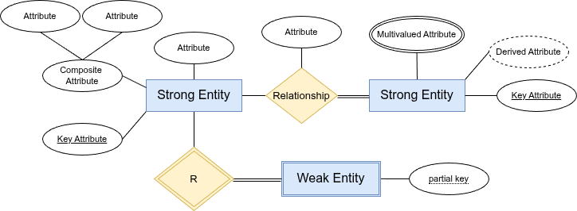{fig-align="center" width="60%"}

---

## Entities

::: callout-note
## All diagrams in this chapter use Chen notation
The sections below (Entities, Attributes, Relationships) describe and illustrate concepts using **Chen notation**: single rectangles for strong entities, double rectangles for weak entities, diamonds for relationships, and ovals for attributes. Cardinality is shown with 1, N, or M labels on the lines. If a diagram you encounter elsewhere uses pairs of numbers like $(1,N)$ or crow's foot line endings, those are Min-Max and Crow's Foot notations — both are covered in full detail after the Worked Example.
:::

### Strong Entity

A **strong entity type** (or simply *entity type*) is a real-world object or concept that:

1. Has an **independent existence** — it does not depend on another object to exist in the database.
2. Has a set of **attributes** that describe it.
3. Has at least one attribute (or combination) that **uniquely identifies** each instance — its **key attribute**.

**Notation:** A **single rectangle** labeled with the entity name (all caps by convention).

Examples: `EMPLOYEE`, `DEPARTMENT`, `PROJECT`, `STUDENT`, `PRODUCT`

**Entity type vs. Entity instance:**

| Term | Meaning | Example |
|------|---------|---------|
| Entity type | The template / class | `EMPLOYEE` |
| Entity set | All current instances | All 500 employees in the DB |
| Entity instance | One specific occurrence | Ahmed Ali, SSN=001 |

**Example — STUDENT entity with its attributes in Chen notation:**

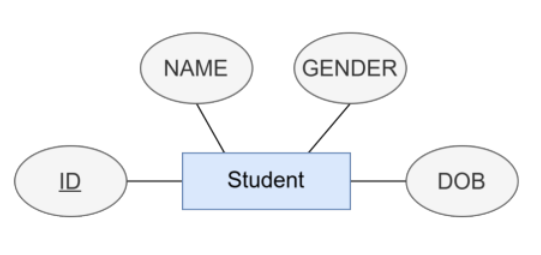{fig-align="center" width="25%"}

In this example: `Student` is the entity (rectangle), `ID` is the key attribute (underlined), and `NAME`, `GENDER`, `DOB` are simple attributes (ovals connected by lines).

### Weak Entity

A **weak entity type** has **no key attribute of its own** — it cannot be uniquely identified without reference to another entity (its **owner**).

| Feature | Strong Entity | Weak Entity |
|---------|--------------|-------------|
| Has own key? | Yes | No — only a **partial key** |
| Identified by | Own primary key | Owner's key + partial key |
| Rectangle notation | Single | **Double** |
| Identifying relationship | Single diamond | **Double diamond** |
| Participation in identifying rel. | May vary | Always **total** |

**Partial key**: The attribute(s) of a weak entity that, combined with the owner's key, uniquely identify a weak entity instance. Shown with a **dashed underline**.

::: callout-important
**Example:** `DEPENDENT` is weak under `EMPLOYEE`.

- `DEPENDENT` has a partial key: `Name`
- Two dependents of *different* employees may share the same name — perfectly fine.
- Two dependents of the *same* employee may **not** share the same name.
- Full identifier: `(SSN, Name)` — a composite key where `SSN` comes from the owner.

If an employee is deleted, all their dependents are deleted too (CASCADE). A dependent record cannot exist without an employee.
:::

**Example — Hotel (strong) and Room (weak entity) in Chen notation:**

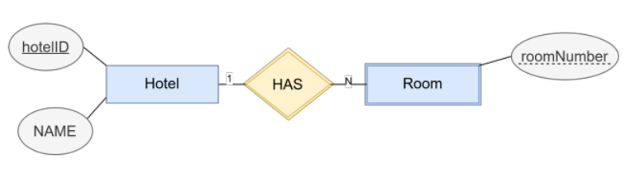{fig-align="center" width="30%"}

- `Hotel` is the **strong entity** — it has its own key (`hotelID`, underlined).
- `Room` is the **weak entity** — `roomNumber` alone is not unique across all hotels (two hotels can both have room 101). It is identified by the combination `(hotelID, roomNumber)`.
- `HAS` is the **identifying relationship** (1:N — one hotel has many rooms).

---

## Attributes

### Attribute Types

An **attribute** is a property that describes an entity type or relationship type. Quarto supports the following types:

| Type | Description | Chen Shape | Example |
|------|-------------|-----------|---------|
| **Simple** | Atomic, cannot be divided further | Plain oval | `Salary`, `Gender` |
| **Composite** | Built from smaller sub-attributes | Oval feeding child ovals | `Name → (Fname, Minit, Lname)` |
| **Multivalued** | Can hold multiple values per entity instance | **Double** oval | `Phone_Numbers`, `Dept_Locations` |
| **Derived** | Computed from another stored attribute; not physically stored | **Dashed** oval | `Age` derived from `Bdate` |
| **Stored** | Permanently stored; may be a source for derived attributes | Plain oval | `Bdate` |
| **Key** | Uniquely identifies each entity instance | Oval with **underlined** text | `Ssn`, `Dnumber` |
| **Partial key** | Identifies weak entity instances within the owner; not globally unique | Oval with **dashed underline** | `Name` (of DEPENDENT) |
| **Complex** | Both composite and multivalued | Nested double oval | `{Address(Street, City, Zip)}` |
| **NULL** | Value is unknown or not applicable | — | `Super_ssn` for a top-level manager |

#### Simple (Atomic) Attribute

A **simple** attribute cannot be divided into smaller meaningful parts. It holds a single indivisible value per entity instance. All attributes in the example below — `Id`, `name`, `price`, and `quantity` — are simple; each stores one value that has no sub-components.

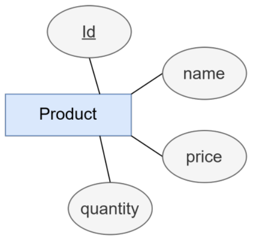{fig-align="center" width="28%"}

#### Composite Attribute

A **composite** attribute is made up of smaller, meaningful sub-attributes. The sub-attributes are shown as child ovals branching from the parent oval. In the example, `FullName` breaks down into `FirstName` and `LastName`; `Address` breaks down into `Street`, `City`, and `State`.

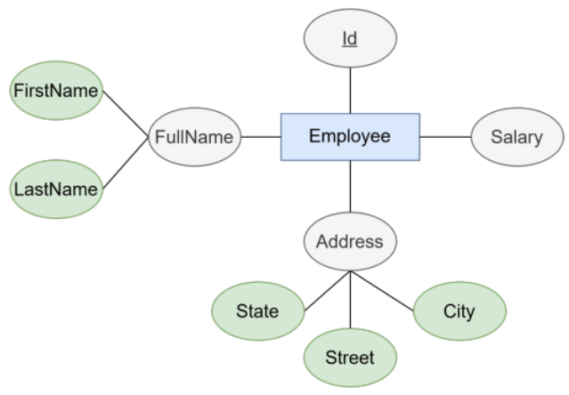{fig-align="center" width="30%"}

#### Single-Valued Attribute

A **single-valued** attribute holds exactly one value for each entity instance. Most attributes are single-valued — for example, every employee has exactly one `FullName` and one `Address`. This contrasts with multi-valued attributes that can hold several values at once.

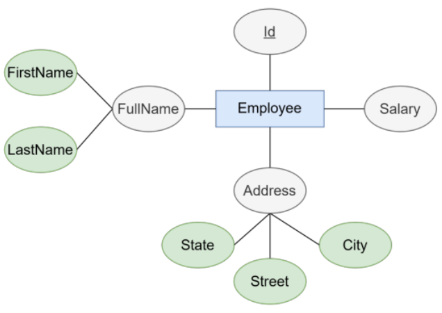{fig-align="center" width="30%"}

#### Multi-Valued Attribute

A **multi-valued** attribute can hold more than one value for the same entity instance. It is drawn as a **double oval**. In the example, an employee can have multiple `Addresses` and multiple `Skills`.

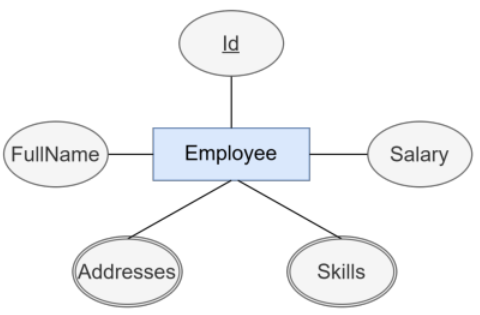{fig-align="center" width="28%"}

#### Derived Attribute

A **derived** attribute can be computed from another stored attribute; it is drawn as a **dashed oval**. Because the value can always be recalculated, it is not physically stored in the database. In the example, `Age` (dashed oval) is derived from the stored `DOB` attribute.

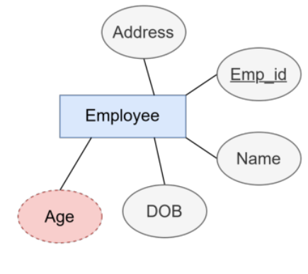{fig-align="center" width="28%"}

#### Key Attribute

A **key** attribute uniquely identifies every instance of an entity type. It is drawn as an oval with its name **underlined**. In the example, `hotelID` is underlined, meaning no two Hotel records share the same `hotelID`.

{fig-align="center" width="28%"}

::: callout-tip
**When is something an attribute vs. an entity?**

Ask: "Do I need to store multiple facts *about* this, or just one value?"
- If multiple facts → it is an entity.
- If one value → it is an attribute.

Example: `Gender` → one value per employee → **attribute**.
Example: `Department` → has a name, number, location, manager → **entity**.
:::

---

## Keys in ER Diagrams

Before moving to relationships, it is essential to understand the **key rule** — the single most important constraint in ER design:

::: callout-important
## The ER Key Rule
**Every strong entity type must have exactly one key attribute** (or one composite key attribute group) that uniquely identifies each instance. You cannot draw a valid ER diagram for a strong entity without specifying its key.

**Weak entities** do not have their own key — instead they have a **partial key** that, combined with the owner entity's key, forms a composite identifier.
:::

### Key Attribute (Strong Entity)

A **key attribute** is drawn as an oval with its name **underlined**. It guarantees that no two instances of the entity have the same value for that attribute.

- One entity can have **only one key attribute** (or one composite key group) at the ER level.
- If two candidate identifiers exist (e.g., both `SSN` and `Email` are unique), you underline **one** in the ER diagram — the one you choose as the primary identifier. The other becomes an alternate key at the relational level (Chapter 5).
- The key attribute in the ER diagram maps directly to the **primary key** column(s) when the entity becomes a relational table.

| ER concept | What it means | Maps to (Ch 5) |
|-----------|--------------|----------------|
| Key attribute (underlined) | Unique identifier for the entity | Primary key |
| Composite key attribute | Two+ attributes together form the key | Composite primary key |

### Partial Key (Weak Entity)

A **partial key** is drawn with a **dashed underline**. It is *not* globally unique — it is only unique within the set of instances owned by the same owner entity.

- The full identifier of a weak entity instance is: **owner's primary key + partial key**.
- This combination maps to a **composite primary key** in the relational table (Chapter 5, Step 2 of the mapping).

**Example — DEPENDENT under EMPLOYEE:**

| EMPLOYEE.SSN | DEPENDENT.Name | Unique? |
|-------------|---------------|--------|
| 001 | Ali | ✓ unique as (001, Ali) |
| 002 | Ali | ✓ different owner — allowed |
| 001 | Ali | ✗ duplicate — not allowed |

::: callout-note
## What about Foreign Keys?
Foreign keys do **not** appear in ER diagrams. They are a relational concept — a column in one table that references the primary key of another table. Foreign keys are introduced in Chapter 5 and created automatically by the ER-to-relational mapping rules.

In an ER diagram, a **relationship line** plays the role that a foreign key plays in a relational table. When the mapping converts a 1:N relationship to SQL, it adds a foreign key column. You do not draw it; it emerges from the mapping.
:::

---

## Relationships

A **relationship type** defines an association among two or more entity types.
A **relationship instance** is one specific pairing of entity instances.

**Notation:** A **single diamond** labeled with the relationship name (verb or verb phrase).

### Degree of a Relationship

| Degree | Name | Example |
|--------|------|---------|
| 1 | Unary (recursive) | `EMPLOYEE` **SUPERVISION** `EMPLOYEE` |
| 2 | Binary | `EMPLOYEE` **WORKS_FOR** `DEPARTMENT` |
| 3 | Ternary | `EMPLOYEE` **Supplies** `PROJECT` with `PART` |

Most real-world relationships are **binary**. Before using a ternary relationship, ask whether it can be decomposed into two binary ones without losing information.

### Cardinality Ratios

For a binary relationship, the **cardinality ratio** specifies how many instances of one entity can be related to one instance of the other. In Chen notation, the label (`1`, `N`, or `M`) is written on the relationship line **near the entity it constrains**.

#### One-to-One (1:1)

Each instance of entity A is associated with **at most one** instance of entity B, and vice versa.

- Each person has **at most one** passport — not everyone has a passport.
- Each passport belongs to **exactly one** person — every passport has an owner.

> **Reading:** "A person may have zero or one passport; a passport must be owned by exactly one person."

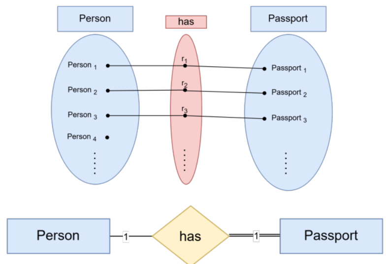{fig-align="center" width="55%"}

#### One-to-Many (1:N)

One instance of entity A is associated with **many** instances of entity B, but each B instance is associated with at most one A.

- A department can exist **without** employees (e.g., a newly created department with no staff yet) → **partial** participation of Department in the relationship.
- An employee **must** be assigned to a department → **total** participation of Employee in the relationship.

> **Left → Right (Department → Employee):** One department employs zero or more employees.  
> **Right → Left (Employee → Department):** Each employee works for exactly one department.

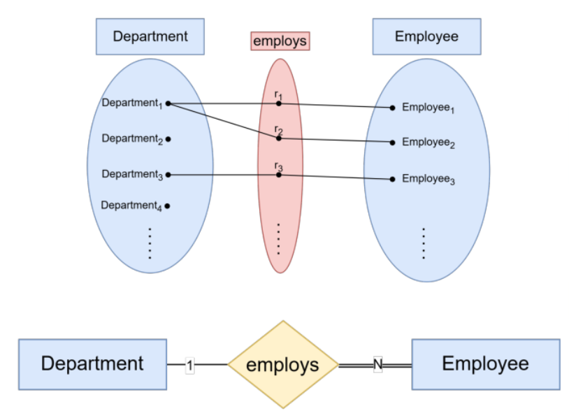{fig-align="center" width="55%"}

#### Many-to-Many (M:N)

Each instance of entity A can be associated with **many** instances of entity B, and each B can be associated with many A's.

> **Left → Right (Student → Course):** A student may enroll in zero or more courses.  
> **Right → Left (Course → Student):** A course may have zero or more students.

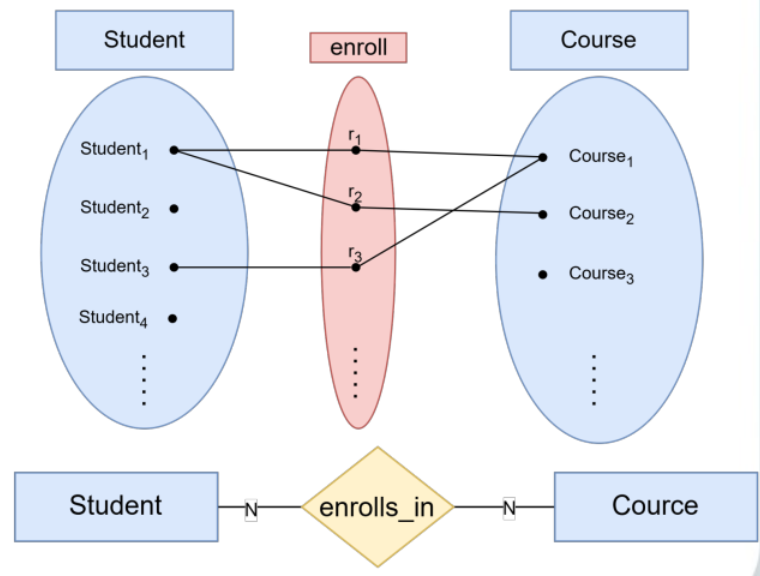{fig-align="center" width="55%"}

### Participation Constraints

Participation constraints specify whether **every** instance of an entity must participate in a relationship, or whether participation is optional.

| Line type | Name | Meaning |
|-----------|------|---------|
| Single line `─` | **Partial** participation | Some instances may not participate |
| Double line `═` | **Total** participation | *Every* instance **must** participate |

**Example — Department managedBy Employee:**

- **Department** side → **double line (total)**: every department *must* be managed by exactly one employee.
- **Employee** side → **single line (partial)**: not every employee is a manager — an employee *may* manage a department, but doesn't have to.

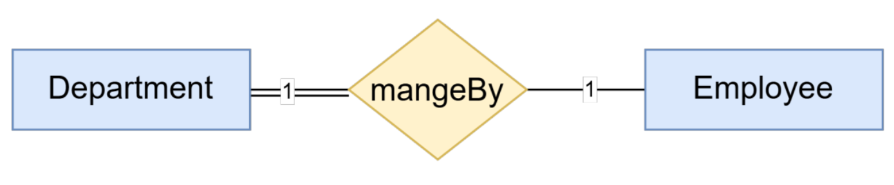{fig-align="center" width="55%"}

::: callout-note
Total participation means the entity **cannot exist** in the database without being connected to this relationship. A department record cannot be inserted unless it has a managing employee assigned to it.
:::

### Relationship Attributes

Some relationships carry their own data — a value that belongs to the **pairing** of two entities, not to either entity alone.

::: callout-important
`Hours` in *WORKS_ON* is a **relationship attribute**: it is the number of hours *this employee* spends on *this project*.

- Storing it with `EMPLOYEE` is wrong: hours on which project?
- Storing it with `PROJECT` is wrong: hours by which employee?
- It belongs to the *combination* `(Employee, Project)` — i.e., the relationship.
:::

In Chen notation, relationship attributes are drawn as ovals attached to the diamond.

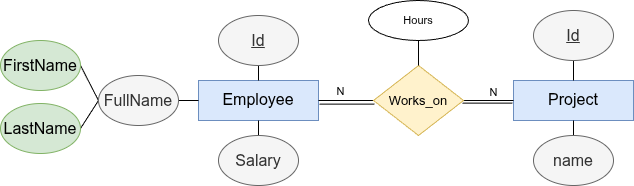{fig-align="center" width="50%"}

### Recursive (Unary) Relationships

A relationship where the **same entity type** participates more than once, in different **roles**.

The diagram below shows two versions of the same idea — the top one is **wrong**, the bottom one is **correct**:

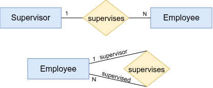{fig-align="center" width="55%"}

**Why the first diagram is wrong:** `Supervisor` is not a different kind of thing from `Employee` — a supervisor *is* an employee who happens to manage others. Drawing two separate entity boxes implies two different tables in the database, which is incorrect.

**Why the second diagram is correct:** A single `Employee` entity with a **recursive** `SUPERVISION` relationship back to itself, with two labelled roles: `Supervisor` (1 side) and `Supervisee` (N side). One entity maps to one table — the role is just a label on the line.

**Why both sides are partial (single line):**

| Role | Min | Reason |
|------|-----|--------|
| `Supervisor` (1 side) | 0 | Not every employee supervises others — a regular worker never plays the supervisor role |
| `Supervisee` (N side) | 0 | Not every employee has a supervisor — the top-level manager has no one above them |

Both sides are $(0,N)$ and $(0,1)$ respectively — **partial participation**, shown as single lines on both ends.

### Ternary Relationships

Involve three entity types simultaneously. A `SUPPLIER` **supplies** a `PART` to a `PROJECT` — no pair alone captures the full meaning.

#### Where the 1 / N Labels Go

In a ternary relationship there is one diamond connected to **three** entities by three lines. A cardinality label (`1` or `N`) is placed on each line **at the entity end of the line — close to the entity box itself, far from the diamond**, exactly like binary relationships.

```{mermaid}
%%| eval: true
%%| echo: false
%%| fig-cap: "Ternary relationship — a DOCTOR prescribes a DRUG for a PATIENT. Label near each entity answers: *'given one specific pair of the other two, how many of me?'*"
flowchart LR
    DOCTOR["DOCTOR"]
    DRUG["DRUG"]
    PATIENT["PATIENT"]
    PRESC{"Prescribes"}

    DOCTOR ---|1|PRESC
    DRUG ---|N|PRESC
    PATIENT ---|N|PRESC
```

#### How to Read the Labels — the "Fix Two, Count the Third" Rule

> **For each entity, mentally fix one specific instance of the other two and ask:
> *"How many instances of this entity can participate?"***
> The label answers that question.

| Label | Fixed | Question | Answer |
|-------|-------|----------|--------|
| **1** near `DOCTOR` | a specific (Drug, Patient) pair | How many doctors prescribed *this* drug to *this* patient? | **1** — exactly one doctor per prescription |
| **N** near `DRUG` | a specific (Doctor, Patient) pair | How many drugs does *this* doctor prescribe to *this* patient? | **N** — many drugs possible |
| **N** near `PATIENT` | a specific (Doctor, Drug) pair | How many patients receive *this* drug from *this* doctor? | **N** — many patients |

**Full reading of the diagram:** *"Each (Drug, Patient) combination is handled by exactly one Doctor; each (Doctor, Patient) pair can involve many Drugs; each (Doctor, Drug) pair can be prescribed to many Patients."*

::: callout-tip
**Quick rule:** The `1` label means "at most one" when you fix the other two. The `N` label means "potentially many."
:::

::: callout-note
Before using a ternary relationship, verify that the three-way combination is truly needed. If any pair of the three entities fully determines the third, a ternary can usually be replaced by two binary relationships.
:::

---

## Worked Example: The Company Database

This section builds the **Company Database ER diagram** incrementally — one requirement at a time. For each step, the relevant sentence from the requirements is highlighted, followed by the updated diagram and an explicit note on any assumption made.

### Requirements

> *"The company has several **departments**. Each department has a unique **name** and a **number**. A department is managed by exactly one **employee**, who is called the **manager**. The manager has a **start date** for their managerial role. A department may have several **locations**.*
>
> *Each employee has a unique **social security number (SSN)**, a **first name**, **middle initial**, **last name**, **date of birth**, **address**, **gender**, and **salary**. An employee's **age** can be derived from their date of birth and does not need to be stored separately. Each employee works in exactly one department but may work on several **projects**. We track the **number of hours** per week each employee works on each project. Each employee may be supervised by at most one other employee.*
>
> *Each project has a unique **name**, a **number**, and a single **location**. Each project is controlled by exactly one department.*
>
> *Employees may have **dependents**. Each dependent has a **name**, **gender**, **date of birth**, and **relationship** to the employee."*

---

### Step 1 — EMPLOYEE Entity

> *"Each employee has a unique **social security number (SSN)**, a **first name**, **middle initial**, **last name**, **date of birth**, **address**, **gender**, and **salary**. An employee's **age** can be derived from their date of birth and does not need to be stored separately."*

We start with the most described entity: `EMPLOYEE`.

- `SSN` → **key attribute** (underlined oval) — uniquely identifies each employee
- `Name` → **composite attribute** — decomposes into `Fname`, `Minit`, `Lname`
- `Bdate` → stored attribute — the value is physically kept in the database
- `Age` → **derived attribute** (dashed oval) — computed from `Bdate`; never stored
- `Address`, `Gender`, `Salary` → simple, single-valued attributes

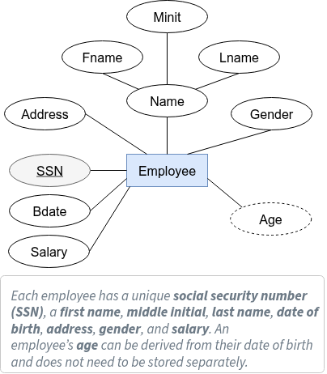{fig-align="center" width="65%"}

---

### Step 2 — DEPARTMENT Entity + MANAGES Relationship

> *"The company has several **departments**. Each department has a unique **name** and a **number**. A department may have several **locations**. A department is managed by **exactly one** employee, who is called the **manager**. The manager has a **start date** for their managerial role."*

- `DEPARTMENT` is a strong entity; `Number` is its key attribute
- `Locations` → **multivalued attribute** (double oval) — *"may have several"*
- `Start_date` → **relationship attribute** on MANAGES — it belongs to the (Employee, Department) pairing, not to either entity alone
- **Department side of MANAGES:** *"exactly one"* → **total** participation, max = 1 (double line, label 1)
- **Employee side of MANAGES:** The requirement does not say every employee is a manager. "Manager" is a *role* played by some employees, not a separate entity type.

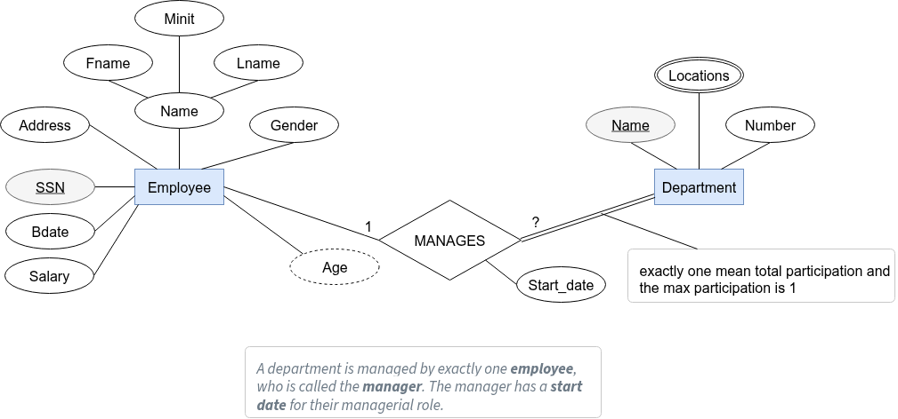{fig-align="center" width="85%"}

::: callout-note
## Assumption — MANAGES (Employee side)
**Stated:** A department must have exactly one manager → Department side is **total, max = 1**.

**Reasoning from requirements:** "Manager" is a role — not every employee manages a department → Employee side is **partial**.

**Assumption:** An employee can manage at most one department at a time → max = 1.
:::

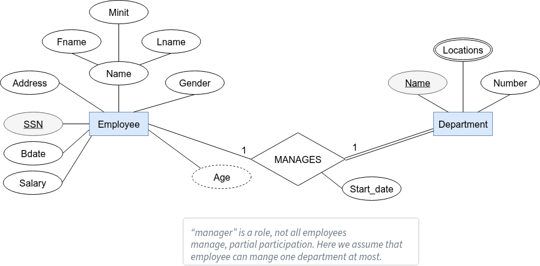{fig-align="center" width="85%"}

---

### Step 3 — WORKS_FOR Relationship

> *"Each employee works in **exactly one** department."*

`WORKS_FOR` connects EMPLOYEE and DEPARTMENT with cardinality N:1.

- **Employee side:** *"exactly one"* → **total** participation (double line), max = 1
- **Department side:** The requirement only states where employees go; it says nothing about whether a department must have employees.

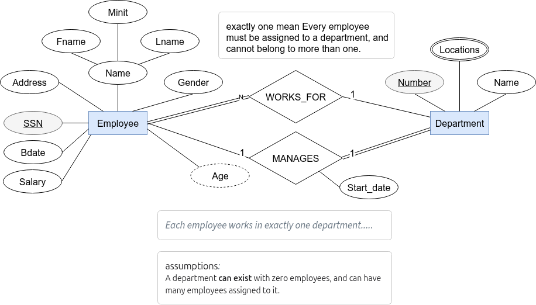{fig-align="center" width="90%"}

::: callout-note
## Assumption — WORKS_FOR (Department side)
**Stated:** Every employee must belong to exactly one department → Employee side is **total**.

**Assumption:** The diagram shows a **single line** on the Department side, meaning a department can exist with zero employees assigned to it → Department side is **partial**, min = 0, max = N.

*This is a design choice. You could require every department to have at least one employee by making their side total (double line).*
:::

---

### Step 4 — PROJECT Entity

> *"Each project has a unique **name**, a **number**, and a single **location**."*

`PROJECT` is a strong entity with three attributes.

- `Number` → **key attribute** (underlined oval)
- `Name` → simple attribute (unique per requirements, but Number is the diagrammatic key)
- `Location` → simple, single-valued attribute — *"a single location"* confirms no double oval needed

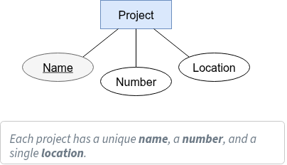{fig-align="center" width="50%"}

---

### Step 5 — CONTROLS Relationship

> *"Each project is controlled by **exactly one** department."*

`CONTROLS` connects PROJECT and DEPARTMENT with cardinality N:1.

- **Project side:** *"exactly one"* → **total** participation (double line), max = 1
- **Department side:** The requirement says nothing about whether a department must control any projects.

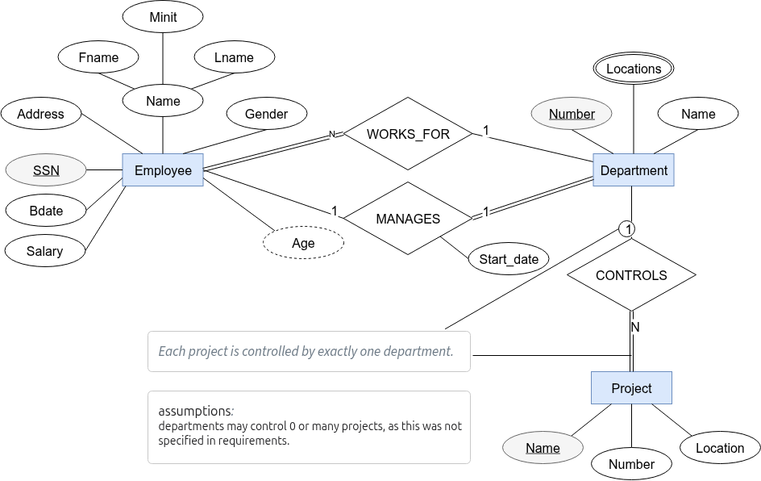{fig-align="center" width="95%"}

::: callout-note
## Assumption — CONTROLS (Department side)
**Stated:** Every project is controlled by exactly one department → Project side is **total**.

**Assumption:** A department may control zero or many projects → Department side is **partial**, min = 0, max = N.

*The requirements do not require every department to control a project.*
:::

---

### Step 6 — WORKS_ON Relationship

> *"Each employee **may** work on several **projects**. We track the **number of hours** per week each employee works on each project."*

`WORKS_ON` connects EMPLOYEE and PROJECT with cardinality M:N.

- `Hours` → **relationship attribute** on WORKS_ON — it belongs to the (Employee, Project) pairing, not to either entity alone
- **Employee side:** The word **"may"** explicitly makes this **partial** (min = 0), max = N
- **Project side:** Not stated — see assumption below.

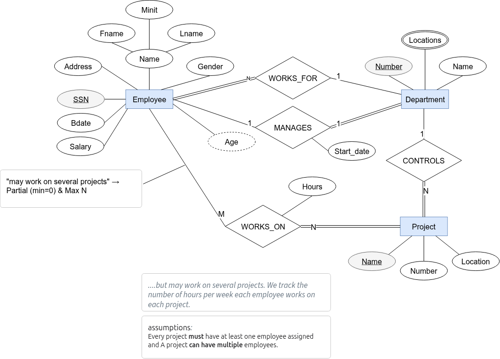{fig-align="center" width="95%"}

::: callout-note
## Assumption — WORKS_ON (Project side)
**Stated:** *"May work on"* → Employee participation is **partial** — directly from requirements.

**Assumption:** A project that has no employees assigned is not yet operational → Project side is **total**, min = 1, max = N.

*This assumption must be confirmed with stakeholders — it is not stated in the text.*
:::

---

### Step 7 — SUPERVISION Relationship

> *"Each employee **may** be supervised by **at most one** other employee."*

`SUPERVISION` is a **recursive (unary)** relationship — EMPLOYEE related to itself, with two roles: **Supervisor** and **Supervisee**.

- **Supervisee side:** *"may be supervised"* → **partial** (min = 0); *"at most one"* → max = 1
- **Supervisor side:** Not stated — see assumption below.

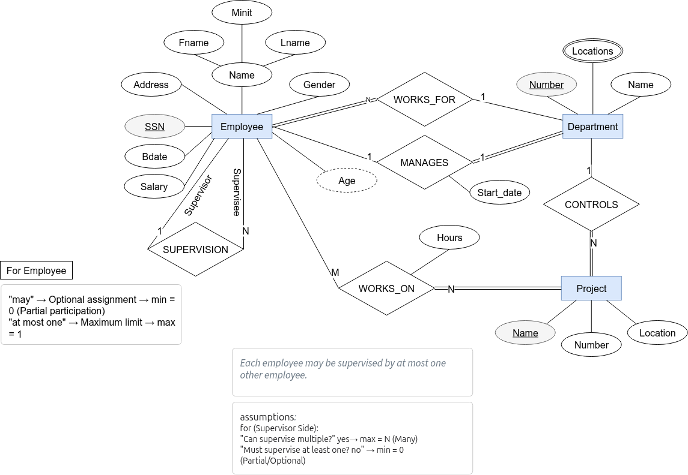{fig-align="center" width="95%"}

::: callout-note
## Assumption — SUPERVISION (Supervisor side)
**Stated:** Each employee *may* be supervised by at most one → Supervisee side is **partial, max = 1**.

**Assumption:** Not every employee supervises anyone (e.g., a regular worker has no one under them; the top-level manager also has no supervisor) → Supervisor side is **partial**, min = 0, max = N.
:::

---

### Step 8 — DEPENDENT Weak Entity + HAS (Full Diagram)

> *"Employees **may** have **dependents**. Each dependent has a **name**, **gender**, **date of birth**, and **relationship** to the employee."*

`DEPENDENT` is a **weak entity** — it has no key of its own and cannot exist without its owning employee.

- `Name` → **partial key** (dashed-underline oval) — unique within one employee's dependents, not globally
- `Gender`, `Bdate`, `Relationship` → simple attributes
- `HAS` is the **identifying relationship** (double diamond) — the combination `(SSN, Name)` uniquely identifies each dependent
- **Employee side:** *"may have"* → **partial** (min = 0, max = N)
- **Dependent side:** A dependent cannot exist without an employee → **total** (min = 1) — this follows structurally from the weak entity definition, not from an assumption

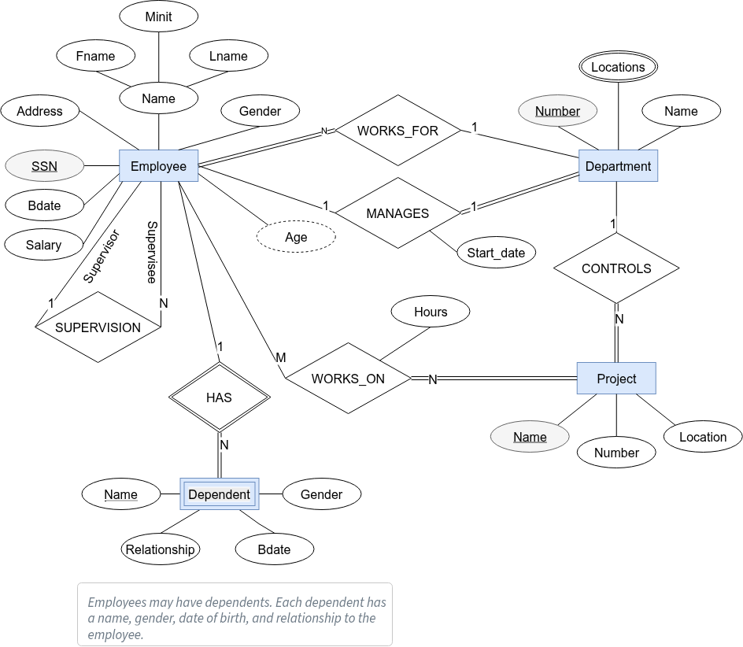{fig-align="center" width="100%"}

---

### Summary

| Step | Added | Key requirement | Assumption made |
|------|-------|----------------|-----------------|
| 1 | EMPLOYEE + attributes | SSN key; composite Name; derived Age from Bdate | — |
| 2 | DEPARTMENT + MANAGES (1:1) | Dept must have exactly one manager → Dept: total, max = 1 | Employee side: partial, max = 1 (manager is a role) |
| 3 | WORKS_FOR (N:1) | *"exactly one department"* → Employee: total, max = 1 | Dept side: partial (a dept can exist with zero employees) |
| 4 | PROJECT + attributes | Number key; single Location | — |
| 5 | CONTROLS (N:1) | *"exactly one department"* → Project: total, max = 1 | Dept side: partial (a dept may control no projects) |
| 6 | WORKS_ON (M:N) + Hours | *"may work on"* → Employee: **partial**, min = 0 | Project side: total (a project must have staff) |
| 7 | SUPERVISION (recursive 1:N) | *"may … at most one"* → Supervisee: partial, max = 1 | Supervisor side: partial (not all employees supervise) |
| 8 | DEPENDENT (weak) + HAS (1:N) | *"may have dependents"* → Employee: partial | Dependent total is structural (weak entity rule) |

::: callout-important
## Stated vs. Assumed Constraints — Quick Reference

**Directly from the requirements text:**

- Employee **total** in WORKS_FOR — *"works in exactly one department"*
- Department **total** in MANAGES — *"managed by exactly one employee"*
- Project **total** in CONTROLS — *"controlled by exactly one department"*
- Employee **partial** in MANAGES — "manager" is a role, not all employees manage
- Employee **partial** in WORKS_ON — *"may work on"*
- Employee **partial** in HAS — *"may have dependents"*
- Supervisee **partial** in SUPERVISION — *"may be supervised by at most one"*
- Dependent **total** in HAS — structural (weak entity cannot exist without owner)

**Design assumptions** (reasonable operational defaults, not stated in text):

- Department **partial** in WORKS_FOR — a department can exist with zero employees (diagram shows single line)
- Department **partial** in CONTROLS — a department need not control any project
- Project **total** in WORKS_ON — a project without any assigned staff is not operational
- Supervisor **partial** in SUPERVISION — not every employee supervises anyone
:::

---

## Min-Max Notation

Chen notation tells us *whether* a participation is total or partial and *what* the cardinality ratio is (1:1, 1:N, M:N), but it stops short of answering a frequent business question: *exactly how many*? "At most three active orders," "between two and five team members," "exactly one department chair" — these rules all collapse into Chen's coarse labels. **Min-Max notation** was introduced precisely to close that gap: it keeps the same diagram shape but replaces each line-end label with a numeric pair $(min, max)$ that pins down both bounds explicitly.

**Min-Max notation** (also called *structural constraints notation*) extends the basic Chen diagram by annotating each entity's side of a relationship line with a pair of numbers: $(min, max)$.

### What Do min and max Mean?

- **min** — the minimum number of relationship instances this entity *must* participate in:
  - $min = 0$ → participation is **optional** (equivalent to a single line in Chen)
  - $min \geq 1$ → participation is **mandatory** (equivalent to a double line in Chen)
- **max** — the maximum number of relationship instances this entity *can* participate in:
  - $max = 1$ → at most one
  - $max = N$ (or $\infty$) → no upper limit

| $(min,max)$ pair | English reading | Chen equivalent |
|------------------|----------------|----------------|
| $(0,1)$ | "zero or one" | Partial, cardinality 1 |
| $(1,1)$ | "exactly one" | Total, cardinality 1 |
| $(0,N)$ | "zero or more" | Partial, cardinality N |
| $(1,N)$ | "one or more" | Total, cardinality N |
| $(4,N)$ | "at least four" | Total, cardinality N |

### Placement Rule

The $(min, max)$ pair is written on the line **next to the entity it constrains**. The general form is:

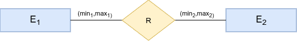{fig-align="center" width="70%"}

- An entity of type $E_1$ may be related to **at least $min_1$** and **at most $max_1$** entities of type $E_2$.
- Likewise, $min_2$ is the minimum number and $max_2$ is the maximum number of $E_1$ entities to which an $E_2$ entity is related.

### Illustrative Example — EMPLOYEE and DEPARTMENT

The diagram below shows Min-Max annotation on a generic EMPLOYEE–DEPARTMENT relationship. The values here are **chosen to illustrate specific constraint patterns** and are independent of the Company Database worked example.

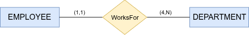{fig-align="center" width="70%"}

| Pair | Placed next to | Meaning |
|------|---------------|---------|
| $(1,1)$ | EMPLOYEE | Every employee is associated with **exactly one** department — mandatory and singular. |
| $(4,N)$ | DEPARTMENT | Every department has **at least 4** employees — a specific minimum business rule. |

::: callout-note
The $(4,N)$ on the DEPARTMENT side is intentionally a specific-value constraint to show that Min-Max is not limited to the four standard combinations. The Company Database uses $(1,N)$ for this side — see the table in the next section.
:::

---

### Company Database in Min-Max Notation

The table below re-expresses every relationship from the Worked Example using $(min, max)$ pairs, consistent with the Full Constraint Summary and the Chen diagram.

| Relationship | Entity A | $(min,max)$ on A | Entity B | $(min,max)$ on B |
|-------------|----------|-----------------|----------|-----------------|
| WORKS_FOR | EMPLOYEE | $(1,1)$ | DEPARTMENT | $(0,N)$ |
| MANAGES | EMPLOYEE | $(0,1)$ | DEPARTMENT | $(1,1)$ |
| WORKS_ON | EMPLOYEE | $(0,N)$ | PROJECT | $(1,N)$ |
| CONTROLS | PROJECT | $(1,1)$ | DEPARTMENT | $(0,N)$ |
| SUPERVISION | EMPLOYEE (Supervisee) | $(0,1)$ | EMPLOYEE (Supervisor) | $(0,N)$ |
| HAS | EMPLOYEE | $(0,N)$ | DEPENDENT | $(1,1)$ |

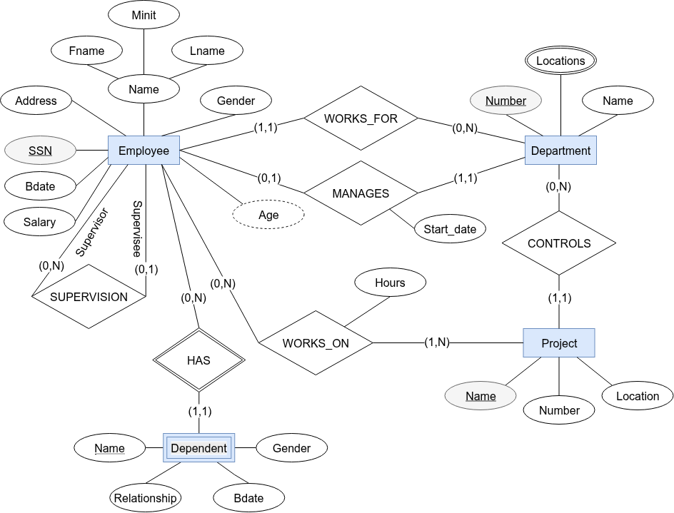{fig-align="center" width="100%"}

::: callout-tip
**Why use Min-Max instead of Chen labels?**

Chen notation labels each relationship line with 1, N, or M — this captures the *maximum* cardinality but not the *minimum*. Min-Max adds the minimum, making it immediately clear whether participation is optional or mandatory without relying on single-vs-double lines. It is especially useful when writing precise business rules for a development team to implement.
:::

### Chen vs Min-Max: Side-by-Side Examples

Each example below shows the **same relationship drawn twice** — once in Chen notation (top) and once in Min-Max notation (bottom) — so you can see exactly how the two representations map onto each other.

---

#### Example 1 — Professor CHAIRS Department (One-to-One, partial / total)

**Business Requirements**

The university has several departments. Each department must have exactly one chairperson who must be a professor. A professor can chair at most one department. Some professors may not chair any department — the chairperson role is optional for professors. If a professor is appointed as chair, they must chair exactly one department. No department can exist without a chairperson.

::: {.callout-tip collapse="true"}
## Solution

**Relationship:** CHAIRS

| Property | Entity A — Professor | Entity B — Department |
|----------|---------------------|----------------------|
| Participation | Partial (optional) | Total (mandatory) |
| $(min,max)$ | $(0,1)$ | $(1,1)$ |
| Chen cardinality label | 1 | 1 |

**Diagram (Chen top / Min-Max bottom):**

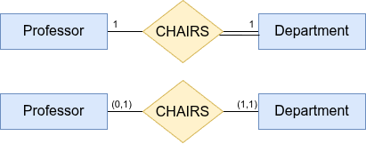{fig-align="center" width="75%"}

**Reading the relationship:**

- **Left → Right (LTR):** Each Professor chairs **0 or 1** Department.
- **Right → Left (RTL):** Each Department is chaired by **exactly 1** Professor.

**How to read — Chen (top):**

- The `1` on the Professor side and the `1` on the Department side tell us this is a **1:1** relationship.
- The **double line** on the Department side means Department participation is **total** (mandatory).
- The **single line** on the Professor side means Professor participation is **partial** (optional).

**How to read — Min-Max (bottom):**

| Pair | Placed next to | Meaning |
|------|---------------|---------|
| $(0,1)$ | Professor | A professor chairs **at most one** department — but is not required to chair any. |
| $(1,1)$ | Department | Every department has **exactly one** chair — mandatory, and only one. |

> **Key insight:** Chen told us the *ratio* (1:1) but left participation implicit in the line style. Min-Max spells out both the minimum and maximum in a single, self-documenting pair.
:::

---

#### Example 2 — Student HOLDS_PERMIT Parking_Permit (One-to-One, both partial)

**Business Requirements**

Students may obtain a parking permit from the university. A student can have at most one parking permit. Some students don't have cars and therefore have no permit. Each parking permit is assigned to exactly one student, but permits can exist in the system before being assigned. If a student leaves, their permit becomes available for reassignment.

::: {.callout-tip collapse="true"}
## Solution

**Relationship:** HOLDS_PERMIT

| Property | Entity A — Student | Entity B — Parking_Permit |
|----------|-------------------|--------------------------|
| Participation | Partial (optional) | Partial (optional) |
| $(min,max)$ | $(0,1)$ | $(0,1)$ |
| Chen cardinality label | 1 | 1 |

**Assumption:** Permits can exist unassigned; not all students need permits.

**Diagram (Chen top / Min-Max bottom):**

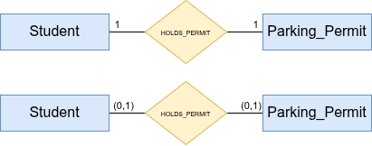{fig-align="center" width="75%"}

**Reading the relationship:**

- **Left → Right (LTR):** Each Student holds **0 or 1** Parking Permit.
- **Right → Left (RTL):** Each Parking Permit is held by **0 or 1** Student.

**How to read — Chen (top):**

- `1` on both sides → **1:1** relationship.
- **Single line** on both sides → participation is **partial** on both ends (neither student nor permit is required to be matched).

**How to read — Min-Max (bottom):**

| Pair | Placed next to | Meaning |
|------|---------------|---------|
| $(0,1)$ | Student | A student holds **at most one** parking permit — but may hold none. |
| $(0,1)$ | Parking_Permit | A parking permit is held by **at most one** student — but may be unassigned. |

> **Key insight:** Both sides are optional. Min-Max makes this unambiguous without having to check whether lines are single or double.
:::

::: callout-note
The full implementation of reassignment — `ON DELETE SET NULL`, status trigger, and the design discussion `SET NULL` vs. `CASCADE` — lives in [Appendix C §C.1](../appendix/appendixC-advanced-constraints.qmd#sec-appC).
:::

---

#### Example 3 — Department OFFERS Course (One-to-Many, both mandatory)

**Business Requirements**

Every department in the university must offer at least one course. A course must be offered by exactly one department. Departments can offer multiple courses. Courses cannot exist without being associated with a department. New departments must create at least one course within their first semester.

::: {.callout-tip collapse="true"}
## Solution

**Relationship:** OFFERS

| Property | Entity A — Department | Entity B — Course |
|----------|----------------------|------------------|
| Participation | Total (mandatory) | Total (mandatory) |
| $(min,max)$ | $(1,N)$ | $(1,1)$ |
| Chen cardinality label | N | 1 |

**Assumption:** Every department must offer courses; cross-listing handled separately.

**Diagram (Chen top / Min-Max bottom):**

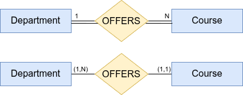{fig-align="center" width="75%"}

**Reading the relationship:**

- **Left → Right (LTR):** Each Department offers **1 or more** Courses.
- **Right → Left (RTL):** Each Course is offered by **exactly 1** Department.

**How to read — Chen (top):**

- `1` on Department, `N` on Course → **1:N** relationship.
- **Double line** on both sides → participation is **total** on both ends.

**How to read — Min-Max (bottom):**

| Pair | Placed next to | Meaning |
|------|---------------|---------|
| $(1,N)$ | Department | Every department offers **at least one** course (no upper limit). |
| $(1,1)$ | Course | Every course is offered by **exactly one** department. |

> **Key insight:** Chen's double lines on both sides simply said "mandatory on both ends." Min-Max adds the upper bound: a department can offer *many* courses, but a course belongs to *only one* department.
:::

::: callout-warning
The static ER diagram cannot capture the *timing* rule "within the first semester." The enforcement trigger and its design alternatives are worked out in [Appendix C §C.2](../appendix/appendixC-advanced-constraints.qmd#sec-appC).
:::

---

#### Example 4 — Professor ADVISES Student (One-to-Many, both partial)

**Business Requirements**

Professors may serve as academic advisors to students. A professor can advise multiple students. Some professors choose not to advise any students. A student may have at most one academic advisor. Some students, particularly freshmen, may not have an assigned advisor yet. Each advisor-student relationship is formalized through the advising system.

::: {.callout-tip collapse="true"}
## Solution

**Relationship:** ADVISES

| Property | Entity A — Professor | Entity B — Student |
|----------|---------------------|-------------------|
| Participation | Partial (optional) | Partial (optional) |
| $(min,max)$ | $(0,N)$ | $(0,1)$ |
| Chen cardinality label | N | 1 |

**Assumption:** Advising is voluntary for professors; freshmen and other students may be unassigned until they select an advisor.

**Diagram (Chen top / Min-Max bottom):**

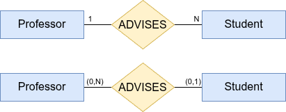{fig-align="center" width="75%"}

**Reading the relationship:**

- **Left → Right (LTR):** Each Professor advises **0 or more** Students.
- **Right → Left (RTL):** Each Student is advised by **0 or 1** Professor.

**How to read — Chen (top):**

- `1` on Professor, `N` on Student → **1:N** relationship.
- **Single line** on both sides → participation is **partial** on both ends.

**How to read — Min-Max (bottom):**

| Pair | Placed next to | Meaning |
|------|---------------|---------|
| $(0,N)$ | Professor | A professor may advise **any number** of students — or none at all. |
| $(0,1)$ | Student | A student may have **at most one** advisor — but is not required to have one. |

> **Key insight:** Chen indicated a 1:N ratio with optional participation, but gave no upper bound on the N side. Min-Max confirms there truly is no cap on how many students a professor can advise, while also confirming a student cannot have more than one.
:::

::: {.callout-note collapse="true"}
## Relationship Attributes: The ADVISES Relationship Has More to Say

The phrase *"Each advisor-student relationship is formalized through the advising system"* is a strong hint that **ADVISES is not a simple binary connection** — it carries descriptive information of its own. In ER modelling, when a relationship has data associated with it (not belonging to either entity alone), that data is modelled as **relationship attributes**.

Candidate attributes for ADVISES:

| Attribute | Type | Meaning |
|-----------|------|---------|
| `assignment_date` | DATE | When the advising relationship was established |
| `status` | ENUM(`ACTIVE`, `INACTIVE`, `PENDING`) | Current state of the advisory relationship |
| `end_date` | DATE (nullable) | When the relationship was formally terminated |
| `notes` | TEXT | Free-text notes entered by advisor or registrar |

**Revised ER diagram with relationship attributes:**

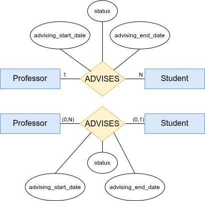{fig-align="center" width="80%"}

> **Design implication:** When a relationship has attributes, it is often a candidate for promotion to an **associative entity** (also called a relationship entity or junction table) — especially if other entities need to reference it. For example, if the advising record itself needs to be referenced by a report or an audit trail, `ADVISES` would become its own entity (e.g., `AdvisingRecord`) with a surrogate key.
:::

---

::: callout-note
**Reading template for Min-Max**

Given a pair $(min, max)$ placed next to entity $E$:

> "Each **[E]** participates in this relationship **at least $min$ time(s)** and **at most $max$ time(s)**."

When $min = 0$ the participation is **optional**; when $min \geq 1$ it is **mandatory**. When $max = N$ there is **no upper limit**; when $max = 1$ the entity participates in **at most one** instance.
:::

---

### Specific Value Constraints: $(0,3)$, $(2,5)$, and Beyond

Not every business rule fits neatly into the four standard patterns $(0,1)$, $(1,1)$, $(0,N)$, $(1,N)$. Min-Max notation allows **any non-negative integers** as the min and max values.

| Example | English meaning | Typical business rule |
|---------|----------------|-----------------------|
| $(0,3)$ | zero to three | A customer may place **at most 3** active orders at a time |
| $(2,5)$ | two to five | A project team must have **between 2 and 5** members |
| $(1,4)$ | one to four | An employee manages **at least 1, at most 4** direct reports |
| $(3,3)$ | exactly three | A committee seat is always filled by **exactly 3** co-chairs |

These constraints are **perfectly valid** at the conceptual level — they are precise expressions of real business rules that the common patterns simply cannot capture. Write them on your ER diagram exactly as you would any other $(min,max)$ pair.

::: callout-warning
**Conceptual validity ≠ automatic SQL enforcement**

Standard SQL foreign-key constraints only know how to enforce "must exist" (referential integrity). They have no mechanism to *count* how many rows a related entity participates in before accepting or rejecting a change. Specific value constraints such as $(0,3)$ or $(2,5)$ therefore **cannot be enforced by foreign keys alone**.
:::

Enforcing specific value constraints in the database requires either subquery-`CHECK`s (PostgreSQL), triggers, stored procedures, or application logic. The four strategies, with trade-offs and ready-to-run SQL, are compared in [Appendix C §C.3](../appendix/appendixC-advanced-constraints.qmd#sec-appC).

---

## Crow's Foot Notation

**Crow's Foot notation** is an ER diagramming notation used to represent entities, attributes, and relationships. It is the standard notation adopted by most professional database design tools — MySQL Workbench, Lucidchart, draw.io, Visio, and ERwin — and is applicable at the **conceptual, logical, and physical** design stages, though it is most commonly encountered during logical and physical design in practice.

Entities are drawn as plain rectangular boxes; the relationship line carries small tick and arc symbols at each end. Those end symbols are called **crow's foot markers** because three diverging lines resemble a bird's foot.

### Symbol Reference

Each line end carries **two markers**. The marker *closest to the entity box* gives the **minimum**; the marker *furthest from the entity box* gives the **maximum**.

**Minimum markers (inner — nearest the entity box):**

| Symbol | Meaning |
|--------|---------|
| `|` (single vertical bar) | Mandatory — must participate ($min \geq 1$) |
| `o` (small open circle) | Optional — may not participate ($min = 0$) |

**Maximum markers (outer — away from the entity box):**

| Symbol | Meaning |
|--------|---------|
| `|` (single vertical bar) | At most one ($max = 1$) |
| `<` (three diverging lines = crow's foot) | Many — no upper limit ($max = N$) |

**Common combinations at a line end:**

| Symbol | Name | $(min,max)$ | Chen equivalent | Plain English |
|:------:|------|:-----------:|----------------|--------------|
| {width="100px"} | bar–bar `\|\|` | $(1,1)$ | Total, cardinality 1 | Exactly one |
| {width="100px"} | circle–bar `o\|` | $(0,1)$ | Partial, cardinality 1 | Zero or one |
| {width="100px"} | bar–crow's foot `\|<` | $(1,N)$ | Total, cardinality N | One or many |
| {width="100px"} | circle–crow's foot `o<` | $(0,N)$ | Partial, cardinality N | Zero or many |

### Reading Rule

Read the symbols at **entity B's end** of the line —they describe how many B instances can be associated with one A instance:

> "Each [Entity A] has **[outer marker reading]** **[inner marker reading]** [Entity B]."

**Example:** `DEPARTMENT ——|{ EMPLOYEE`

> "Each Department has **one or many** Employees." ($min = 1$, $max = N$)

### Crow's Foot Examples

Each example below shows a Crow's Foot diagram (top) alongside its Chen equivalent (bottom).

---

#### Example 1 — Person HAS Passport (One-to-One, both mandatory)

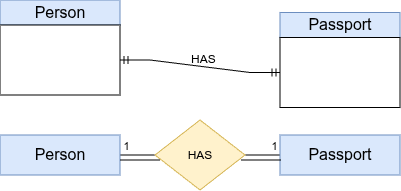{fig-align="center" width="70%"}

| End | Symbol | Reading |
|-----|--------|---------|
| Person side | `||` (bar–bar) | Every person holds **exactly one** passport. |
| Passport side | `||` (bar–bar) | Every passport belongs to **exactly one** person. |

> Both participations are total (mandatory) and the cardinality is 1:1 on both sides.

---

#### Example 2 — Employee IS ASSIGNED Office (One-to-One, Employee optional)

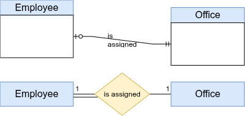{fig-align="center" width="70%"}

| End | Symbol | Reading |
|-----|--------|---------|
| Employee side | `o|` (circle–bar) | An employee may be assigned to **zero or one** office. |
| Office side | `||` (bar–bar) | Every office is assigned to **exactly one** employee. |

> Employee participation is partial (optional); Office participation is total (mandatory).

---

#### Example 3 — Customer PLACES Order (One-to-Many, both mandatory)

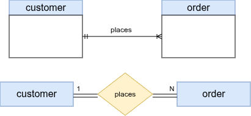{fig-align="center" width="70%"}

| End | Symbol | Reading |
|-----|--------|---------|
| Customer side | `||` (bar–bar) | Every order is placed by **exactly one** customer. |
| Order side | `|<` (bar–crow's foot) | Every customer places **one or many** orders. |

> Both participations are mandatory; cardinality is 1:N.

---

#### Textual Note — Extending Crow's Foot for Specific Upper Bounds

Standard Crow's Foot symbols can only express four combinations: $(0,1)$, $(1,1)$, $(0,N)$, $(1,N)$. When a business rule demands a **specific upper bound** (e.g., at most 3), the symbol alone is insufficient.

{fig-align="center" width="65%"}

In the diagram above, the CLASS side carries:

- The **circle–crow's foot** symbol `o<` — meaning *zero or many* in standard Crow's Foot.
- A **textual annotation** `(0,3)` written next to the symbol to narrow the upper bound to **at most 3**.

::: callout-note
**Why a textual note?**

The standard `o<` symbol means *unbounded many* ($max = N$). There is no dedicated Crow's Foot symbol for a finite upper limit such as 3. The widely adopted convention is to keep the closest-matching symbol (`o<` for zero-or-many) and add a parenthesised note — `(0,3)` — directly beside it to record the actual maximum. The `(1,1)` on the PROFESSOR side is read normally: every teaching instance belongs to exactly one professor.

This approach is also used in tools like ERwin and Visio when constraints exceed what the four standard symbols can express.
:::


#### Crow's Foot Across Design Stages — Conceptual vs. Logical

Crow's Foot notation is used at **multiple design stages**, and what appears inside each entity box changes as you move from one stage to the next. The Customer–Order example below illustrates the key differences between a **conceptual** diagram and a **logical** diagram drawn with the same Crow's Foot symbols.

---

**Conceptual schema** — what the business means, not how it is stored:

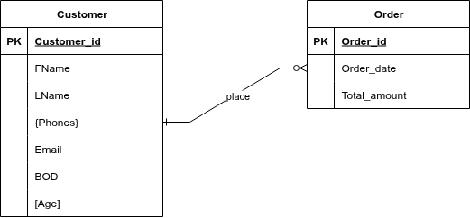{fig-align="center" width="85%"}

At this stage:

- **Multi-valued attribute** `{Phones}` is shown inside the Customer box using curly braces — it is recorded as a fact about the entity but not yet split into a separate table.
- **Derived attribute** `[Age]` is shown using square brackets — it is computable from `BOD` and is included only for documentation; it will not become a stored column.
- **No foreign key** appears in the Order box — FK columns are a relational implementation detail, not a conceptual concept.
- The relationship line carries the crow's foot markers only; the line represents the *association*, not a column.

---

**Logical schema** — how the data will be structured in a relational database:

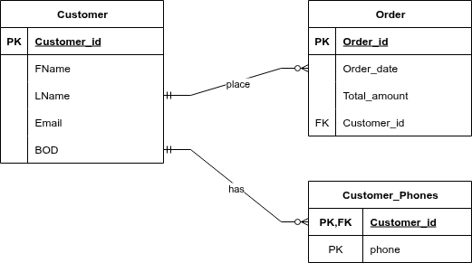{fig-align="center" width="85%"}

At this stage, three transformations have been applied:

| Conceptual element | Logical transformation | Reason |
|---|---|---|
| `{Phones}` multi-valued attribute | Becomes a new table `Customer_Phones(Customer_id PK/FK, phone PK)` | Relational columns are atomic — a cell cannot hold a list of values |
| `[Age]` derived attribute | **Dropped** — not stored | Age is computed from `BOD` at query time; storing it would create update anomalies |
| No FK in Order | `Customer_id FK` added to Order | The many-side table must hold the FK that references the one-side PK |

::: callout-note
**Reading the FK relationship in the logical diagram**

The crow's foot line between Customer and Order still reads the same way — one customer places zero-or-many orders. The difference is that the Order table now contains a `Customer_id` column (marked FK) that enforces this link at the database level. The line in the logical diagram connects the `Customer_id PK` column in Customer to the `Customer_id FK` column in Order, making the referential constraint explicit.

The new `Customer_Phones` table has a **composite primary key** `(Customer_id, phone)` — both columns together identify a unique phone number per customer — and `Customer_id` is simultaneously a FK back to Customer.
:::

---

::: callout-tip
**When to use which notation?**

| Situation | Best choice |
|-----------|------------|
| University course, exam, textbook exercise | **Chen** |
| Specifying precise business rules (exact min and max counts) | **Min-Max** |
| Design tool, project documentation, professional work | **Crow's Foot** |

All three notations encode the same information. Once you understand the underlying concepts, switching between notations is straightforward.
:::

---

## ER-to-Relational Mapping and Final Schema

With the ER / EER diagram now finalised, the next step is to translate it into concrete relational tables. That translation is a seven-step algorithm that depends on relational vocabulary — candidate keys, foreign keys, referential actions, and NULL semantics — which is developed in full in Chapter 5. To avoid teaching those concepts twice, the complete mapping walkthrough for this Company case study, together with the final SQL script, lives at the end of Chapter 5. See [Chapter 5, §ER-to-Relational Mapping](../part-03-relational-model/ch05-relational-model.qmd#er-to-relational-mapping).

## Summary

::: callout-important
## Chapter 3 — Key Takeaways

1. **ER diagram** = graphical conceptual schema drawn before any SQL or implementation decisions.
2. **Three notations**: Chen (academic standard, used in this book), Min-Max (precise constraints), Crow's Foot (industry tools).
3. **Strong entity**: independent existence, has its own key. **Weak entity**: no key of own; identified by owner's key + partial key via identifying relationship; always total participation.
4. **Seven attribute types**: simple, composite, multivalued (double oval), derived (dashed oval), stored, key (underlined), partial key (dashed underline).
5. **Cardinality ratios**: 1:1, 1:N, M:N — written as labels near entities in Chen notation.
6. **Participation**: total (double line) = entity cannot exist without this relationship; partial (single line) = optional.
7. **Min-Max** $(min,max)$ gives exact lower and upper bounds — more precise than cardinality ratio alone.
8. **Relationship attributes** belong to the relationship when their value depends on the combination of both participating entities.
9. **7-step mapping** *(covered in Chapter 5)*: Strong → table (1); Weak → table with composite PK (2); 1:1 → FK on total side (3); 1:N → FK on N-side (4); M:N → junction table (5); Multivalued → separate table (6); N-ary → new table (7). The full walkthrough and SQL script for the Company Database appear in [Chapter 5, §ER-to-Relational Mapping](../part-03-relational-model/ch05-relational-model.qmd#er-to-relational-mapping).
:::

---

## Review Questions

### Conceptual

1. Define **entity type**, **entity instance**, and **key attribute**. Give a concrete example of each from the Company Database.
2. Explain the difference between a **composite attribute** and a **multivalued attribute**. How does each appear in the ER diagram? *(Their effect on the relational mapping is covered in Chapter 5.)*
3. What is a **weak entity type**? What distinguishes it visually in Chen notation? Give a real-world example other than DEPENDENT.
4. What is the difference between **Chen notation**, **Min-Max notation**, and **Crow's Foot notation**? In what context is each used?

### Short-Answer / Compare

5. Compare **cardinality ratio** and **$(min,max)$** notation. Write the $(min,max)$ constraints for *WORKS_FOR* and explain each value.
6. Explain what **total participation** means for EMPLOYEE in *WORKS_FOR*. What SQL constraint enforces this?
7. Describe the difference between a **relationship attribute** and an **entity attribute**. Why does `Hours` belong to *WORKS_ON* and not to EMPLOYEE or PROJECT?
8. Why is `Start_date` a relationship attribute of *MANAGES* rather than an attribute of EMPLOYEE or DEPARTMENT?

### True / False (with explanation)

9. *"A many-to-many relationship can safely be represented by adding a FK to one of the two entity tables."* — True or False?
10. *"Derived attributes must be stored in the database to avoid recomputing them."* — True or False?
11. *"A weak entity always has total participation in its identifying relationship."* — True or False?

### Multiple Choice

12. In Chen notation, a **double diamond** represents:
    - (a) A ternary relationship
    - (b) A many-to-many relationship
    - **(c) An identifying relationship for a weak entity** ✓
    - (d) A recursive relationship

13. In Crow's Foot notation, `──o{──` on the right end of a line means:
    - (a) Exactly one — (b) One or many — **(c) Zero or many** ✓ — (d) Zero or one

### Design Exercise

14. A car rental company stores: **Vehicles** (plate number, make, model, year, mileage), **Customers** (customer ID, name, driving licence), and **Rentals** (pickup date, return date, total cost). Each rental involves exactly one vehicle and one customer. A vehicle can be rented many times (but not simultaneously).

    (a) Draw a complete ER diagram in Chen notation with entity types, attribute types, key attributes, relationship types, cardinality ratios, and participation constraints.

::: {.callout-note collapse="false"}
## Mapping & SQL Questions — See Chapter 5

The questions below require relational-model vocabulary (foreign keys, referential integrity, NULL semantics) and the 7-step ER-to-Relational algorithm, all developed in **[Chapter 5 — The Relational Model](../part-03-relational-model/ch05-relational-model.qmd#er-to-relational-mapping)**. Review them here as a forward-preview of what mapping entails.

- **Design Exercise (continued)** — For the car rental ER diagram you drew above:
  - (b) Apply the 7-step mapping to produce a relational schema.
  - (c) Identify which FKs may be NULL and which must be NOT NULL. Justify each.

- **True / False** — *"In the 7-step mapping, a multivalued attribute of a strong entity becomes a separate table."*

- **Multiple Choice** — Which step of the 7-step mapping handles M:N relationships?
  - (a) Step 3  (b) Step 4  **(c) Step 5** ✓  (d) Step 6

- **Multiple Choice** — For the *MANAGES* (1:1) relationship, the FK is placed in the `DEPARTMENT` table because:
  - (a) DEPARTMENT has more rows
  - **(b) Every DEPARTMENT must have a manager (total participation), minimizing NULLs** ✓
  - (c) SQL does not support 1:1 keys on EMPLOYEE
  - (d) Managers are employees, so the FK must point outward

- **SQL** — Write the `CREATE TABLE` statement for the `WORKS_ON` table (Step 5 mapping), including the composite PK and both FKs. Which SQL keyword enforces NOT NULL on FK columns?
:::
