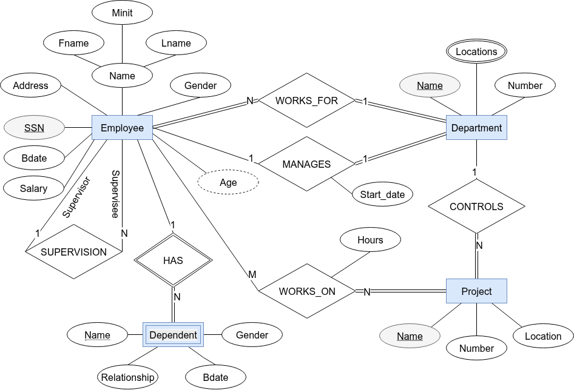



## A Brief History — Why the Relational Model?

The relational model was introduced in **1970** by the English computer scientist **Edgar F. Codd** in his landmark paper *"A Relational Model of Data for Large Shared Data Banks"*. To appreciate the model's design choices, it helps to understand the problems it was solving.

### The Problems Before 1970

Before the relational model, databases were based on **hierarchical** (tree-shaped) and **network** (graph-shaped) models. These models forced application programmers to:

- **Know the physical layout of data** — any change to file structure or storage required rewriting every application that touched that data. Codd called this *physical data dependence*.
- **Navigate the "Connection Trap"** — to retrieve related data in network models, a programmer had to walk explicit pointer paths. Missing a pointer or traversing in the wrong direction produced wrong results silently.
- **Accept inconsistency** — there was no mathematical foundation to define what "consistent" even meant, so the same fact could be stored contradictorily in different parts of the database.

### What Codd Set Out to Fix

Codd's 1970 paper targeted three specific goals:

| Goal | Problem it Solved |
|------|------------------|
| **Data independence** | Programs should work unchanged even when physical storage changes |
| **Resolving the Connection Trap** | Data relationships should be expressed declaratively (by value), not by physical pointers |
| **Mathematical consistency** | A sound basis — set theory and predicate logic — to define, query, and reason about data |

The key insight was to represent all data as **tables of values**, where relationships between tables are expressed by **matching values** (foreign keys) rather than by pointers. A query language can then declare *what* data is needed, not *how* to navigate to it — this is the foundation that SQL is built on.

::: callout-note
**From Chapter 3 to Chapter 5.** Chapters 3 and 4 produced an ER/EER diagram — Codd's conceptual-design layer, free of implementation detail. This chapter makes the transition to the relational layer: the precise mathematical structure that every ER diagram is eventually mapped into.
:::

::: callout-important
**Design order matters.** In this course, relational tables are derived from ER diagrams using the 7-step mapping covered at the end of this chapter. We do **not** design tables from scratch in this chapter. If you need to define a new table, first draw the ER diagram, then map. Skipping the ER step leads to schemas with redundancy and missing constraints.
:::

## From ER to Relational — Vocabulary Bridge

Before diving into theory, it helps to see how the concepts you already know from Chapter 3 translate into relational terminology. Every ER construct has an exact counterpart in the relational world.

| ER World (Ch 3) | Relational World (Ch 5) | Notes |
|----------------|------------------------|-------|
| Entity | Relation / Table | One rectangle → one table |
| Entity instance | Tuple / Row | One real-world object → one row |
| Attribute | Attribute / Column | Same word, same idea |
| Key attribute (underlined oval) | Primary key | The chosen unique identifier |
| Partial key (dashed-underline oval) | Part of composite PK | Combined with owner's FK to form the PK |
| Composite attribute | Multiple columns | Each sub-attribute becomes its own column |
| Derived attribute (dashed oval) | Not stored — computed in queries | Never becomes a column |
| Multivalued attribute (double oval) | Separate table with FK | Cannot be a single column |
| Strong entity | Table with its own PK | Stands alone |
| Weak entity | Table with composite PK (partial key + owner FK) | Cannot exist without owner |
| 1:N relationship | Foreign key column added to the N side | No new table needed |
| 1:1 relationship | Foreign key column on the total-participation side | No new table needed |
| M:N relationship | New junction table with composite PK | Always creates a new table |
| Relationship attribute | Column in the junction or relationship table | Moves with the relationship |

::: callout-tip
The key taxonomy you will learn in this chapter — superkey, candidate key, primary key, alternate key, foreign key, composite key — is **relational model vocabulary**. In the ER world you only had "key attribute" and "partial key". The full taxonomy only makes sense once you have a table with rows.
:::

---

## Where Do Tables Come From?

Before we dive into the mathematical definition of tables, domains, and keys, we must answer a fundamental question: **Where do the tables come from?**

We don't just invent tables randomly. We design them based on how we perceive the real world. This process starts with two core concepts: **Entities** and **Relationships**.

Database design is usually a three-step process:

1. **Conceptual Design (The "What"):** We create an abstract model of the real world. We identify the things that matter (entities) and how they are connected (relationships). This is often done using an Entity-Relationship (ER) diagram. This model is independent of any specific database software.

2. **Logical Design (The "How"):** We take our conceptual model and map it to a specific data model, such as the Relational Model. We define tables (relations), columns (attributes), keys, and constraints. This is the main subject of this chapter.

3. **Physical Design (The "Where"):** We implement our logical design on a specific Database Management System (DBMS) like MySQL, PostgreSQL, or Oracle, deciding on file organizations and indexes.

---

## Mathematical Foundation

The relational model was proposed by **E.F. Codd** in 1970 and grounded in **set theory** and **first-order predicate logic**.

A **relation** $R$ of degree $n$ is a subset of the Cartesian product of $n$ domains:

$$R \subseteq D_1 \times D_2 \times \cdots \times D_n$$

Each element of $R$ is a **tuple** $t = (v_1, v_2, \ldots, v_n)$ where $v_i \in D_i$.

A **domain** $D_i$ is a set of **atomic** (indivisible) values of the same type. For example:
- $D_{Salary} = \{x \in \mathbb{R} \;|\; x \geq 0\}$
- $D_{Gender} = \{\text{'M', 'F', 'N'}\}$

### Domain Specification Components {#sec-domain-components}

Saying "a domain is a data type" is only a starting point. A complete domain specification in a real system has seven components. These map directly to the SQL constraints you write on each column.

| Component | What it Specifies | SQL Mechanism | Example |
|-----------|------------------|---------------|---------|
| **1. Data Type** | The kind of values (integer, text, date …) | `INT`, `VARCHAR`, `DATE`, `DECIMAL`, `BOOLEAN` | `Salary DECIMAL(10,2)` |
| **2. Length / Precision** | Maximum characters, total digits, decimal places | `VARCHAR(n)`, `CHAR(n)`, `DECIMAL(p,s)` | `Name VARCHAR(50)`, `GPA DECIMAL(3,2)` |
| **3. Date Format** | How date/time values are interpreted | `DATE` (ISO 8601: `YYYY-MM-DD` internally) | `Bdate DATE` stores `1995-08-20` |
| **4. Range** | Lower and upper bounds on numeric or date values | `CHECK(col BETWEEN a AND b)` | `CHECK(GPA BETWEEN 0.0 AND 4.0)` |
| **5. Constraints** | Rules that restrict allowed values beyond type | `NOT NULL`, `UNIQUE`, `CHECK(expr)`, `PRIMARY KEY`, `FOREIGN KEY` | `CHECK(Gender IN ('M','F','N'))` |
| **6. NULL Support** | Whether the attribute may be absent | `NULL` (default) or `NOT NULL` | `Middle_Name VARCHAR(30)` — nullable |
| **7. Default Value** | Value used when none is supplied on INSERT | `DEFAULT expr` | `Status VARCHAR(10) DEFAULT 'Active'` |

::: callout-note
**Date formats.** SQL stores `DATE` values in ISO 8601 format (`YYYY-MM-DD`) internally regardless of how an application displays them. You may see `DD/MM/YYYY` in European interfaces or `MM/DD/YYYY` in American ones — these are *display* formats, not storage formats. Always insert dates as `'2026-02-07'`.
:::

#### Example: Domain Specification for a `Student` Table Column

```sql
-- Component 1 (Data Type) + Component 2 (Precision):  DECIMAL(3,2)
-- Component 4 (Range):    CHECK(GPA BETWEEN 0.0 AND 4.0)
-- Component 5 (Constraint): NOT NULL
-- Component 7 (Default):  DEFAULT 0.0
GPA  DECIMAL(3,2)  NOT NULL  DEFAULT 0.0  CHECK(GPA BETWEEN 0.0 AND 4.0)

-- Component 1 (Data Type): VARCHAR(50)
-- Component 2 (Length):    max 50 chars
-- Component 6 (NULL):      nullable (middle name may not exist)
Middle_Name  VARCHAR(50)

-- Component 1: DATE
-- Component 3 (Date Format): always stored YYYY-MM-DD
-- Component 5: NOT NULL (every student has a birth date)
Bdate  DATE  NOT NULL
```

::: callout-important
**NULL has three meanings** — even though it looks like one thing, NULL in a column can represent three different real-world situations:

| Reason | Example |
|--------|---------|
| **Unknown** — the value exists but we don't know it | `Bdate NULL` for a historical record where birth date is unrecorded |
| **Not applicable** — the attribute makes no sense for this entity | `Spouse_Name NULL` for an unmarried employee |
| **Does not exist** — the entity genuinely has no value | `Second_Phone NULL` for a person who has only one phone number |

The database cannot distinguish these three meanings from NULL alone. Use documentation or separate boolean flags when the distinction matters.
:::

---

## Key Terminology

| Formal Term | SQL Term | Meaning |
|------------|---------|---------|
| **Relation** | Table | A set of tuples; no duplicates |
| **Tuple** | Row / Record | One entity instance |
| **Attribute** | Column / Field | A named domain variable |
| **Domain** | Data type | Allowed values for an attribute |
| **Degree** | Arity | Number of attributes |
| **Cardinality** | Row count | Number of tuples |
| **Relation schema** | Table definition | $R(A_1:D_1, \ldots, A_n:D_n)$ |
| **Relation instance** | Table contents | The current set of tuples |
| **Database schema** | All table definitions | Collection of all relation schemas |
| **Database state** | All table contents | Snapshot of all current tuples |

---

## Properties of Relations

| Property | Formal Relation | SQL Table |
|----------|----------------|-----------|
| No duplicate tuples | Required by set theory | Enforced only with PK or UNIQUE |
| Tuple ordering | Irrelevant | Undefined without ORDER BY |
| Attribute ordering | Irrelevant | Fixed by column position |
| Atomic attribute values | Required (**1NF**) | Required in normalized tables |
| NULL values | Not allowed (formal model) | Allowed in ANSI SQL |

::: callout-note
SQL tables are **multisets** (bags), not sets. Without a primary key, SQL allows duplicate rows. The formal relational model does not. Always define a primary key.
:::

---

## Attribute Types {#sec-attribute-types}

An **attribute** represents a property or characteristic of an entity. Not all attributes behave the same way, and understanding their differences directly affects how you design a relational schema.

### Classification Overview

```
Attributes
├── By Structure
│   ├── Simple (Atomic)     — cannot be subdivided
│   └── Composite           — can be subdivided into sub-attributes
├── By Multiplicity
│   ├── Single-Valued       — exactly one value per entity
│   └── Multi-Valued        — multiple values per entity  → always needs a separate table
└── By Storage
    ├── Stored              — explicitly stored in the database
    ├── Derived             — computed from stored attributes → never stored as a column
    └── NULL                — value is absent (unknown / not applicable / does not exist)
```

---

### 1. Simple (Atomic) Attributes

Cannot be subdivided into smaller, meaningful parts. Each value is a single indivisible unit.

| Attribute | Why Atomic |
|-----------|-----------|
| `Ssn CHAR(9)` | Used as one 9-character block; splitting it has no meaning |
| `Age INT` | A single integer, indivisible |
| `ISBN VARCHAR(17)` | Treated as one code, not split by segment |
| `EmployeeID INT` | Single surrogate integer |

**In the relational model:** simple attributes map directly to a single column. This is the normal case.

---

### 2. Composite Attributes

Can be logically divided into sub-attributes that each carry independent meaning.

| Composite Attribute | Sub-attributes |
|--------------------|---------------|
| `Name` | `Fname`, `Minit`, `Lname` |
| `Address` | `Street`, `City`, `State`, `ZIP`, `Country` |
| `Date_of_Birth` | `Day`, `Month`, `Year` |
| `Phone` | `Country_Code`, `Area_Code`, `Number` |

**In the relational model:** composite attributes are **flattened** — each sub-attribute becomes its own column. The composite name itself does not appear as a column (Step 1 of ER-to-Relational Mapping).

```text
-- Composite 'Name' → flattened into three columns
EMPLOYEE(Ssn,
          Fname NN,   -- sub-attribute
          Minit,      -- sub-attribute (nullable)
          Lname NN)   -- sub-attribute
-- 'Name' itself is NOT an attribute in the schema
```

::: callout-tip
**Flatten or not?** Flatten when users will search, sort, or display sub-attributes independently. If `Address` will always be displayed as one string and never filtered by `City`, a single `VARCHAR` column may be acceptable — but it sacrifices flexibility.
:::

---

### 3. Single-Valued Attributes

Have **exactly one value** per entity at any given time. This is the default assumption for relational attributes.

| Example | Reason |
|---------|--------|
| `StudentID INT` | Each student has exactly one ID |
| `Bdate DATE` | Each person has one birth date |
| `Current_GPA DECIMAL(3,2)` | One current GPA per student |
| `Department VARCHAR(50)` | Employee belongs to one department at a time |

**In the relational model:** single-valued attributes map directly to a standard column — no special handling needed.

---

### 4. Multi-Valued Attributes

Can have **multiple values** for a single entity.

| Example | Multiple Values |
|---------|----------------|
| `Phone_Numbers` | `{+1-800-555-0101, +1-800-555-0102}` |
| `Email_Addresses` | `{alice@work.com, alice@home.com}` |
| `Skills` | `{Python, Java, SQL}` |
| `Dept_Locations` | `{Houston, Stafford, Bellaire}` |

**In the relational model:** multi-valued attributes **cannot** be a single column (that would violate 1NF — atomicity). They are always mapped to a **separate table** with a FK back to the owner (Step 6 of ER-to-Relational Mapping).

```text
-- Multi-valued 'Skills' → separate table
EMPLOYEE_SKILLS(Ssn NN→EMPLOYEE(Ssn) {ON DELETE CASCADE ON UPDATE CASCADE},
                Skill NN)
    PK: (Ssn, Skill)    -- composite PK: one row per (employee, skill)
```

::: callout-important
**Never store multiple values in one column.** Comma-separated lists (`'Python,Java,SQL'`) or multiple numbered columns (`Skill1`, `Skill2`, `Skill3`) both violate 1NF and break queries, indexes, and foreign keys. Always use a separate table.
:::

---

### 5. Stored Attributes

Values are **explicitly written to and read from** the database. Every column that is not derived is a stored attribute.

| Example | Stored As |
|---------|----------|
| `Bdate DATE` | The actual birth date value `1995-08-20` |
| `Salary DECIMAL(10,2)` | The exact salary figure `75000.00` |
| `Hire_Date DATE` | The calendar date the employee was hired |

---

### 6. Derived Attributes

Values can be **computed from other stored attributes** at query time. They are **never stored as columns** — storing them creates redundancy and risks inconsistency (the stored value can go stale).

| Derived Attribute | Computed From | Query Expression |
|------------------|--------------|-----------------|
| `Age` | `Bdate` | `EXTRACT(YEAR FROM AGE(Bdate))` |
| `Years_of_Experience` | `Hire_Date` | `EXTRACT(YEAR FROM AGE(Hire_Date))` |
| `Total_Salary` | `Base_Salary + Bonus` | `Base_Salary + Bonus` |
| `Total_Price` | `Quantity × Unit_Price` | `Quantity * Unit_Price` |

**In the relational model:** derived attributes are **omitted** from the schema entirely (Step 1 rule). Compute them in `SELECT` queries.

```text
-- WRONG: Age stored as a column → goes stale on every birthday
EMPLOYEE(Ssn, Fname NN, Lname NN, Bdate, Age, ...)

-- CORRECT: Age omitted from schema; computed on demand
EMPLOYEE(Ssn, Fname NN, Lname NN, Bdate, ...)
```

```sql
-- Query: derive Age at read time — always current, no storage cost
SELECT Fname, Lname,
       EXTRACT(YEAR FROM AGE(Bdate)) AS Age
FROM Employee;
```

---

### 7. NULL Attributes

NULL represents the **absence of a value**. Recall the three meanings from §Domain Specification Components:

| Reason | Attribute Example | How to Declare |
|--------|-----------------|---------------|
| **Unknown** — value exists but not recorded | `Bdate DATE` — person alive but date unknown | `Bdate DATE` (nullable, omit NOT NULL) |
| **Not applicable** — attribute doesn't apply | `Spouse_Name VARCHAR(50)` — unmarried person | `Spouse_Name VARCHAR(50)` (nullable) |
| **Does not exist** — entity has no such value | `Second_Phone CHAR(10)` — person has one phone | `Second_Phone CHAR(10)` (nullable) |

**Design rule:** Mark a column `NN` when the business rule requires a value to always be present. Leave it without `NN` when the value is genuinely optional.

```text
EMPLOYEE(Ssn,
          Fname NN,                               -- required
          Minit,                                   -- optional (middle name may not exist)
          Lname NN,                               -- required
          Salary NN CK(Salary > 0),               -- required, with range check
          Super_ssn →EMPLOYEE(Ssn)                -- nullable: CEO has no supervisor
              {ON DELETE SET NULL ON UPDATE CASCADE})
```

---

### Summary: Attribute Types at a Glance

| Type | Stored as Column? | Special Handling |
|------|------------------|-----------------|
| Simple | Yes — one column | None |
| Composite | No — **flatten** to sub-attribute columns | Step 1 mapping |
| Single-Valued | Yes — one column | None |
| Multi-Valued | No — **separate table** with FK | Step 6 mapping |
| Stored | Yes — one column | None |
| Derived | **No — omit; compute in query** | Step 1 mapping |
| NULL | Same column, `NULL`/`NOT NULL` declaration | Nullability constraint |

---

## Formal Schema Notation

A **relation schema** defines the structure of a table: its name, attributes, data types, and constraints. There are three common ways to write the same schema. This book uses the **Formal Notation** (Style 1) exclusively — learn it thoroughly, then use the other styles to read SQL textbooks or exam questions.

---

### Style 1 — Formal Notation (Used in This Book) {#sec-formal-notation}

This is the compact, implementation-independent shorthand used throughout this course.

| Symbol | Meaning | Example |
|--------|---------|----------|
| First attribute(s) in the list | **Primary Key (PK)** — listed first; underlined in diagrams | `EMPLOYEE(Ssn, ...)` |
| `NN` | `NOT NULL` | `Fname NN` |
| `U` | `UNIQUE` | `Dname NN U` |
| `CK(expr)` | `CHECK` constraint | `Salary CK(Salary >= 0)` |
| `→TABLE(pk)` | **Foreign Key** referencing TABLE's pk column | `Dno NN→DEPARTMENT(Dnumber)` |
| `{ON DELETE X  ON UPDATE Y}` | Referential action for that FK | `Dno NN→DEPARTMENT(Dnumber) {ON DELETE RESTRICT  ON UPDATE CASCADE}` |
| `PK: (a, b)` below the relation | Composite primary key (two or more attributes) | `PK: (Essn, Pno)` |

**Example — Student relation:**

```text
STUDENT(StudentID,
        Fname NN, Lname NN,
        Email NN U,
        Phone,
        GPA CK(GPA BETWEEN 0.0 AND 4.0),
        Major NN→DEPARTMENT(DeptCode) {ON DELETE SET NULL ON UPDATE CASCADE})
```

Reading it: `StudentID` is the PK (listed first). `Fname` and `Lname` must not be NULL. `Email` must be unique and not null. `Phone` is optional. `GPA` has a range check. `Major` is a FK to `DEPARTMENT` with cascading updates and NULL on department deletion.

---

### Style 2 — Shorthand Notation

Used in many textbooks and exam questions for quick sketches. Attributes are listed without data types; the primary key is **underlined**.

$$\text{STUDENT}(\underline{\text{StudentID}}, \text{Fname}, \text{Lname}, \text{Email}, \text{Phone}, \text{GPA}, \text{Major})$$

$$\text{ENROLLMENT}(\underline{\text{StudentID}}, \underline{\text{CourseID}}, \text{Semester}, \text{Grade})$$

Where: a dashed underline or arrow indicates a foreign key in many textbook diagrams.

**When to use it:** Quick whiteboard sketches, exam answers where full notation is not required. You lose all constraint information — this is a *naming* notation only.

---

### Style 3 — SQL `CREATE TABLE` (Full Constraint Notation)

The most verbose and most precise. Used for actual database implementation. The same constraints expressed in Style 1 formal notation become `CONSTRAINT` clauses.

```sql
CREATE TABLE Student (
    StudentID       INT             PRIMARY KEY AUTO_INCREMENT,
    Fname           VARCHAR(50)     NOT NULL,
    Lname           VARCHAR(50)     NOT NULL,
    Email           VARCHAR(100)    NOT NULL UNIQUE,
    Phone           CHAR(10),
    GPA             DECIMAL(3,2)    CHECK (GPA BETWEEN 0.0 AND 4.0),
    Major           VARCHAR(10),
    FOREIGN KEY (Major) REFERENCES Department(DeptCode)
        ON DELETE SET NULL
        ON UPDATE CASCADE
);
```

---

### Comparing the Three Styles

The following table shows the **same** `ENROLLMENT` relation written in all three styles.

**Logical facts:**
- PK is composite: `(StudentID, CourseID, Semester)`
- `StudentID` → FK to `STUDENT`
- `CourseID` → FK to `COURSE`
- `Grade` is optional (not yet assigned at enrollment)
- `Semester` must not be NULL

| Style | Representation |
|-------|---------------|
| **Formal (Book)** | `ENROLLMENT(StudentID NN→STUDENT(StudentID) {ON DELETE CASCADE ON UPDATE CASCADE},` <br> `CourseID NN→COURSE(CourseID) {ON DELETE CASCADE ON UPDATE CASCADE},` <br> `Semester NN, Grade)` <br> `PK: (StudentID, CourseID, Semester)` |
| **Shorthand** | $\text{ENROLLMENT}(\underline{\text{StudentID}}, \underline{\text{CourseID}}, \underline{\text{Semester}}, \text{Grade})$ |
| **SQL** | `CREATE TABLE Enrollment (StudentID INT NOT NULL, CourseID INT NOT NULL,` <br> `Semester VARCHAR(20) NOT NULL, Grade CHAR(2),` <br> `PRIMARY KEY (StudentID, CourseID, Semester),` <br> `FOREIGN KEY (StudentID) REFERENCES Student(StudentID) ON DELETE CASCADE,` <br> `FOREIGN KEY (CourseID) REFERENCES Course(CourseID) ON DELETE CASCADE);` |

::: callout-important
**Throughout this book, always use Style 1 (Formal Notation).** It is language-independent and captures all constraints concisely. SQL (Style 3) is used when implementing schemas; Shorthand (Style 2) is used only in quick diagrams.
:::

---

### Company Database — Logical Schema {#company-logical-schema}

::: callout-important
## From ER Diagram (Chapter 3) → Relational Schema (This Chapter)

The six relations below are derived directly from the Company Database ER diagram built step-by-step in **Chapter 3** using the **7-step ER-to-Relational mapping** (covered in §ER-to-Relational Mapping at the end of this chapter). Every attribute, key, and foreign key traces back to a specific ER construct — we do **not** invent tables from scratch.

Check Chapter 3 for the definitive ER diagram and attribute names.
:::

{fig-align="center" width="100%"}

#### Logical Schema Tables (Full Detail)

Each table below shows the complete picture: every column, its data type, integrity constraints, which columns are primary or foreign keys, and the referential actions that keep the database consistent when rows are updated or deleted.

---

**EMPLOYEE** — strong entity EMPLOYEE (ER Step 1)

| Column | Data Type | Key | Constraints | FK → Table(col) | ON UPDATE | ON DELETE |
|--------|-----------|-----|-------------|-----------------|-----------|-----------|
| `Ssn` | `CHAR(9)` | **PK** | NOT NULL | — | — | — |
| `Fname` | `VARCHAR(15)` | | NOT NULL | — | — | — |
| `Minit` | `CHAR(1)` | | | — | — | — |
| `Lname` | `VARCHAR(15)` | | NOT NULL | — | — | — |
| `Bdate` | `DATE` | | | — | — | — |
| `Address` | `VARCHAR(100)` | | | — | — | — |
| `Gender` | `CHAR(1)` | | CHECK (`IN ('M','F','N')`) | — | — | — |
| `Salary` | `DECIMAL(10,2)` | | NOT NULL, CHECK (`> 0`) | — | — | — |
| `Super_ssn` | `CHAR(9)` | | nullable | EMPLOYEE(`Ssn`) | CASCADE | SET NULL |
| `Dno` | `INT` | **FK** | NOT NULL | DEPARTMENT(`Dnumber`) | CASCADE | RESTRICT |

> `Super_ssn` is nullable — top-level managers have no supervisor (SUPERVISION is partial on both sides).  
> `ON DELETE SET NULL` on `Super_ssn` — if a supervisor is deleted, subordinates stay but their supervisor reference is cleared.  
> `ON DELETE RESTRICT` on `Dno` — a department with assigned employees cannot be deleted; reassign employees first.

---

**DEPARTMENT** — strong entity DEPARTMENT (ER Step 2)

| Column | Data Type | Key | Constraints | FK → Table(col) | ON UPDATE | ON DELETE |
|--------|-----------|-----|-------------|-----------------|-----------|-----------|
| `Dnumber` | `INT` | **PK** | NOT NULL | — | — | — |
| `Dname` | `VARCHAR(25)` | | NOT NULL, UNIQUE | — | — | — |
| `Mgr_ssn` | `CHAR(9)` | **FK** | NOT NULL | EMPLOYEE(`Ssn`) | CASCADE | RESTRICT |
| `Mgr_start_date` | `DATE` | | | — | — | — |

> `Mgr_ssn` is NOT NULL — every department must have exactly one manager (DEPARTMENT is total in MANAGES).  
> `ON DELETE RESTRICT` on `Mgr_ssn` — you cannot delete an employee who is currently a department manager; reassign first.

---

**DEPT_LOCATIONS** — multivalued attribute `Locations` of DEPARTMENT (ER Step 2 / Mapping Rule 6)

| Column | Data Type | Key | Constraints | FK → Table(col) | ON UPDATE | ON DELETE |
|--------|-----------|-----|-------------|-----------------|-----------|-----------|
| `Dnumber` | `INT` | **PK + FK** | NOT NULL | DEPARTMENT(`Dnumber`) | CASCADE | CASCADE |
| `Dlocation` | `VARCHAR(50)` | **PK** | NOT NULL | — | — | — |

> Composite PK: `(Dnumber, Dlocation)` — a department can appear many times, once per location.  
> `ON DELETE CASCADE` — when a department is deleted, all its location rows are removed automatically.

---

**PROJECT** — strong entity PROJECT (ER Step 4)

| Column | Data Type | Key | Constraints | FK → Table(col) | ON UPDATE | ON DELETE |
|--------|-----------|-----|-------------|-----------------|-----------|-----------|
| `Pnumber` | `INT` | **PK** | NOT NULL | — | — | — |
| `Pname` | `VARCHAR(25)` | | NOT NULL, UNIQUE | — | — | — |
| `Plocation` | `VARCHAR(50)` | | | — | — | — |
| `Dnum` | `INT` | **FK** | NOT NULL | DEPARTMENT(`Dnumber`) | CASCADE | RESTRICT |

> `Dnum` is NOT NULL — every project is controlled by exactly one department (PROJECT is total in CONTROLS).  
> `ON DELETE RESTRICT` — a department that controls active projects cannot be deleted.

---

**WORKS_ON** — M:N relationship WORKS_ON with attribute `Hours` (ER Step 6)

| Column | Data Type | Key | Constraints | FK → Table(col) | ON UPDATE | ON DELETE |
|--------|-----------|-----|-------------|-----------------|-----------|-----------|
| `Essn` | `CHAR(9)` | **PK + FK** | NOT NULL | EMPLOYEE(`Ssn`) | CASCADE | CASCADE |
| `Pno` | `INT` | **PK + FK** | NOT NULL | PROJECT(`Pnumber`) | CASCADE | CASCADE |
| `Hours` | `DECIMAL(5,1)` | | CHECK (`>= 0`) | — | — | — |

> Composite PK: `(Essn, Pno)` — one row per (employee, project) pair.  
> `ON DELETE CASCADE` on both FKs — removing an employee or project automatically deletes the related work assignments.

---

**DEPENDENT** — weak entity DEPENDENT, owned by EMPLOYEE via HAS (ER Step 8)

| Column | Data Type | Key | Constraints | FK → Table(col) | ON UPDATE | ON DELETE |
|--------|-----------|-----|-------------|-----------------|-----------|-----------|
| `Essn` | `CHAR(9)` | **PK + FK** | NOT NULL | EMPLOYEE(`Ssn`) | CASCADE | CASCADE |
| `Dependent_name` | `VARCHAR(50)` | **PK** | NOT NULL | — | — | — |
| `Gender` | `CHAR(1)` | | CHECK (`IN ('M','F','N')`) | — | — | — |
| `Bdate` | `DATE` | | | — | — | — |
| `Relationship` | `VARCHAR(20)` | | | — | — | — |

> Composite PK: `(Essn, Dependent_name)` — the partial key `Dependent_name` is unique only within one employee's dependents.  
> `ON DELETE CASCADE` — a dependent is a weak entity and cannot exist without its owning employee.

---

#### Compact Schema (Quick Reference)

The same six relations using the formal shorthand (identical convention used throughout §ER-to-Relational Mapping). PK = first/leading attribute(s); `NN` = NOT NULL; `U` = UNIQUE; `CK()` = CHECK; `→TABLE(pk)` = FK; `{…}` = referential actions; `PK: (a, b)` below = composite PK.

```text
EMPLOYEE(Ssn,
         Fname NN, Minit, Lname NN, Bdate, Address,
         Gender CK(Gender IN ('M','F','N')),
         Salary NN CK(Salary > 0),
         Super_ssn  →EMPLOYEE(Ssn)         {ON DELETE SET NULL   ON UPDATE CASCADE},
         Dno       NN→DEPARTMENT(Dnumber)  {ON DELETE RESTRICT   ON UPDATE CASCADE})

DEPARTMENT(Dnumber, Dname NN U,
           Mgr_ssn    NN→EMPLOYEE(Ssn)     {ON DELETE RESTRICT   ON UPDATE CASCADE},
           Mgr_start_date)

DEPT_LOCATIONS(Dnumber→DEPARTMENT(Dnumber) {ON DELETE CASCADE    ON UPDATE CASCADE},
               Dlocation NN)
    PK: (Dnumber, Dlocation)

PROJECT(Pnumber, Pname NN U, Plocation,
        Dnum NN→DEPARTMENT(Dnumber)         {ON DELETE RESTRICT   ON UPDATE CASCADE})

WORKS_ON(Essn→EMPLOYEE(Ssn)                {ON DELETE CASCADE    ON UPDATE CASCADE},
         Pno→PROJECT(Pnumber)              {ON DELETE CASCADE    ON UPDATE CASCADE},
         Hours CK(Hours >= 0))
    PK: (Essn, Pno)

DEPENDENT(Essn→EMPLOYEE(Ssn)               {ON DELETE CASCADE    ON UPDATE CASCADE},
          Dependent_name NN,
          Gender CK(Gender IN ('M','F','N')),
          Bdate, Relationship)
    PK: (Essn, Dependent_name)
```

---

## Complete Key Taxonomy

The word "key" is overloaded in database terminology. Here is the complete hierarchy:

```{mermaid}
%%| eval: true
%%| echo: false
flowchart TD
    SK["Superkey<br/>(any set of attributes<br/>that uniquely identifies a tuple)"]
    CK["Candidate Key<br/>(minimal superkey —<br/>no proper subset is a superkey)"]
    PK["Primary Key<br/>(chosen candidate key;<br/>NOT NULL + UNIQUE enforced by DBMS)"]
    AK["Alternate Key<br/>(any other candidate key;<br/>UNIQUE NOT NULL in SQL)"]
    UK["Unique Key<br/>(UNIQUE constraint;<br/>NULLs permitted — not necessarily a candidate key)"]
    FK["Foreign Key<br/>(references PK of another relation)"]
    NK["Natural Key<br/>(PK is a real-world attribute:<br/>e.g., SSN, ISBN)"]
    SK2["Surrogate Key<br/>(system-generated integer:<br/>e.g., AUTO_INCREMENT id)"]
    COMP["Composite Key<br/>(PK made of two or more attributes)"]

    SK --> CK
    CK --> PK
    CK --> AK
    AK -.->|"implemented as"| UK
    PK --> NK
    PK --> SK2
    PK --> COMP
    PK -.->|"can be referenced by"| FK
```

### Definitions

::: callout-note
**Coming from ER diagrams?** The key attribute (underlined oval) in an ER diagram corresponds to the **primary key** here. A partial key (dashed-underline) on a weak entity becomes part of a **composite primary key** in the relational table. The rest of this taxonomy — superkey, candidate key, alternate key, foreign key — is relational-model vocabulary that has no direct ER equivalent. Foreign keys specifically are created by the mapping rules in §ER-to-Relational Mapping at the end of this chapter.
:::

**Superkey**: A set of one or more attributes $\{A_1, \ldots, A_k\}$ such that no two tuples in any valid relation instance share the same values for all $k$ attributes.

**Candidate key**: A *minimal* superkey — removing any attribute from the set destroys its uniqueness property.

**Primary key**: The candidate key chosen by the designer as the official identifier. The DBMS creates an *implicit* unique, not-null index for the PK.

**Alternate key**: Any candidate key that was not chosen as the PK. These should still be declared as `UNIQUE NOT NULL` (or `UNIQUE` if NULLs are possible) to prevent duplicate non-null values.

**Unique key**: A `UNIQUE` constraint placed on any column or column combination that is **not** the primary key. It guarantees no two non-NULL values are the same, but — unlike primary keys — it **permits NULL** values (typically more than one, since NULLs are considered distinct in most SQL engines). Every alternate key is implemented as a unique key, but not every unique key is a candidate key.

::: callout-important
**Primary Key vs Alternate Key vs Unique Key — the distinction:**

| | Primary Key | Alternate Key | Unique Key |
|--|-------------|--------------|------------|
| Is it a candidate key? | Yes | Yes | Not necessarily |
| NULL allowed? | **Never** | Depends (usually NOT NULL) | **Yes** (NULLs permitted) |
| How many per table? | Exactly one | Zero or more | Zero or more |
| SQL declaration | `PRIMARY KEY` | `UNIQUE NOT NULL` | `UNIQUE` |
| Example | `StudentID` | `Email` (declared `UNIQUE NOT NULL`) | `Phone` (declared `UNIQUE`, may be NULL) |

In practice: declare your chosen PK with `PRIMARY KEY`; declare all other candidate keys with `UNIQUE NOT NULL`; declare non-key uniqueness requirements (e.g., usernames that may be left blank during registration) with `UNIQUE` alone.
:::

```sql
CREATE TABLE Student (
    StudentID   INT         PRIMARY KEY,        -- Primary Key: NOT NULL + UNIQUE enforced by DBMS
    Ssn         CHAR(9)     UNIQUE NOT NULL,     -- Alternate Key: also a candidate key, no NULLs
    Email       VARCHAR(100) UNIQUE NOT NULL,    -- Alternate Key: also a candidate key
    Phone       CHAR(10)    UNIQUE,              -- Unique Key: uniqueness enforced, but NULLs allowed
    Fname       VARCHAR(50) NOT NULL,
    Lname       VARCHAR(50) NOT NULL
);
```

**Foreign key (FK)**: Attribute(s) in relation $R_1$ that reference the PK of relation $R_2$. Enforces **referential integrity** between tables.

**Natural key**: A real-world attribute used as PK (SSN, passport number, ISBN). Pros: meaningful to users; Cons: changes in the real world break referential integrity.

**Surrogate key**: A system-generated integer (e.g., `id INT AUTO_INCREMENT`) used as PK. Pros: stable, compact, never changes; Cons: no business meaning.

**Composite key**: A PK made of two or more attributes. Required for M:N junction tables and weak entities.

---

## Choosing a Primary Key

When multiple candidate keys exist, use this guide:

| Criterion | Recommendation |
|-----------|---------------|
| **Stability** | Choose the candidate key most unlikely to change (SSNs change if government reassigns; `id` never changes) |
| **Compactness** | Prefer fewer bytes — integer (4 bytes) over UUID (16 bytes) over long string; smaller PK = faster indexes |
| **Natural vs. surrogate** | Prefer surrogate for entities that are internal (orders, log entries); natural is acceptable for lookup tables (country code, ISO currency) |
| **Composite vs. single-column** | Single-column PKs are easier to reference via FKs in multiple tables; composite is fine for junction tables |
| **Uniqueness guarantee** | If no real-world attribute reliably guarantees uniqueness (people can share names, addresses), use a surrogate |

::: callout-note
## Rule of Thumb

Use `id INT AUTO_INCREMENT` (or `BIGINT` for very large tables) as PK for most tables. Keep natural keys as `UNIQUE NOT NULL` alternate keys. This gives you: stability, compactness, and a meaningful constraint on the business attribute.

```sql
CREATE TABLE Employee (
    id        INT          AUTO_INCREMENT PRIMARY KEY,
    Ssn       CHAR(9)      NOT NULL UNIQUE,   -- alternate key
    Fname     VARCHAR(15)  NOT NULL,
    Salary    DECIMAL(10,2) CHECK (Salary > 0),
    Dno       INT          NOT NULL REFERENCES Department(id)
);
```
:::

---

## Key Analysis — Worked Examples {#sec-key-examples}

The following examples build key-identification skill systematically. For each example, the method is:

1. Identify **superkeys** — any attribute set that guarantees uniqueness based on business rules (not just current data).
2. Find the **minimal** superkeys → these are the **candidate keys**.
3. Choose one candidate key as the **primary key** (using the selection guide above).
4. Remaining candidate keys → **alternate keys** (declared `UNIQUE NOT NULL`).
5. Note any **unique keys** (UNIQUE but NULL permitted, or non-minimal).
6. Identify **foreign keys** from context.

::: callout-important
**Never infer keys from sample data alone.** If a column happens to have no duplicates in the current rows, that does not make it a key. A key must be justified by a *business rule* or a stated functional dependency that holds for all past, present, and future valid instances.
:::

---

### Example 1 — Students Table (Multiple Candidate Keys, Nullable Alternate Key)

| StudentID | Name | Email | Phone | Major | AdvisorID |
|-----------|------|-------|-------|-------|-----------|
| 1001 | Alice | alice@uni.edu | 555-0101 | CS | 501 |
| 1002 | Bob | bob@uni.edu | 555-0102 | Math | 502 |
| 1003 | Alice | NULL | 555-0103 | CS | 501 |

**Semantic rules:** `StudentID` is auto-generated and always unique. `Email` is university-assigned and unique when present, but may be NULL for new students. `Name`, `Major`, `AdvisorID` can repeat.

**Superkey analysis:**

| Attribute Set | Unique in All Future Instances? | Verdict |
|--------------|--------------------------------|---------|
| `{StudentID}` | Yes — auto-generated, enforced | **Superkey** |
| `{Email}` | Yes for non-NULL values (NULLs are distinct in SQL) | **Superkey** |
| `{Name}` | No — two students named Alice already | Not a superkey |
| `{Major}` | No — CS appears twice | Not a superkey |
| `{StudentID, Name}` | Yes — but Name is redundant | Superkey, not minimal |
| `{StudentID, Email}` | Yes — but each alone already works | Superkey, not minimal |

**Results:**

| Key Type | Value | SQL Declaration |
|----------|-------|----------------|
| Candidate keys | `{StudentID}`, `{Email}` | — |
| **Primary key** | `StudentID` | `PRIMARY KEY` |
| Alternate key | `Email` | `UNIQUE` (NULL permitted for new students) |
| Unique key | `Email` | `UNIQUE` |
| Foreign key | `AdvisorID → ADVISOR(AdvisorID)` | `FOREIGN KEY ... ON DELETE SET NULL` |

**Formal schema notation:**
```text
STUDENT(StudentID,
        Name NN,
        Email U,
        Phone,
        Major,
        AdvisorID →ADVISOR(AdvisorID) {ON DELETE SET NULL ON UPDATE CASCADE})
```

---

### Example 2 — Scoreboard (Composite Candidate Key)

*A racing game records scores. Each player has at most one score per year.*

| Player | Year | Score |
|--------|------|-------|
| Mario | 2023 | 9800 |
| Luigi | 2023 | 8750 |
| Luigi | 2024 | 9100 |
| Mario | 2024 | 9800 |

**Semantic rule:** One score per player per year. The same score value can appear for different players or in different years.

**Superkey analysis:**

| Attribute Set | Unique? | Reason |
|--------------|---------|--------|
| `{Player}` | No | Luigi appears twice |
| `{Year}` | No | 2023 appears twice |
| `{Score}` | No | 9800 appears twice |
| `{Player, Year}` | Yes | Business rule: one score per player per year | **→ Superkey** |
| `{Player, Score}` | No | Same player could score the same in different years |
| `{Score, Year}` | No | Different players could tie in the same year |
| `{Player, Year, Score}` | Yes | Contains `{Player, Year}` | → Superkey, not minimal |

**Results:**

| Key Type | Value |
|----------|-------|
| Candidate key | `{Player, Year}` |
| **Primary key** | `(Player, Year)` — composite |
| Alternate keys | None |
| Foreign keys | None |

::: callout-important
**The Superset Principle.** Once `{Player, Year}` is a superkey, every superset — `{Player, Year, Score}`, etc. — is automatically also a superkey. Only the *minimal* superkeys are candidate keys. Listing every possible superkey is unnecessary.
:::

**Formal schema notation:**
```text
SCOREBOARD(Player NN, Year NN, Score NN)
    PK: (Player, Year)
```

---

### Example 3 — Employee / Department / Project (Multi-Table)

**Employee** table — semantic rules: `EmployeeID` system-generated, unique. `Email` unique per employee. `DepartmentID` repeats.

| Key Type | EMPLOYEE | DEPARTMENT | PROJECT |
|----------|---------|-----------|---------|
| Candidate keys | `{EmployeeID}`, `{Email}` | `{DepartmentID}`, `{DepartmentName}` | `{ProjectID}` |
| **Primary key** | `EmployeeID` | `DepartmentID` | `ProjectID` |
| Alternate keys | `Email` | `DepartmentName` | None |
| Unique keys | `Email` | `DepartmentName` | None |
| Foreign keys | `DepartmentID → DEPARTMENT` | None | `ManagerID → EMPLOYEE` |

**Formal schema notation:**
```text
EMPLOYEE(EmployeeID,
         FirstName NN, LastName NN,
         Email NN U,
         DepartmentID NN→DEPARTMENT(DepartmentID) {ON DELETE RESTRICT ON UPDATE CASCADE})

DEPARTMENT(DepartmentID, DepartmentName NN U)

PROJECT(ProjectID,
        ProjectName NN,
        ManagerID NN→EMPLOYEE(EmployeeID) {ON DELETE RESTRICT ON UPDATE CASCADE})
```

---

### Example 4 — Online Store Orders (Surrogate Key, Composite Trap)

*An online store records orders. `OrderID` is always unique. A customer may order the same product twice on the same day.*

| OrderID | CustomerID | OrderDate | ProductID |
|---------|-----------|-----------|-----------|
| 1001 | C1 | 2026-01-15 | PRD-A |
| 1002 | C1 | 2026-01-15 | PRD-B |
| 1003 | C2 | 2026-01-16 | PRD-A |

**Why `{CustomerID, OrderDate, ProductID}` is not a candidate key:** The business allows a customer to order the same product twice on the same day. Future rows could duplicate that triple — so it is not a reliable superkey.

**Results:**

| Key Type | Value |
|----------|-------|
| Candidate key | `{OrderID}` only |
| **Primary key** | `OrderID` (surrogate) |
| Alternate keys | None |
| Foreign keys | `CustomerID → CUSTOMERS`, `ProductID → PRODUCTS` |

**Formal schema notation:**
```text
ORDER(OrderID,
      CustomerID NN→CUSTOMERS(CustomerID) {ON DELETE RESTRICT ON UPDATE CASCADE},
      OrderDate NN,
      ProductID NN→PRODUCTS(ProductID) {ON DELETE RESTRICT ON UPDATE CASCADE})
```

---

### Example 5 — University Students (Nullable Candidate Keys)

**Semantic rules:** `StudentID` — never NULL, always unique. `Ssn` — unique when present, NULL for international students. `Email` — unique when present, NULL during registration. `Phone` and `Name` can repeat.

**Results:**

| Key Type | Value | SQL |
|----------|-------|-----|
| Candidate keys | `{StudentID}`, `{Ssn}`, `{Email}` | — |
| **Primary key** | `StudentID` — never NULL, stable | `PRIMARY KEY` |
| Alternate keys | `Ssn`, `Email` | `UNIQUE` (NULLs permitted) |
| Foreign keys | None in this table | — |

**Formal schema notation:**
```text
STUDENT(StudentID,
        Fname NN, Lname NN,
        Ssn U,
        Email U,
        Phone)
```

::: callout-note
`Ssn U` and `Email U` use the `U` (UNIQUE) symbol without `NN`, reflecting that NULLs are permitted. In SQL: `UNIQUE` without `NOT NULL`. Multiple NULLs are allowed because `NULL ≠ NULL` in SQL — each NULL is considered distinct and does not violate UNIQUE.
:::

---

### Example 6 — Self-Referencing FK (Employee Hierarchy)

*Each employee may have a manager who is also an employee. The CEO has no manager.*

| EmpID | Name | ManagerID | DeptID |
|-------|------|----------|--------|
| E001 | Nour | NULL | D1 |
| E002 | Ahmed | E001 | D1 |
| E003 | Sara | E001 | D2 |
| E004 | Omar | E002 | D1 |

**Results:**

| Key Type | Value |
|----------|-------|
| Candidate key | `{EmpID}` |
| **Primary key** | `EmpID` |
| Alternate keys | None |
| Foreign keys | `ManagerID → EMPLOYEE(EmpID)` (self-ref), `DeptID → DEPARTMENT` |

**Formal schema notation:**
```text
EMPLOYEE(EmpID,
         Name NN,
         ManagerID  →EMPLOYEE(EmpID)    {ON DELETE SET NULL  ON UPDATE CASCADE},
         DeptID NN →DEPARTMENT(DeptID)  {ON DELETE RESTRICT  ON UPDATE CASCADE})
```

::: callout-note
**Self-referencing FK.** The FK `ManagerID` points back to the same table (`EMPLOYEE`). `ManagerID` is nullable — the root of the hierarchy (CEO) has no manager. `ON DELETE SET NULL` means: if a manager row is deleted, their direct reports' `ManagerID` is set to NULL rather than the reports being deleted.
:::

---

## Integrity Constraints

### Domain Constraint

Every attribute value must belong to the attribute's domain.

```sql
Gender  CHAR(1) CHECK (Gender IN ('M','F','N'))
Salary DECIMAL(10,2) CHECK (Salary >= 0)
```

### Entity Integrity Constraint

> **No component of a [primary key]{fg="#c0392b" .bold} may be NULL.**

The PK is the tuple's identifier. A NULL PK would mean "we don't know which entity this is" — making the row unidentifiable and violating the relational model.

### Referential Integrity Constraint

Let $R_1$ have a [foreign key]{fg="#2980b9" .bold} $FK$ referencing $R_2$'s primary key $PK$. The constraint is:

$$\forall t_1 \in r_1: t_1[FK] = \text{NULL} \;\lor\; \exists t_2 \in r_2: t_2[PK] = t_1[FK]$$

*Plain English:* Every non-NULL FK value in $R_1$ must match an existing PK value in $R_2$.

### Key Uniqueness Constraint

Every candidate key must hold distinct non-NULL values across all tuples.

::: callout-important
## Constraint Violations — Quick Reference

| Constraint | Violation example | Error message type |
|-----------|---------|---------|
| Domain | `INSERT Salary = -5000` | CHECK constraint failed |
| Entity integrity | `INSERT INTO Employee (Ssn) VALUES (NULL)` | Column 'Ssn' cannot be null |
| Referential integrity | `INSERT Employee Dno=99` where Dept 99 doesn't exist | Foreign key constraint failed |
| Key uniqueness | Two rows with same Ssn | Duplicate entry for key 'Ssn' |
:::

---

## Foreign Key Actions

When a referenced PK is deleted or updated, the DBMS executes the declared **referential action**:

| Action | On DELETE | On UPDATE | Meaning |
|--------|-----------|-----------|---------|
| `RESTRICT` / `NO ACTION` | Default | Default | Reject the operation if matching FK rows exist |
| `CASCADE` | Delete matching FK rows | Update FK values to match new PK | Propagate automatically |
| `SET NULL` | Set FK to NULL | Set FK to NULL | Detach the referencing rows |
| `SET DEFAULT` | Set FK to default value | Set FK to default | Fill with a placeholder |

### Example 1 — What Each Action Does {#sec-fk-action-example}

**Setup.** The schema below declares `EMPLOYEE.Dno` as a FK referencing `DEPARTMENT`:

```
DEPARTMENT(Dnumber: INT NN, Dname: VARCHAR(20) NN U)
  PK: (Dnumber)

EMPLOYEE(Ssn: CHAR(9) NN, Fname: VARCHAR(15) NN,
         Dno: INT → DEPARTMENT(Dnumber) {ON DELETE <action> ON UPDATE <action>})
  PK: (Ssn)
```

**Initial data:**

**DEPARTMENT**

| Dnumber | Dname          |
|---------|----------------|
| 5       | Research       |
| 4       | Administration |

**EMPLOYEE**

| Ssn       | Fname | Dno |
|-----------|-------|-----|
| 123456789 | Alice | 5   |
| 333445555 | Bob   | 5   |
| 987654321 | Carol | 4   |

**Case A — `DELETE FROM DEPARTMENT WHERE Dnumber = 5`**

*(Alice and Bob both reference Dnumber = 5)*

| Action on FK | What the DBMS does | EMPLOYEE after |
|--------------|--------------------|----------------|
| `RESTRICT` | **Operation rejected.** Alice and Bob still reference Dno = 5. | Unchanged |
| `CASCADE` | Alice's row and Bob's row are **deleted automatically**. | Only Carol remains |
| `SET NULL` | Alice.Dno ← **NULL**, Bob.Dno ← **NULL**. | All 3 rows kept; Dno is NULL for Alice & Bob |
| `SET DEFAULT` | Alice.Dno ← **default value** (e.g., 1), Bob.Dno ← default. | All 3 rows kept; Dno = 1 for Alice & Bob |

**Case B — `UPDATE DEPARTMENT SET Dnumber = 7 WHERE Dnumber = 5`**

| Action on FK | What the DBMS does | EMPLOYEE after |
|--------------|--------------------|----------------|
| `RESTRICT` | **Operation rejected.** Alice and Bob still hold Dno = 5. | Unchanged |
| `CASCADE` | Alice.Dno ← **7**, Bob.Dno ← **7** automatically. | Dno = 7 for Alice & Bob |
| `SET NULL` | Alice.Dno ← **NULL**, Bob.Dno ← **NULL**. | All 3 rows kept; Dno is NULL |
| `SET DEFAULT` | Alice.Dno ← **default**, Bob.Dno ← **default**. | Dno = default for Alice & Bob |

::: callout-tip
**Choosing the right action:**
- **CASCADE** is appropriate for weak entity owners (deleting a department deletes all employees in it).
- **SET NULL** is appropriate when the relationship is optional (an employee can temporarily have no department).
- **RESTRICT** is the safest default — it forces you to handle the dependency explicitly before deleting/updating.
:::

---

### Example 2 — Multiple FK References: One RESTRICT Blocks Everything {#sec-fk-conflict}

A single parent table can be referenced by **multiple child tables**, each with its own declared action.
The critical rule is:

::: callout-important
**All FK constraints on the parent row are checked before the operation is allowed.**
If even **one** referencing table uses `RESTRICT` and has matching rows, the entire operation is rejected — regardless of what the other child tables declare.
:::

**Setup.**

```
DEPARTMENT(Dnumber: INT NN, Dname: VARCHAR(20) NN U)
  PK: (Dnumber)

EMPLOYEE(Ssn: CHAR(9) NN, Fname: VARCHAR(15) NN,
         Dno: INT → DEPARTMENT(Dnumber) {ON DELETE CASCADE ON UPDATE CASCADE})
  PK: (Ssn)

PROJECT(Pnumber: INT NN, Pname: VARCHAR(15) NN,
        Dnum: INT → DEPARTMENT(Dnumber) {ON DELETE RESTRICT ON UPDATE RESTRICT})
  PK: (Pnumber)
```

**Initial data:**

**DEPARTMENT**

| Dnumber | Dname    |
|---------|----------|
| 5       | Research |
| 4       | Admin    |

**EMPLOYEE**

| Ssn       | Fname | Dno |
|-----------|-------|-----|
| 123456789 | Alice | 5   |
| 333445555 | Bob   | 5   |

**PROJECT**

| Pnumber | Pname      | Dnum |
|---------|------------|------|
| 10      | ProductX   | 5    |
| 20      | Automation | 4    |

**Scenario A — Try to delete Research (Dnumber = 5):**

The DBMS checks **both** child tables:

| Child table | Action declared | Matching rows? | Result |
|-------------|-----------------|----------------|--------|
| EMPLOYEE | `ON DELETE CASCADE` | Alice, Bob → Dno = 5 | Would cascade-delete them |
| PROJECT | `ON DELETE RESTRICT` | ProductX → Dnum = 5 | **BLOCKS the operation** |

→ **`DELETE` is rejected.** Neither the department row nor the employee rows are removed.
The application must first delete or reassign `PROJECT` rows that reference Dnumber = 5, then retry.

**Scenario B — Try to delete Admin (Dnumber = 4):**

| Child table | Action declared | Matching rows? | Result |
|-------------|-----------------|----------------|--------|
| EMPLOYEE | `ON DELETE CASCADE` | Carol → Dno = 4 | Would cascade-delete Carol |
| PROJECT | `ON DELETE RESTRICT` | Automation → Dnum = 4 | **BLOCKS the operation** |

→ **`DELETE` is also rejected** because Automation references Dnumber = 4.

**Scenario C — Try to delete a department with NO child references (e.g., add Dnumber = 9 with no employees or projects):**

| Child table | Matching rows? | Result |
|-------------|----------------|--------|
| EMPLOYEE | None | OK |
| PROJECT | None | OK |

→ **`DELETE` succeeds** because no FK constraint is violated.

::: callout-note
**Key takeaway:** When designing a schema with multiple FK references to the same parent, think of `RESTRICT` as a *veto*. Any `RESTRICT` FK with live referencing rows will block the operation for the entire parent row, even if every other FK says `CASCADE`.
:::

---

## NULL Values and Three-Valued Logic

**NULL** represents *unknown*, *missing*, or *not applicable*. Different NULLs express different real-world meanings:

| Reason for NULL | Example |
|----------------|---------|
| Unknown | `Bdate` of an employee not on record |
| Not applicable | `Super_ssn` for the CEO (no supervisor) |
| Not yet known | `Mgr_start_date` during a transition period |

### Three-Valued Logic

Standard two-valued logic (TRUE/FALSE) does not work with NULLs. SQL uses **three-valued logic** (TRUE / FALSE / UNKNOWN):

| P | Q | P AND Q | P OR Q |
|---|---|---------|--------|
| T | UNKNOWN | UNKNOWN | T |
| F | UNKNOWN | F | UNKNOWN |
| UNKNOWN | UNKNOWN | UNKNOWN | UNKNOWN |

Comparisons involving NULL always yield UNKNOWN:
```sql
NULL = NULL   → UNKNOWN  (not TRUE!)
NULL <> NULL  → UNKNOWN
NULL IS NULL  → TRUE     (use IS NULL / IS NOT NULL)
```

::: callout-important
Aggregate functions (`SUM`, `AVG`, `MAX`, `MIN`) **ignore NULL values**. `COUNT(*)` counts all rows; `COUNT(column)` counts only non-NULL values.
:::

---

## Business Rules: DB Constraints vs. Application Logic

A **business rule** is a statement about the organization that must always be true.

| Where to enforce | Examples | Mechanism |
|-----------------|---------|-----------|
| **Database (DBMS)** | "Salary must be positive"; "Every employee must belong to a department"; "SSN is unique" | `CHECK`, `NOT NULL`, `FOREIGN KEY`, `UNIQUE` |
| **Application code** | "Managers must have 3 years experience"; "Enrollment requires prerequisite completion" | Business logic layer, triggers |
| **Both** | "Age must be ≥ 18" | `CHECK` in DB + client-side validation |

::: callout-tip
**Prefer DB-level constraints wherever possible.** Application code changes frequently; different applications may access the same database and accidentally skip validation. A DB constraint cannot be bypassed from any application.

The exception: complex rules that require multi-table logic or dynamic thresholds are better expressed in **stored procedures** or **triggers** (or at the business logic layer for maintainability).
:::

---

## Handling Constraint Violations in Applications {#sec-violation-handling}

The DBMS will reject any INSERT, UPDATE, or DELETE that violates a constraint — but simply letting the error crash your application is not acceptable. This section explains what each operation can violate and how to handle it properly.

### What Each Operation Can Violate

| Operation | Possible Violations |
|-----------|-------------------|
| **INSERT** | PK duplicate; FK value not in parent table; NOT NULL column omitted; UNIQUE duplicate; CHECK fails; domain type mismatch |
| **UPDATE** | PK changed to a duplicate; FK changed to non-existent parent; NOT NULL set to NULL; UNIQUE creates duplicate; CHECK fails; referential integrity on parent PK update |
| **DELETE** | **Referential integrity** — deleting a parent row that has matching FK children (default: RESTRICT rejects the delete) |

::: callout-note
DELETE does not violate PK, UNIQUE, NOT NULL, or CHECK constraints — those apply to the *values* in a row, not to removing rows.
:::

### Referential Actions Recap

When a parent row's PK is deleted or updated, the DBMS applies the declared action to the child FK rows:

| Action | On DELETE | On UPDATE |
|--------|-----------|-----------|
| `RESTRICT` / `NO ACTION` | Reject if child rows exist | Reject if child rows exist |
| `CASCADE` | Delete child rows | Propagate new PK value to FKs |
| `SET NULL` | Set FK to NULL | Set FK to NULL |
| `SET DEFAULT` | Set FK to its declared default | Set FK to its declared default |

### Application-Level Response Strategies

Knowing the DBMS will reject invalid data is not enough — your application must handle the error gracefully. The following strategies apply regardless of programming language or framework:

**Strategy 1 — Pre-validate before issuing SQL**

Check incoming data against business rules before sending the query. This avoids unnecessary round-trips to the database for obviously invalid input.

```sql
-- Example: check uniqueness before inserting
SELECT COUNT(*) FROM Student WHERE Email = 'newstudent@uni.edu';
-- If 0, proceed with INSERT; otherwise inform the user
```

> Caveat: Pre-validation has a race condition in concurrent environments — another transaction may insert the same email between your check and your insert. Always combine pre-validation with constraint enforcement at the DB level.

**Strategy 2 — Use transactions for multi-statement operations**

Wrap related INSERT/UPDATE/DELETE statements in a single transaction. If any statement causes a violation, roll back the entire unit of work so no partial changes persist.

```sql
BEGIN;
    INSERT INTO Department (Dnumber, Dname, Mgr_ssn, Mgr_start_date)
        VALUES (5, 'Robotics', 'E999', '2026-01-01');     -- may fail if E999 doesn't exist yet
    INSERT INTO Employee (Ssn, Fname, Lname, Salary, Dno)
        VALUES ('E999', 'Laila', 'Nasser', 90000, 5);
COMMIT;
-- If Employee insert fails, the Department insert is rolled back
```

**Strategy 3 — Catch and translate DBMS error codes**

Every DBMS returns a specific error code for each constraint violation. Catch these and convert them into user-friendly messages.

| Constraint Violated | MySQL Error | PostgreSQL Error | User Message (example) |
|--------------------|------------|-----------------|----------------------|
| PRIMARY KEY duplicate | `1062` | `23505` | "A student with this ID already exists." |
| FOREIGN KEY fails | `1452` | `23503` | "The selected department does not exist." |
| NOT NULL fails | `1048` | `23502` | "Name is required and cannot be blank." |
| CHECK fails | `3819` | `23514` | "GPA must be between 0.0 and 4.0." |
| UNIQUE fails | `1062` | `23505` | "This email is already registered." |

**Strategy 4 — Use deferrable constraints for circular dependencies**

Some schemas have circular foreign-key dependencies (e.g., Employee references Department, Department references Employee as manager). Inserting the first row of either table temporarily violates the other FK. The solution: declare FK constraints as `DEFERRABLE INITIALLY DEFERRED` and insert both rows in a single transaction.

```sql
-- PostgreSQL example: circular Employee ↔ Department dependency
ALTER TABLE Department
    ADD CONSTRAINT fk_dept_manager
    FOREIGN KEY (Mgr_ssn) REFERENCES Employee(Ssn)
    DEFERRABLE INITIALLY DEFERRED;    -- checked at COMMIT, not at INSERT

BEGIN;
    INSERT INTO Department (Dnumber, Dname, Mgr_ssn) VALUES (1, 'Research', 'E001');
    INSERT INTO Employee (Ssn, Fname, Lname, Dno) VALUES ('E001', 'Hana', 'Saeed', 1);
COMMIT;
-- Both FKs checked together at COMMIT — both rows exist, no violation
```

> MySQL does not support `DEFERRABLE`. Use the two-phase `ALTER TABLE` DDL approach (create tables without the circular FK, then add it) as shown in §Final Company Database Schema.

**Strategy 5 — Test edge cases explicitly**

Write tests that deliberately trigger each constraint and verify the application responds correctly:

| Test Case | Expected Behavior |
|-----------|------------------|
| Insert with duplicate PK | Application shows "ID already in use" |
| Insert with NULL in NOT NULL column | Application shows "Field is required" |
| Delete parent with children and RESTRICT | Application shows "Cannot delete — dependencies exist" |
| Delete parent with children and CASCADE | Child rows deleted silently |
| FK to non-existent parent | Application shows "Referenced record not found" |
| CHECK constraint violated | Application shows business-rule-specific message |

::: callout-important
**Design constraints carefully from the start.** Changing a `NOT NULL` column to nullable (or vice versa) on a table with millions of rows is an expensive, sometimes risky migration. Decide at design time which attributes are truly required and which are optional, and encode that decision as a DB constraint — not as a comment or documentation note.
:::

---

## ER-to-Relational Mapping

Chapters 3 and 4 produced a complete ER / EER diagram for the Company domain. Now that we have the full relational vocabulary — relations, keys, foreign keys, referential actions, and NULL semantics — we can mechanically translate that diagram into a working set of SQL tables. A **seven-step algorithm** covers every legal ER construct; the rest of this section walks through each step on the Company case study and ends with the complete schema in one place.

::: callout-note
## Algorithm Overview

| Step | ER Construct | Mapping Rule |
|------|-------------|--------------|
| 1 | Strong entity type | One table per entity; flatten composites; omit derived; multivalued deferred to Step 6 |
| 2 | Weak entity type | Composite PK = owner PK + partial key; FK to owner with `ON DELETE CASCADE` |
| 3 | Binary 1:1 relationship | FK on the **total**-participation side (`NOT NULL`); both-partial → FK nullable |
| 4 | Binary 1:N relationship | FK on the **N-side**; `NOT NULL` if N-side is total, nullable if partial |
| 5 | Binary M:N relationship | Junction table; composite PK = both FKs; include relationship attributes |
| 6 | Multivalued attribute | New table; composite PK = owner FK + attribute value |
| 7 | N-ary relationship (n > 2) | New table; FKs from all $n$ participating entities; PK = all FKs |
:::

::: callout-note
## Schema Notation Shorthand (Recap)

Each step shows the mapping result in **formal schema notation** — a compact, implementation-independent description — before the SQL. The shorthand introduced at the start of this chapter (§Formal Schema Notation) is used throughout:

| Symbol | Meaning | Example |
|--------|---------|---------|
| First attribute(s) | Primary Key (PK) — underlined in textbook diagrams | `EMPLOYEE(Ssn, ...)` |
| `NN` | `NOT NULL` | `Fname NN` |
| `U` | `UNIQUE` | `Dname NN U` |
| `CK(expr)` | `CHECK` constraint | `Salary CK(Salary >= 0)` |
| `→TABLE(pk)` | Foreign Key referencing TABLE's pk attribute | `Dno NN→DEPARTMENT(Dnumber)` |
| `{ON DELETE X ON UPDATE Y}` | Referential action for that specific FK | `Essn→EMPLOYEE(Ssn) {ON DELETE CASCADE ON UPDATE CASCADE}` |
| Composite PK | Two or more leading FK attributes | `WORKS_ON(Essn→EMPLOYEE(Ssn), Pno→PROJECT(Pnumber), ...)` |
:::

---

### Step 1 — Strong Entity Types

**Rule:** For each strong entity type $E$, create one relation. **Flatten** composite attributes (e.g., `Name` → `Fname`, `Minit`, `Lname`). **Omit** derived attributes — compute them at query time. Multivalued attributes are handled in Step 6.

**ER Source — Company Database:**

{fig-align="center" width="90%"}

#### Formal Schema

```text
EMPLOYEE(Ssn, Fname NN, Minit, Lname NN, Bdate,
         Address,
         Gender CK(Gender IN ('M','F')),
         Salary NN CK(Salary >= 0))
    -- Super_ssn added in Step 4b  |  Dno added in Step 4a

DEPARTMENT(Dnumber CK(Dnumber > 0), Dname NN U)
    -- Mgr_ssn and Mgr_start_date added in Step 3a

PROJECT(Pnumber CK(Pnumber > 0), Pname NN U, Plocation,
        Dnum NN→DEPARTMENT(Dnumber))
```

#### SQL Implementation

##### EMPLOYEE

```sql
CREATE TABLE Employee (
    ssn             CHAR(9)         PRIMARY KEY
                    CHECK (ssn ~ '^\d{9}$'),            -- fixed-length national ID, 9 digits
    fname           VARCHAR(15)     NOT NULL,
    minit           CHAR(1),                            -- nullable: not everyone has a middle initial
    lname           VARCHAR(15)     NOT NULL,
    -- composite 'Name' flattened into fname, minit, lname above ↑
    bdate           DATE,                               -- stored; derived 'Age' is omitted
    address         VARCHAR(100),                       -- single simple attribute as shown in ER diagram
    gender          CHAR(1)         CHECK (gender IN ('M', 'F')),
    salary          NUMERIC(10, 2)  NOT NULL CHECK (salary >= 0)
    -- super_ssn (self-referencing FK) added in Step 4b
    -- dno (FK to Department)        added in Step 4a
);
```

> **Derived attribute rule:** `Age` is derived from `bdate` — do **not** store it.
> Compute on demand: `EXTRACT(YEAR FROM AGE(bdate)) AS age`

##### DEPARTMENT

```sql
CREATE TABLE Department (
    dnumber         INT             PRIMARY KEY CHECK (dnumber > 0),
    dname           VARCHAR(30)     NOT NULL UNIQUE
    -- mgr_ssn and mgr_start_date added in Step 3a
);
```

##### PROJECT

```sql
CREATE TABLE Project (
    pnumber         INT             PRIMARY KEY CHECK (pnumber > 0),
    pname           VARCHAR(25)     NOT NULL UNIQUE,
    plocation       VARCHAR(30),
    dnum            INT             NOT NULL,           -- total participation → NOT NULL
    FOREIGN KEY (dnum) REFERENCES Department(dnumber)
        ON DELETE RESTRICT                             -- cannot delete dept with active projects
        ON UPDATE CASCADE
);
```

---

### Step 2 — Weak Entity Types

**Rule:** For each weak entity type $W$ with owner $E$:

- Create table $R$; include all attributes of $W$.
- Add owner's PK as a FK column (`NOT NULL`).
- PK of $R$ = **owner FK + partial key** of $W$ (composite).
- Use `ON DELETE CASCADE` — the weak entity has no independent existence.

**ER Source — DEPENDENT (weak entity, owner: EMPLOYEE):**

```{mermaid}
%%| eval: true
%%| echo: false
%%| fig-align: center
erDiagram
    EMPLOYEE {
        char_9_ Ssn PK
        varchar Fname
        varchar Lname
    }
    DEPENDENT {
        char_9_ Essn FK
        varchar Dependent_name PK
        char Gender
        date Bdate
        varchar Relationship
    }
    EMPLOYEE ||--|{ DEPENDENT : "HAS (identifying relationship)"
```

#### Formal Schema

```text
DEPENDENT(Essn NN→EMPLOYEE(Ssn) {ON DELETE CASCADE ON UPDATE CASCADE},
          Dependent_name NN,
          Gender CK(Gender IN ('M','F')),
          Bdate,
          Relationship NN CK(Relationship IN
              ('Spouse','Son','Daughter','Father','Mother','Sibling')))
    PK: (Essn, Dependent_name)       -- composite: owner FK + partial key
```

#### SQL Implementation

```sql
CREATE TABLE Dependent (
    essn            CHAR(9)         NOT NULL,               -- owner FK (part of composite PK)
    dependent_name  VARCHAR(15)     NOT NULL,               -- partial key
    gender          CHAR(1)         CHECK (gender IN ('M', 'F')),
    bdate           DATE,
    relationship    VARCHAR(10)     NOT NULL
                    CHECK (relationship IN
                        ('Spouse', 'Son', 'Daughter', 'Father', 'Mother', 'Sibling')),
    PRIMARY KEY (essn, dependent_name),                     -- composite PK
    FOREIGN KEY (essn) REFERENCES Employee(ssn)
        ON DELETE CASCADE                                   -- employee deleted → all dependents deleted
        ON UPDATE CASCADE
);
```

::: callout-warning
**`ON DELETE CASCADE` is mandatory for weak entities.** A dependent cannot exist without its owner employee. Omitting it violates the identifying relationship semantics.
:::

---

### Step 3 — Binary 1:1 Relationships

Three participation scenarios produce different mapping decisions:

| Scenario | Mapping rule | FK nullable? |
|----------|-------------|-------------|
| **(a)** One total / one partial | FK on the **total** side; include relationship attrs | `NOT NULL` |
| **(b)** Both total | Merge tables **or** cross-FKs with `DEFERRABLE` | Both `NOT NULL` |
| **(c)** Both partial | FK on more stable entity | `NULL` allowed |

#### (a) MANAGES — Department (total) : Employee (partial)

**ER Source:**

```{mermaid}
%%| eval: true
%%| echo: false
%%| fig-align: center
erDiagram
    EMPLOYEE {
        char_9_ Ssn PK
        varchar Fname
        varchar Lname
    }
    DEPARTMENT {
        int Dnumber PK
        varchar Dname
        char_9_ Mgr_ssn FK "NOT NULL (total)"
        date Mgr_start_date
    }
    EMPLOYEE ||--o{ DEPARTMENT : "MANAGES (1:1)"
```

**Formal Schema** — FK and relationship attribute added to DEPARTMENT (total side):

```text
DEPARTMENT(Dnumber CK(Dnumber > 0), Dname NN U,
           Mgr_ssn NN→EMPLOYEE(Ssn),
           Mgr_start_date NN)
    -- Mgr_ssn NOT NULL: every department must have exactly one manager (total participation)
    -- Mgr_start_date is a relationship attribute of MANAGES
```

**SQL:**

```sql
ALTER TABLE Department
    ADD COLUMN mgr_ssn          CHAR(9)  NOT NULL,          -- total → NOT NULL
    ADD COLUMN mgr_start_date   DATE     NOT NULL DEFAULT CURRENT_DATE,
    ADD CONSTRAINT fk_dept_manager
        FOREIGN KEY (mgr_ssn) REFERENCES Employee(ssn)
        ON DELETE RESTRICT                                  -- cannot delete an active manager
        ON UPDATE CASCADE;
```

#### (b) Both-Total — Person : Passport

**ER Source:**

```{mermaid}
%%| eval: true
%%| echo: false
%%| fig-align: center
erDiagram
    PERSON {
        char_14_ National_id PK
        varchar Full_name
        date Birth_date
        char_9_ Passport_number FK "NOT NULL UNIQUE"
    }
    PASSPORT {
        char_9_ Passport_number PK
        date Issue_date
        date Expiry_date
        char_2_ Country
    }
    PERSON ||--|| PASSPORT : "HAS (both total)"
```

**Formal Schema:**

```text
PASSPORT(Passport_number, Issue_date NN,
         Expiry_date NN CK(Expiry_date > Issue_date),
         Country NN)

PERSON(National_id, Full_name NN, Birth_date NN,
       Passport_number NN U→PASSPORT)
    -- NN + UNIQUE together enforce 1:1
    -- DEFERRABLE needed: Person and Passport must be inserted in a single transaction
```

**SQL:**

```sql
CREATE TABLE Passport (
    passport_number CHAR(9)     PRIMARY KEY,
    issue_date      DATE        NOT NULL,
    expiry_date     DATE        NOT NULL CHECK (expiry_date > issue_date),
    country         CHAR(2)     NOT NULL                    -- ISO 3166-1 alpha-2
);

CREATE TABLE Person (
    national_id     CHAR(14)    PRIMARY KEY,
    full_name       VARCHAR(60) NOT NULL,
    birth_date      DATE        NOT NULL,
    passport_number CHAR(9)     NOT NULL UNIQUE,            -- total → NOT NULL; UNIQUE enforces 1:1
    FOREIGN KEY (passport_number) REFERENCES Passport(passport_number)
        ON DELETE RESTRICT
        ON UPDATE CASCADE
        DEFERRABLE INITIALLY DEFERRED                       -- allow inserting both in one transaction
);
```

#### (c) Both-Partial — Employee : ParkingSpot

**ER Source:**

```{mermaid}
%%| eval: true
%%| echo: false
%%| fig-align: center
erDiagram
    EMPLOYEE {
        char_9_ Ssn PK
        int Spot_id FK "NULL (partial)"
    }
    PARKING_SPOT {
        int Spot_id PK
        varchar Location
        varchar Status
    }
    EMPLOYEE |o--o| PARKING_SPOT : "ASSIGNED_TO (both partial)"
```

**Formal Schema:**

```text
EMPLOYEE(..., Spot_id→PARKING_SPOT)
    -- Spot_id nullable: partial participation on both sides
    -- ON DELETE SET NULL: spot freed automatically when employee departs
```

**SQL:**

```sql
ALTER TABLE Employee
    ADD COLUMN spot_id INT NULL,                            -- partial → nullable
    ADD CONSTRAINT fk_emp_parking
        FOREIGN KEY (spot_id) REFERENCES ParkingSpot(spot_id)
        ON DELETE SET NULL                                  -- spot freed when employee leaves
        ON UPDATE CASCADE;
```

---

### Step 4 — Binary 1:N Relationships

**Rule:** Add the **1-side's PK** as a FK column to the **N-side** table; include any relationship attributes on the N-side.

| N-side participation | FK nullability | Typical FK action |
|---------------------|---------------|------------------|
| **Total** | `NOT NULL` | `RESTRICT` (protect parent) |
| **Partial** | `NULL` allowed | `SET NULL` or `SET DEFAULT` |

#### (a) WORKS_FOR — Department 1 : N Employee (Employee total)

**ER Source:**

{fig-align="center" width="75%"}

**Formal Schema** — FK added to EMPLOYEE (N-side, total):

```text
EMPLOYEE(Ssn, Fname NN, Minit, Lname NN, Bdate,
         Address,
         Gender    CK(Gender IN ('M','F')),
         Salary    NN CK(Salary >= 0),
         Super_ssn →EMPLOYEE(Ssn),
         Dno       NN→DEPARTMENT(Dnumber))
    -- Dno NOT NULL: every employee must belong to exactly one department (total)
```

**SQL:**

```sql
ALTER TABLE Employee
    ADD COLUMN dno INT NOT NULL,                            -- total → NOT NULL
    ADD CONSTRAINT fk_emp_dept
        FOREIGN KEY (dno) REFERENCES Department(dnumber)
        ON DELETE RESTRICT                                  -- cannot remove dept with employees
        ON UPDATE CASCADE;
```

#### (b) SUPERVISES — Employee self-references itself (both sides partial)

**ER Source:**

```{mermaid}
%%| eval: true
%%| echo: false
%%| fig-align: center
erDiagram
    EMPLOYEE {
        char_9_ Ssn PK
        char_9_ Super_ssn FK "NULL (partial)"
        varchar Fname
        varchar Lname
    }
    EMPLOYEE }o--o| EMPLOYEE : "SUPERVISES (self-referencing 1:N)"
```

**Formal Schema:**

```text
EMPLOYEE(..., Super_ssn→EMPLOYEE(Ssn))
    -- Super_ssn nullable: top executive has no supervisor (partial on both sides)
    -- ON DELETE SET NULL: subordinates become unmanaged when supervisor is removed
```

**SQL:**

```sql
ALTER TABLE Employee
    ADD COLUMN super_ssn CHAR(9) NULL,                      -- partial → nullable
    ADD CONSTRAINT fk_emp_supervisor
        FOREIGN KEY (super_ssn) REFERENCES Employee(ssn)
        ON DELETE SET NULL                                  -- supervisor deleted → subordinates unmanaged
        ON UPDATE CASCADE;
```

::: callout-note
**Self-referencing FK** — the FK points back to the same table (`Employee` references `Employee`). The root of the reporting hierarchy has `super_ssn = NULL`.
:::

#### (c) CONTROLS — Department 1 : N Project (Project total)

Already handled in Step 1: `Project.dnum NOT NULL` was declared with its FK. **No further action needed.**

---

### Step 5 — Binary M:N Relationships

**Rule:** Create a **junction table** $R$. Add both entity PKs as FK columns. PK of $R$ = combination of both FKs (both are `NOT NULL` since they form the key). Include relationship attributes as additional columns.

#### WORKS_ON — Employee M:N Project (relationship attribute: Hours)

**ER Source:**

{fig-align="center" width="75%"}

**Formal Schema:**

```text
WORKS_ON(Essn→EMPLOYEE(Ssn) {ON DELETE CASCADE ON UPDATE CASCADE},
         Pno→PROJECT(Pnumber)  {ON DELETE CASCADE ON UPDATE CASCADE},
         Hours CK(Hours >= 0 AND Hours <= 168))
    PK: (Essn, Pno)
    -- Both FKs are NOT NULL (they form the composite PK)
```

**SQL:**

```sql
CREATE TABLE Works_On (
    essn    CHAR(9)         NOT NULL,
    pno     INT             NOT NULL,
    hours   NUMERIC(5, 1)   CHECK (hours >= 0 AND hours <= 168),   -- max realistic work hours/week
    PRIMARY KEY (essn, pno),
    FOREIGN KEY (essn) REFERENCES Employee(ssn)
        ON DELETE CASCADE                                   -- employee leaves → remove assignments
        ON UPDATE CASCADE,
    FOREIGN KEY (pno)  REFERENCES Project(pnumber)
        ON DELETE CASCADE                                   -- project cancelled → remove assignments
        ON UPDATE CASCADE
);
```

::: callout-note
**`CASCADE` vs `RESTRICT` on junction tables:**

| Junction row has … | Recommended action |
|--------------------|--------------------|
| No independent meaning (pure association) | `CASCADE` — remove the link when either entity is removed |
| Independent business meaning (e.g., a contract, a grade) | `RESTRICT` — preserve the record even after one entity is deleted |
:::

---

### Step 6 — Multivalued Attributes

**Rule:** For each multivalued attribute $A$ on entity $E$, create a new table $R$. PK of $R$ = (owner FK + attribute value). Use `ON DELETE CASCADE`.

#### DEPT_LOCATIONS — multivalued `Locations` on Department

**ER Source:**

```{mermaid}
%%| eval: true
%%| echo: false
%%| fig-align: center
erDiagram
    DEPARTMENT {
        int Dnumber PK
        varchar Dname
    }
    DEPT_LOCATIONS {
        int Dnumber FK
        varchar Dlocation PK
    }
    DEPARTMENT ||--|{ DEPT_LOCATIONS : "has locations (multivalued)"
```

**Formal Schema:**

```text
DEPT_LOCATIONS(Dnumber→DEPARTMENT(Dnumber) {ON DELETE CASCADE ON UPDATE CASCADE},
               Dlocation NN)
    PK: (Dnumber, Dlocation)     -- composite PK prevents duplicate locations per dept
```

**SQL:**

```sql
CREATE TABLE Dept_Locations (
    dnumber     INT             NOT NULL,
    dlocation   VARCHAR(30)     NOT NULL,
    PRIMARY KEY (dnumber, dlocation),                       -- composite PK prevents duplicates
    FOREIGN KEY (dnumber) REFERENCES Department(dnumber)
        ON DELETE CASCADE                                   -- department deleted → all locations deleted
        ON UPDATE CASCADE
);
```

#### EMPLOYEE_PHONES — multivalued `Phone_numbers` on Employee

**ER Source:**

```{mermaid}
%%| eval: true
%%| echo: false
%%| fig-align: center
erDiagram
    EMPLOYEE {
        char_9_ Ssn PK
        varchar Fname
    }
    EMPLOYEE_PHONES {
        char_9_ Ssn FK
        varchar Phone_type PK
        varchar Phone_number
    }
    EMPLOYEE ||--|{ EMPLOYEE_PHONES : "has phones (multivalued)"
```

**Formal Schema:**

```text
EMPLOYEE_PHONES(Ssn→EMPLOYEE(Ssn) {ON DELETE CASCADE ON UPDATE CASCADE},
                Phone_type NN CK(Phone_type IN ('Mobile','Home','Work')),
                Phone_number NN CK(Phone_number ~ '^\+?[\d\s\-()]{7,20}$'))
    PK: (Ssn, Phone_type)        -- one number per type per employee
```

**SQL:**

```sql
CREATE TABLE Employee_Phones (
    ssn          CHAR(9)        NOT NULL,
    phone_type   VARCHAR(10)    NOT NULL CHECK (phone_type IN ('Mobile', 'Home', 'Work')),
    phone_number VARCHAR(20)    NOT NULL
                 CHECK (phone_number ~ '^\+?[\d\s\-\(\)]{7,20}$'),
    PRIMARY KEY (ssn, phone_type),                          -- one number per type per employee
    FOREIGN KEY (ssn) REFERENCES Employee(ssn)
        ON DELETE CASCADE
        ON UPDATE CASCADE
);
```

---

### Step 7 — N-ary Relationships (n > 2)

**Rule:** Create a new table $R$. Add FKs from all $n$ participating entity tables. PK of $R$ = combination of all FKs. Include any relationship attributes as additional columns.

#### SUPPLY — ternary (Supplier × Project × Part)

*A supplier supplies a specific part to a specific project.*

**ER Source:**

```{mermaid}
%%| eval: true
%%| echo: false
%%| fig-align: center
erDiagram
    SUPPLIER {
        int Supplier_id PK
        varchar Sname
    }
    PROJECT {
        int Pnumber PK
        varchar Pname
    }
    PART {
        int Part_id PK
        varchar Part_name
    }
    SUPPLY {
        int Supplier_id FK
        int Project_id  FK
        int Part_id     FK
        int Quantity
        numeric Unit_price
        date Supply_date
    }
    SUPPLIER ||--o{ SUPPLY : "provides"
    PROJECT  ||--o{ SUPPLY : "receives"
    PART     ||--o{ SUPPLY : "used_in"
```

**Formal Schema:**

```text
SUPPLY(Supplier_id→SUPPLIER        {ON DELETE RESTRICT ON UPDATE CASCADE},
       Project_id→PROJECT(Pnumber)  {ON DELETE RESTRICT ON UPDATE CASCADE},
       Part_id→PART                 {ON DELETE RESTRICT ON UPDATE CASCADE},
       Quantity    NN CK(Quantity > 0),
       Unit_price  NN CK(Unit_price >= 0),
       Supply_date NN)
    PK: (Supplier_id, Project_id, Part_id)
    -- All three FKs are NOT NULL (they form the composite PK)
```

**SQL:**

```sql
CREATE TABLE Supply (
    supplier_id     INT             NOT NULL,
    project_id      INT             NOT NULL,
    part_id         INT             NOT NULL,
    quantity        INT             NOT NULL CHECK (quantity > 0),
    unit_price      NUMERIC(10, 2)  NOT NULL CHECK (unit_price >= 0),
    supply_date     DATE            NOT NULL DEFAULT CURRENT_DATE,
    PRIMARY KEY (supplier_id, project_id, part_id),         -- all three FKs form composite PK
    FOREIGN KEY (supplier_id) REFERENCES Supplier(supplier_id)
        ON DELETE RESTRICT ON UPDATE CASCADE,
    FOREIGN KEY (project_id)  REFERENCES Project(pnumber)
        ON DELETE RESTRICT ON UPDATE CASCADE,
    FOREIGN KEY (part_id)     REFERENCES Part(part_id)
        ON DELETE RESTRICT ON UPDATE CASCADE
);
```

---

### FK Referential Action Reference

When a referenced row is deleted or its PK is updated, the DBMS applies the declared action:

| Action | On `DELETE` | On `UPDATE` | Best for |
|--------|------------|------------|---------|
| `RESTRICT` *(default)* | Block delete if child rows exist | Block update | Records with independent business meaning |
| `CASCADE` | Delete child rows automatically | Propagate the new PK value | Weak entities; purely associative junction rows |
| `SET NULL` | Set FK column(s) to `NULL` | Set FK column(s) to `NULL` | Optional (partial) relationships |
| `SET DEFAULT` | Set FK column(s) to their declared default | Set FK column(s) to default | Reassign to a fallback/placeholder entity |
| `NO ACTION` | Like `RESTRICT` but checked at end of transaction | Same | Deferred constraint checking |

---

### NULL Summary

| Situation | FK nullable? | Typical referential action |
|-----------|-------------|--------------------------|
| Weak entity FK to owner | **NOT NULL** (part of PK) | `CASCADE` |
| 1:1 — FK on total-participation side | **NOT NULL** | `RESTRICT` |
| 1:1 — FK on partial-participation side | `NULL` allowed | `SET NULL` |
| 1:N — N-side **total** participation | **NOT NULL** | `RESTRICT` |
| 1:N — N-side **partial** participation | `NULL` allowed | `SET NULL` |
| M:N junction table FKs | **NOT NULL** (part of PK) | `CASCADE` |
| N-ary junction table FKs | **NOT NULL** (part of PK) | `RESTRICT` |
| Self-referencing FK (supervisor) | `NULL` allowed | `SET NULL` |

---

### Solved Examples {#sec-er-mapping-solved}

Each example below gives a natural-language scenario and an ER diagram. Work through the mapping yourself, then expand the **Solution** panel to check your answer. Where more than one mapping is technically correct the solution discusses *all* options and justifies the preferred choice.

---

#### Example 1 — 1:1 · Total / Partial · No Relationship Attributes

**Scenario:** Every *Branch* must have exactly one *Manager* (an Employee). An Employee may manage at most one Branch — but most Employees are not managers.

```{mermaid}
%%| eval: true
%%| echo: false
%%| fig-align: center
erDiagram
    EMPLOYEE {
        char_9_ Ssn PK
        varchar Fname
        varchar Lname
    }
    BRANCH {
        int    Branch_id PK
        varchar Branch_name
    }
    EMPLOYEE |o--|| BRANCH : "MANAGES (1:1)"
```

::: {.callout-tip collapse="true"}
## Solution

**Participation summary:**

| Side | Cardinality | Participation | $(min, max)$ |
|------|-------------|---------------|--------------|
| EMPLOYEE | 1 | **Partial** — most employees are not managers | $(0,1)$ |
| BRANCH | 1 | **Total** — every branch has exactly one manager | $(1,1)$ |

**Mapping rule (Step 3a):** For a 1:1 relationship with one **total** and one **partial** side, place the FK on the **total** side. The FK is `NOT NULL` because that entity must always be connected.

**Why FK on BRANCH, not EMPLOYEE?**

Placing the FK on EMPLOYEE would mean most rows would hold `NULL` (partial side) — unnecessary NULLs in every non-manager row. Placing it on BRANCH keeps the column non-null and compact.

**Formal Schema:**

```text
EMPLOYEE(Ssn, Fname NN, Lname NN)

BRANCH(Branch_id, Branch_name NN,
       Manager_ssn NN→EMPLOYEE(Ssn) {ON DELETE RESTRICT ON UPDATE CASCADE})
    -- Manager_ssn NOT NULL: total participation — a branch must always have a manager
```

**SQL:**

```sql
CREATE TABLE Employee (
    ssn    CHAR(9)      PRIMARY KEY,
    fname  VARCHAR(30)  NOT NULL,
    lname  VARCHAR(30)  NOT NULL
);

CREATE TABLE Branch (
    branch_id     INT         PRIMARY KEY,
    branch_name   VARCHAR(50) NOT NULL,
    manager_ssn   CHAR(9)     NOT NULL,          -- total → NOT NULL
    FOREIGN KEY (manager_ssn) REFERENCES Employee(ssn)
        ON DELETE RESTRICT                        -- cannot remove an active manager
        ON UPDATE CASCADE
);
```

> **Key insight:** The FK always migrates to the **total** side. `NOT NULL` there is mandatory — it enforces the "must have" constraint at the database level.
:::

---

#### Example 2 — 1:1 · Both Partial · No Relationship Attributes (two valid solutions)

**Scenario:** A *Doctor* may be assigned a *Clinic* room to use. A room may be assigned to at most one doctor. Neither assignment is mandatory — some doctors do rounds only; some rooms are shared conference spaces.

```{mermaid}
%%| eval: true
%%| echo: false
%%| fig-align: center
erDiagram
    DOCTOR {
        int    Doctor_id PK
        varchar Full_name
    }
    ROOM {
        int    Room_id PK
        varchar Room_number
        varchar Floor
    }
    DOCTOR |o--o| ROOM : "USES_ROOM (1:1 both partial)"
```

::: {.callout-tip collapse="true"}
## Solution

**Participation summary:**

| Side | Cardinality | Participation | $(min, max)$ |
|------|-------------|---------------|--------------|
| DOCTOR | 1 | **Partial** — some doctors have no assigned room | $(0,1)$ |
| ROOM | 1 | **Partial** — some rooms are not assigned | $(0,1)$ |

**Mapping rule (Step 3c):** Both sides partial → FK can go on **either** table. Choose the side that minimises NULLs and reflects the natural business direction.

**Option A — FK on DOCTOR** *(preferred)*

Reasoning: A doctor is created first (the doctor *exists* independently of having a room); the room assignment is a property of the doctor, not the room. Most queries will start from a doctor and ask "which room?", not the reverse.

```text
DOCTOR(Doctor_id, Full_name NN,
       Room_id→ROOM {ON DELETE SET NULL ON UPDATE CASCADE})
    -- Room_id nullable: partial participation
```

```sql
ALTER TABLE Doctor
    ADD COLUMN room_id INT NULL,
    ADD CONSTRAINT fk_doc_room
        FOREIGN KEY (room_id) REFERENCES Room(room_id)
        ON DELETE SET NULL                         -- room removed → doctor simply loses assignment
        ON UPDATE CASCADE;
```

**Option B — FK on ROOM** *(also valid, slightly worse)*

Reasoning: If rooms are assigned-to far less frequently than doctors exist, ROOM rows would have more NULLs. But technically correct.

```text
ROOM(Room_id, Room_number NN, Floor NN,
     Doctor_id→DOCTOR {ON DELETE SET NULL ON UPDATE CASCADE})
```

**Option C — Separate junction table** *(over-engineered for 1:1)*

Avoids NULLs entirely but adds a third table and join for a simple 1:1. Only warranted if the assignment itself carries extra attributes (e.g., assignment date, duration).

**Decision guide for both-partial 1:1:**

| Criterion | Prefer FK on … |
|-----------|---------------|
| One entity "owns" the other conceptually | The owning entity |
| One entity is queried far more often | The entity used as the starting point in queries |
| One entity exists before the other | The entity that is created second (it references what already exists) |
| NULLs would be rare on one side | The side where NULLs are rarest |

> **Bottom line:** FK on DOCTOR. Doctors exist before room assignments; the room column is logically a doctor attribute; most queries say "find this doctor's room", not "find this room's doctor".
:::

---

#### Example 3 — 1:N · N-side Total · Relationship Attribute

**Scenario:** A *Publisher* produces many *Books*. Every Book must belong to exactly one Publisher (total on Book). The relationship records the `contract_date` when the publishing agreement was signed.

```{mermaid}
%%| eval: true
%%| echo: false
%%| fig-align: center
erDiagram
    PUBLISHER {
        int    Publisher_id PK
        varchar Publisher_name
    }
    BOOK {
        int    ISBN PK
        varchar Title
    }
    PUBLISHER ||--|{ BOOK : "PUBLISHES (1:N, rel.attr: contract_date)"
```

::: {.callout-tip collapse="true"}
## Solution

**Participation summary:**

| Side | Cardinality | Participation | $(min, max)$ |
|------|-------------|---------------|--------------|
| PUBLISHER | 1 | Partial — a publisher may have no books yet | $(0,N)$ |
| BOOK | N | **Total** — every book must have a publisher | $(1,1)$ |

**Mapping rule (Step 4):** FK migrates to the **N-side** (BOOK). N-side is total → FK is `NOT NULL`. Relationship attribute `contract_date` travels with the FK to the N-side row.

**Formal Schema:**

```text
PUBLISHER(Publisher_id, Publisher_name NN U)

BOOK(ISBN, Title NN,
     Publisher_id NN→PUBLISHER {ON DELETE RESTRICT ON UPDATE CASCADE},
     Contract_date NN)
    -- Publisher_id NOT NULL: book cannot exist without a publisher (total)
    -- Contract_date is a relationship attribute — stored on the N-side row
```

**SQL:**

```sql
CREATE TABLE Publisher (
    publisher_id    INT          PRIMARY KEY,
    publisher_name  VARCHAR(80)  NOT NULL UNIQUE
);

CREATE TABLE Book (
    isbn            CHAR(13)     PRIMARY KEY,
    title           VARCHAR(200) NOT NULL,
    publisher_id    INT          NOT NULL,          -- total → NOT NULL
    contract_date   DATE         NOT NULL,          -- relationship attribute on N-side
    FOREIGN KEY (publisher_id) REFERENCES Publisher(publisher_id)
        ON DELETE RESTRICT                          -- cannot remove publisher with active books
        ON UPDATE CASCADE
);
```

> **Key insight:** Relationship attributes in 1:N relationships always travel to the N-side row — there is no need for a separate table.
:::

---

#### Example 4 — 1:N · N-side Partial · Relationship Attribute

**Scenario:** A *Department* may optionally assign a *Budget_Category* to each *Employee* for expense tracking. Not every employee has a budget category (e.g., interns are excluded). If a budget category is deleted, affected employees lose the assignment rather than being deleted themselves. The relationship records the `assigned_on` date.

```{mermaid}
%%| eval: true
%%| echo: false
%%| fig-align: center
erDiagram
    BUDGET_CATEGORY {
        int    Category_id PK
        varchar Category_name
    }
    EMPLOYEE {
        char_9_ Ssn PK
        varchar  Fname
    }
    BUDGET_CATEGORY ||--o{ EMPLOYEE : "CATEGORIZES (1:N partial, rel.attr: assigned_on)"
```

::: {.callout-tip collapse="true"}
## Solution

**Participation summary:**

| Side | Cardinality | Participation | $(min, max)$ |
|------|-------------|---------------|--------------|
| BUDGET_CATEGORY | 1 | Partial — a category may have no employees yet | $(0,N)$ |
| EMPLOYEE | N | **Partial** — some employees have no category | $(0,1)$ |

**Mapping rule (Step 4):** FK on the N-side (EMPLOYEE). N-side is **partial** → FK is `NULL` allowed. Relationship attribute `assigned_on` goes on the same row, but must be `NULL` when the FK is `NULL` (no assignment = no date).

**Formal Schema:**

```text
EMPLOYEE(Ssn, Fname NN,
         Category_id→BUDGET_CATEGORY {ON DELETE SET NULL ON UPDATE CASCADE},
         Assigned_on)
    -- Category_id nullable: partial participation
    -- Assigned_on nullable: meaningless without a category assignment
    -- CK(Category_id IS NULL AND Assigned_on IS NULL
    --    OR Category_id IS NOT NULL AND Assigned_on IS NOT NULL)  ← enforce consistency
```

**SQL:**

```sql
CREATE TABLE Employee (
    ssn           CHAR(9)   PRIMARY KEY,
    fname         VARCHAR(30) NOT NULL,
    category_id   INT        NULL,                 -- partial → nullable
    assigned_on   DATE       NULL,                 -- nullable when no category
    CONSTRAINT chk_category_consistency
        CHECK (
            (category_id IS NULL AND assigned_on IS NULL) OR
            (category_id IS NOT NULL AND assigned_on IS NOT NULL)
        ),
    FOREIGN KEY (category_id) REFERENCES Budget_Category(category_id)
        ON DELETE SET NULL                         -- category removed → employees lose assignment
        ON UPDATE CASCADE
);
```

> **Key insight:** When a relationship attribute accompanies a nullable FK, add a `CHECK` constraint to keep them consistent — either *both* filled in or *both* null.
:::

---

#### Example 5 — M:N · Both Total · Relationship Attribute

**Scenario:** Students enroll in courses; each student takes many courses, and each course has many students. Both participations are total (a student must be enrolled in at least one course; a course must have at least one student). The enrollment records the `semester`, `year`, and `grade` (nullable until graded).

```{mermaid}
%%| eval: true
%%| echo: false
%%| fig-align: center
erDiagram
    STUDENT {
        int    Student_id PK
        varchar Full_name
    }
    COURSE {
        int    Course_id PK
        varchar Course_name
    }
    ENROLLMENT {
        varchar Semester
        int    Year
        char_2_ Grade
    }
    STUDENT ||--|{ ENROLLMENT : "enrolled in"
    COURSE  ||--|{ ENROLLMENT : "has"
```

::: {.callout-tip collapse="true"}
## Solution

**Participation summary:**

| Side | Cardinality | Participation | $(min, max)$ |
|------|-------------|---------------|--------------|
| STUDENT | M | Total — every student is enrolled in at least one course | $(1,N)$ |
| COURSE | N | Total — every course has at least one student | $(1,N)$ |

**Mapping rule (Step 5):** Create a **junction table** `ENROLLMENT`. Both FKs are `NOT NULL` (they form the composite PK). Relationship attributes `semester`, `year`, `grade` become regular columns on the junction table.

**Formal Schema:**

```text
STUDENT(Student_id, Full_name NN)

COURSE(Course_id, Course_name NN)

ENROLLMENT(Student_id NN→STUDENT {ON DELETE CASCADE ON UPDATE CASCADE},
           Course_id  NN→COURSE  {ON DELETE CASCADE ON UPDATE CASCADE},
           Semester NN CK(Semester IN ('Fall','Spring','Summer')),
           Year     NN CK(Year >= 2000),
           Grade    CK(Grade IN ('A+','A','A-','B+','B','B-','C+','C','C-','D','F')))
    PK: (Student_id, Course_id)
    -- Grade is nullable: not yet assigned until the course ends
```

**SQL:**

```sql
CREATE TABLE Student (
    student_id  INT          PRIMARY KEY,
    full_name   VARCHAR(60)  NOT NULL
);

CREATE TABLE Course (
    course_id   INT          PRIMARY KEY,
    course_name VARCHAR(100) NOT NULL
);

CREATE TABLE Enrollment (
    student_id  INT          NOT NULL,
    course_id   INT          NOT NULL,
    semester    VARCHAR(10)  NOT NULL CHECK (semester IN ('Fall', 'Spring', 'Summer')),
    year        INT          NOT NULL CHECK (year >= 2000),
    grade       CHAR(2)      NULL
                CHECK (grade IN ('A+','A','A-','B+','B','B-','C+','C','C-','D','F')),
    PRIMARY KEY (student_id, course_id),
    FOREIGN KEY (student_id) REFERENCES Student(student_id)
        ON DELETE CASCADE ON UPDATE CASCADE,
    FOREIGN KEY (course_id)  REFERENCES Course(course_id)
        ON DELETE CASCADE ON UPDATE CASCADE
);
```

> **Key insight:** In M:N mappings the junction table is **always** created regardless of participation — and both FK columns are always `NOT NULL` because they form the composite primary key.
:::

---

#### Example 6 — M:N with Multivalued Relationship Attribute

**Scenario:** Employees work on projects (M:N). For each assignment, the employee may fill multiple *roles* on that project (e.g., `'Developer'`, `'Tester'`, `'Lead'`). The set of roles is multivalued and belongs to the *relationship*, not to the employee or project individually.

```{mermaid}
%%| eval: true
%%| echo: false
%%| fig-align: center
erDiagram
    EMPLOYEE {
        char_9_ Ssn PK
        varchar  Fname
    }
    PROJECT {
        int    Pnumber PK
        varchar Pname
    }
    ASSIGNMENT {
        decimal Hours
    }
    ASSIGNMENT_ROLES {
        varchar Role
    }
    EMPLOYEE ||--o{ ASSIGNMENT : "assigned to"
    PROJECT  ||--o{ ASSIGNMENT : "has"
    ASSIGNMENT ||--|{ ASSIGNMENT_ROLES : "fills role (multivalued)"
```

::: {.callout-tip collapse="true"}
## Solution

**Step 1 — Map the M:N relationship (Step 5):**

Create the junction table `ASSIGNMENT` for the M:N relationship. `Hours` is a scalar relationship attribute → goes directly on `ASSIGNMENT`.

```text
ASSIGNMENT(Essn NN→EMPLOYEE(Ssn) {ON DELETE CASCADE ON UPDATE CASCADE},
           Pno  NN→PROJECT(Pnumber) {ON DELETE CASCADE ON UPDATE CASCADE},
           Hours CK(Hours >= 0))
    PK: (Essn, Pno)
```

**Step 2 — Map the multivalued relationship attribute (Step 6 applied to a relationship):**

`Roles` is multivalued on the *relationship* (not a single entity). Create a separate table `ASSIGNMENT_ROLES`. Its PK is the *full* junction key plus the attribute value.

```text
ASSIGNMENT_ROLES(Essn→EMPLOYEE(Ssn)    {ON DELETE CASCADE ON UPDATE CASCADE},
                 Pno→PROJECT(Pnumber)  {ON DELETE CASCADE ON UPDATE CASCADE},
                 Role NN CK(Role IN ('Developer','Tester','Lead','Analyst','DBA')))
    PK: (Essn, Pno, Role)
    FK: (Essn, Pno) → ASSIGNMENT(Essn, Pno) {ON DELETE CASCADE ON UPDATE CASCADE}
```

**SQL:**

```sql
CREATE TABLE Assignment (
    essn   CHAR(9)       NOT NULL,
    pno    INT           NOT NULL,
    hours  NUMERIC(5,1)  CHECK (hours >= 0),
    PRIMARY KEY (essn, pno),
    FOREIGN KEY (essn) REFERENCES Employee(ssn)
        ON DELETE CASCADE ON UPDATE CASCADE,
    FOREIGN KEY (pno)  REFERENCES Project(pnumber)
        ON DELETE CASCADE ON UPDATE CASCADE
);

CREATE TABLE Assignment_Roles (
    essn   CHAR(9)      NOT NULL,
    pno    INT          NOT NULL,
    role   VARCHAR(20)  NOT NULL
           CHECK (role IN ('Developer', 'Tester', 'Lead', 'Analyst', 'DBA')),
    PRIMARY KEY (essn, pno, role),
    FOREIGN KEY (essn, pno) REFERENCES Assignment(essn, pno)
        ON DELETE CASCADE ON UPDATE CASCADE
);
```

> **Key insight:** A multivalued attribute on a *relationship* requires its own table whose PK extends the junction table's composite key with the attribute value. The composite FK pointing back to the junction table enforces referential integrity between the two tables.
:::

---

#### Example 7 — 1:1 · Both Total · Multiple Solutions Compared

**Scenario:** Every *Employee* must have exactly one *Tax_Record*, and every Tax_Record belongs to exactly one Employee. Both entities must exist before the relationship can be established (corporate regulation requires simultaneous creation).

```{mermaid}
%%| eval: true
%%| echo: false
%%| fig-align: center
erDiagram
    EMPLOYEE {
        char_9_ Ssn PK
        varchar  Fname
    }
    TAX_RECORD {
        int    Tax_record_id PK
        date   Filing_date
        decimal Tax_paid
    }
    EMPLOYEE ||--|| TAX_RECORD : "HAS_TAX_RECORD (both total)"
```

::: {.callout-tip collapse="true"}
## Solution

**Participation summary:**

| Side | Cardinality | Participation | $(min, max)$ |
|------|-------------|---------------|--------------|
| EMPLOYEE | 1 | **Total** — every employee must have a tax record | $(1,1)$ |
| TAX_RECORD | 1 | **Total** — every tax record belongs to exactly one employee | $(1,1)$ |

Three mappings are valid. All three are evaluated below.

---

**Option A — FK on EMPLOYEE** *(preferred)*

```text
TAX_RECORD(Tax_record_id, Filing_date NN, Tax_paid NN)

EMPLOYEE(Ssn, Fname NN,
         Tax_record_id NN U→TAX_RECORD {ON DELETE RESTRICT ON UPDATE CASCADE})
    -- NN + UNIQUE together enforce the 1:1 at the DB level
```

```sql
CREATE TABLE Tax_Record (
    tax_record_id  INT           PRIMARY KEY,
    filing_date    DATE          NOT NULL,
    tax_paid       NUMERIC(12,2) NOT NULL
);

CREATE TABLE Employee (
    ssn            CHAR(9)  PRIMARY KEY,
    fname          VARCHAR(30) NOT NULL,
    tax_record_id  INT      NOT NULL UNIQUE,   -- NN + UNIQUE enforces 1:1
    FOREIGN KEY (tax_record_id) REFERENCES Tax_Record(tax_record_id)
        ON DELETE RESTRICT ON UPDATE CASCADE
);
```

**Why preferred:** Tax records are government-issued entities that exist independently; an employee is created *referencing* the record. The FK lives on EMPLOYEE (the entity created second, after the record is ready).

---

**Option B — FK on TAX_RECORD** *(also valid)*

```text
EMPLOYEE(Ssn, Fname NN)

TAX_RECORD(Tax_record_id, Filing_date NN, Tax_paid NN,
           Owner_ssn NN U→EMPLOYEE {ON DELETE CASCADE ON UPDATE CASCADE})
```

**Why less preferred:** A tax record referencing an employee suggests the *record* is created after the *employee* — the reverse of how tax systems actually work.

---

**Option C — Merge into one table** *(only when always co-created and co-deleted)*

```text
EMPLOYEE_TAX(Ssn, Fname NN, Filing_date NN, Tax_paid NN)
```

Eliminates the FK and join entirely. Valid when employee and tax record always exist together and are managed as a unit. Loses the ability to query or manage tax records independently.

---

**Decision guide for both-total 1:1:**

| Question | Preferred option |
|----------|-----------------|
| Which entity is created first? | FK on the entity created **second** (it references what already exists) |
| Are the entities always co-created and co-deleted? | Consider **merging** into one table |
| Do both entities need to be queried independently? | Keep as **separate tables**; FK on the less central entity |
| Is there a "parent" and a "dependent" entity? | FK on the **dependent** side |

**Enforcing both-total with a circular dependency:**

When both FKs must be `NOT NULL` (true mutual total participation), a **chicken-and-egg** problem arises: inserting Employee requires Tax_Record to exist, and vice versa. Solutions:

1. Wrap both `INSERT` statements in a single transaction with `DEFERRABLE INITIALLY DEFERRED` constraints.
2. Temporarily allow `NULL`, insert both rows, then update and tighten the constraint.
3. Merge into one table (Option C).

> **Bottom line:** Choose Option A. Tax records exist before employees reference them; `NOT NULL UNIQUE` on `Employee.tax_record_id` enforces the 1:1 constraint; and `DEFERRABLE` handles simultaneous creation.
:::

---

#### Example 8 — Weak Entity · Total / Identifying Relationship

**Scenario:** A *Building* contains many *Rooms*. Rooms are identified by their room number *within a building* — the same number can exist in different buildings. If a building is demolished, all its rooms cease to exist.

```{mermaid}
%%| eval: true
%%| echo: false
%%| fig-align: center
erDiagram
    BUILDING {
        int    Building_id PK
        varchar Building_name
    }
    ROOM {
        varchar Room_number "partial key"
        int    Floor
        int    Capacity
    }
    BUILDING ||--|{ ROOM : "CONTAINS (identifying)"
```

::: {.callout-tip collapse="true"}
## Solution

**Participation summary:**

| Side | Role | $(min, max)$ |
|------|------|--------------|
| BUILDING | Owner (strong) | $(0,N)$ — may have no rooms yet |
| ROOM | Weak entity | $(1,1)$ — must belong to exactly one building |

**Mapping rule (Step 2):** Weak entity → separate table; PK = owner FK + partial key; `ON DELETE CASCADE` is mandatory.

**Formal Schema:**

```text
BUILDING(Building_id, Building_name NN)

ROOM(Building_id NN→BUILDING {ON DELETE CASCADE ON UPDATE CASCADE},
     Room_number NN,
     Floor NN,
     Capacity CK(Capacity > 0))
    PK: (Building_id, Room_number)
    -- Building_id is NOT NULL and part of PK: total participation by definition
    -- Room_number is a partial key: unique only within one building
```

**SQL:**

```sql
CREATE TABLE Building (
    building_id    INT          PRIMARY KEY,
    building_name  VARCHAR(80)  NOT NULL
);

CREATE TABLE Room (
    building_id   INT          NOT NULL,           -- owner FK (part of composite PK)
    room_number   VARCHAR(10)  NOT NULL,           -- partial key
    floor         INT          NOT NULL,
    capacity      INT          CHECK (capacity > 0),
    PRIMARY KEY (building_id, room_number),        -- composite PK
    FOREIGN KEY (building_id) REFERENCES Building(building_id)
        ON DELETE CASCADE                          -- building demolished → all rooms deleted
        ON UPDATE CASCADE
);
```

> **Key insight:** Weak entities **always** use `ON DELETE CASCADE` because they have no existence independent of their owner. The composite PK prevents a room number from colliding across buildings.
:::

---

#### Example 9 — Quick-Reference Card

The table below consolidates every scenario covered in Examples 1–8 into a single reference.

| Scenario | Cardinality | Participation | FK location | FK nullable? | `ON DELETE` action |
|----------|-------------|---------------|-------------|-------------|---------------------|
| 1:1 — one total / one partial | 1:1 | Total + Partial | **Total** side | `NOT NULL` | `RESTRICT` |
| 1:1 — both partial (entity A more stable) | 1:1 | Partial + Partial | More stable entity | `NULL` | `SET NULL` |
| 1:1 — both total (A created first) | 1:1 | Total + Total | Entity created **second** | `NOT NULL UNIQUE` | `RESTRICT` |
| 1:N — N-side total | 1:N | Any + Total | **N-side** | `NOT NULL` | `RESTRICT` |
| 1:N — N-side partial | 1:N | Any + Partial | **N-side** | `NULL` | `SET NULL` |
| M:N (any participation) | M:N | Any | **Junction table** (new) | `NOT NULL` (PK) | `CASCADE` |
| Weak entity | — | Identifying | **Weak entity table** | `NOT NULL` (part of PK) | `CASCADE` |
| Multivalued attribute on entity | — | — | **New table** (owner FK + value) | `NOT NULL` (PK) | `CASCADE` |
| Multivalued attribute on relationship | — | — | **New table** (junction FK + value) | `NOT NULL` (PK) | `CASCADE` |

---

## Final Company Database Schema

### Formal Schema (Complete)

```text
EMPLOYEE(Ssn, Fname NN, Minit, Lname NN, Bdate,
         Address,
         Gender    CK(Gender IN ('M','F')),
         Salary    NN CK(Salary >= 0),
         Super_ssn →EMPLOYEE(Ssn)          {ON DELETE SET NULL  ON UPDATE CASCADE},
         Dno       NN→DEPARTMENT(Dnumber)  {ON DELETE RESTRICT  ON UPDATE CASCADE})

DEPARTMENT(Dnumber CK(Dnumber > 0), Dname NN U,
           Mgr_ssn NN→EMPLOYEE(Ssn)        {ON DELETE RESTRICT  ON UPDATE CASCADE},
           Mgr_start_date NN)

DEPT_LOCATIONS(Dnumber→DEPARTMENT(Dnumber) {ON DELETE CASCADE   ON UPDATE CASCADE},
               Dlocation NN)
    PK: (Dnumber, Dlocation)

PROJECT(Pnumber CK(Pnumber > 0), Pname NN U, Plocation,
        Dnum NN→DEPARTMENT(Dnumber)         {ON DELETE RESTRICT  ON UPDATE CASCADE})

WORKS_ON(Essn→EMPLOYEE(Ssn)                {ON DELETE CASCADE   ON UPDATE CASCADE},
         Pno→PROJECT(Pnumber)              {ON DELETE CASCADE   ON UPDATE CASCADE},
         Hours CK(Hours >= 0 AND Hours <= 168))
    PK: (Essn, Pno)

DEPENDENT(Essn→EMPLOYEE(Ssn)               {ON DELETE CASCADE   ON UPDATE CASCADE},
          Dependent_name NN,
          Gender CK(Gender IN ('M','F')),
          Bdate,
          Relationship NN CK(Relationship IN
              ('Spouse','Son','Daughter','Father','Mother','Sibling')))
    PK: (Essn, Dependent_name)
```

### Full SQL Script (dependency order)

```sql
-- ============================================================
-- Step 1b: Strong Entity — Department  (created first; no FK deps)
-- ============================================================
CREATE TABLE Department (
    dnumber         INT             PRIMARY KEY CHECK (dnumber > 0),
    dname           VARCHAR(30)     NOT NULL UNIQUE,
    mgr_ssn         CHAR(9)         NOT NULL,           -- Step 3a: MANAGES (total) → NOT NULL
    mgr_start_date  DATE            NOT NULL DEFAULT CURRENT_DATE
    -- FK to Employee added via ALTER after Employee is created (circular dep)
);

-- ============================================================
-- Step 1a: Strong Entity — Employee  (depends on Department)
-- ============================================================
CREATE TABLE Employee (
    ssn             CHAR(9)         PRIMARY KEY
                    CHECK (ssn ~ '^\d{9}$'),
    fname           VARCHAR(15)     NOT NULL,
    minit           CHAR(1),
    lname           VARCHAR(15)     NOT NULL,
    bdate           DATE,                               -- 'Age' is derived → not stored
    address         VARCHAR(100),                       -- single simple attribute as shown in ER diagram
    gender          CHAR(1)         CHECK (gender IN ('M', 'F')),
    salary          NUMERIC(10, 2)  NOT NULL CHECK (salary >= 0),
    super_ssn       CHAR(9)         NULL,               -- Step 4b: self-ref, partial → nullable
    dno             INT             NOT NULL,            -- Step 4a: WORKS_FOR, total → NOT NULL
    FOREIGN KEY (super_ssn) REFERENCES Employee(ssn)
        ON DELETE SET NULL  ON UPDATE CASCADE,
    FOREIGN KEY (dno)       REFERENCES Department(dnumber)
        ON DELETE RESTRICT  ON UPDATE CASCADE
);

-- Close the circular dependency: 
ALTER TABLE Department
    ADD CONSTRAINT fk_dept_manager
        FOREIGN KEY (mgr_ssn) REFERENCES Employee(ssn)
        ON DELETE RESTRICT ON UPDATE CASCADE;

-- ============================================================
-- Step 1c: Strong Entity — Project  (depends on Department)
-- ============================================================
CREATE TABLE Project (
    pnumber         INT             PRIMARY KEY CHECK (pnumber > 0),
    pname           VARCHAR(25)     NOT NULL UNIQUE,
    plocation       VARCHAR(30),
    dnum            INT             NOT NULL,            -- Step 4a: CONTROLS, total → NOT NULL
    FOREIGN KEY (dnum) REFERENCES Department(dnumber)
        ON DELETE RESTRICT ON UPDATE CASCADE
);

-- ============================================================
-- Step 2: Weak Entity — Dependent (owner: Employee)
-- ============================================================
CREATE TABLE Dependent (
    essn            CHAR(9)         NOT NULL,           -- owner FK (part of composite PK)
    dependent_name  VARCHAR(15)     NOT NULL,           -- partial key
    gender          CHAR(1)         CHECK (gender IN ('M', 'F')),
    bdate           DATE,
    relationship    VARCHAR(10)     NOT NULL
                    CHECK (relationship IN
                        ('Spouse', 'Son', 'Daughter', 'Father', 'Mother', 'Sibling')),
    PRIMARY KEY (essn, dependent_name),
    FOREIGN KEY (essn) REFERENCES Employee(ssn)
        ON DELETE CASCADE ON UPDATE CASCADE             -- weak entity: cascade is mandatory
);

-- ============================================================
-- Step 5: M:N Junction — Works_On (Employee × Project)
-- ============================================================
CREATE TABLE Works_On (
    essn    CHAR(9)         NOT NULL,
    pno     INT             NOT NULL,
    hours   NUMERIC(5, 1)   CHECK (hours >= 0 AND hours <= 168),
    PRIMARY KEY (essn, pno),
    FOREIGN KEY (essn) REFERENCES Employee(ssn)
        ON DELETE CASCADE ON UPDATE CASCADE,
    FOREIGN KEY (pno)  REFERENCES Project(pnumber)
        ON DELETE CASCADE ON UPDATE CASCADE
);

-- ============================================================
-- Step 6: Multivalued — Dept_Locations (Department.locations)
-- ============================================================
CREATE TABLE Dept_Locations (
    dnumber     INT             NOT NULL,
    dlocation   VARCHAR(30)     NOT NULL,
    PRIMARY KEY (dnumber, dlocation),
    FOREIGN KEY (dnumber) REFERENCES Department(dnumber)
        ON DELETE CASCADE ON UPDATE CASCADE
);
```

::: callout-warning
## Circular FK: Employee ↔ Department

`Employee.dno → Department` and `Department.mgr_ssn → Employee` form a circular foreign-key dependency. You cannot create both constraints simultaneously in a single `CREATE TABLE` sequence. Two solutions:

1. **Two-phase DDL** — create `Department` without `mgr_ssn` FK, create `Employee`, then `ALTER TABLE Department ADD CONSTRAINT ...` to add the missing FK (as shown above).
2. **Deferred constraints** — declare both FKs as `DEFERRABLE INITIALLY DEFERRED` and wrap the initial inserts in a single transaction. PostgreSQL checks deferred constraints only at `COMMIT`, so both rows can be inserted before either FK is validated.
:::

---

## Summary

::: callout-important
## Chapter 5 — Key Takeaways

- **History**: Codd (1970) introduced the relational model to solve physical data dependence, the Connection Trap, and data inconsistency in older hierarchical/network models.
- A **relation** is a mathematical set of tuples. Properties: no duplicates, no ordering, atomic values (1NF).
- **Domain specification** has 7 components: data type, length/precision, date format, range, constraints, NULL support, and default value.
- **Attribute types**: simple (atomic), composite (flatten to sub-columns), single-valued, multi-valued (separate table), stored, derived (never stored — compute in query), NULL.
- **Schema notation — three styles**: Formal (this book: `NN`, `U`, `CK()`, `→TABLE(pk)`), Shorthand (underline PK), SQL (`CREATE TABLE`). Always use Formal notation in this course.
- **Schema diagrams**: rectangles for relations, underlines for PK, arrows for FK; convey structure at a glance.
- **Key taxonomy**: superkey → candidate key → {primary key, alternate key, unique key} → {natural / surrogate / composite}. Unique key = UNIQUE constraint, NULLs permitted; Alternate key = candidate key not chosen as PK, declared UNIQUE NOT NULL.
- **Key identification**: a candidate key is a minimal set of attributes that uniquely identifies every tuple — justified by business rules, never inferred from sample data alone (the Superset Principle: adding attributes to a superkey always yields another superkey). Full FD theory is covered in Chapter 9.
- **PK selection guide**: prefer surrogate integers for stability and compactness; keep natural attributes as `UNIQUE NOT NULL` alternate keys.
- **Four integrity constraints**: domain, entity integrity (PK ≠ NULL), referential integrity (FK → PK), key uniqueness.
- **FK actions**: RESTRICT (safe default), CASCADE (weak entities, junction rows), SET NULL (optional relationships), SET DEFAULT, NO ACTION.
- **NULL** uses three-valued logic (T/F/UNKNOWN); comparisons involving NULL yield UNKNOWN; aggregates ignore NULLs; three meanings: Unknown / Not Applicable / Does Not Exist.
- **Business rules**: enforce at DB level with constraints when possible; use application code for complex multi-table logic.
- **Handling violations**: pre-validate input, use transactions, catch error codes, use deferrable constraints for circular FKs, test edge cases.
:::

---

## Review Questions

### Conceptual

1. Define **relation**, **tuple**, **attribute**, and **domain** using set-theory language. Give a concrete example from the Company Database for each.
2. Explain the difference between a **candidate key**, a **primary key**, and an **alternate key**. Can a relation have more than one candidate key? Give an example.
3. What is the **entity integrity constraint**? Give a precise statement of why a NULL primary key violates it.

### Short-Answer / Compare

4. Compare **natural keys** and **surrogate keys**. For the `EMPLOYEE` table in the Company Database, which would you choose as PK? Justify using at least two of the criteria from §5.7.
5. Explain the difference between `ON DELETE CASCADE` and `ON DELETE SET NULL`. For the `DEPENDENT` weak entity referenced by `EMPLOYEE`, which action is more appropriate? Why?
6. The `WORKS_ON` table has a composite PK `(Essn, Pno)`. Explain why neither `Essn` alone nor `Pno` alone qualifies as a candidate key, using the concept of functional dependency.

### True / False (with explanation)

7. *"If no two rows in the current `Employee` table have the same `Lname`, then `Lname` is a candidate key."* — True or False? Explain the principle involved.
8. *"NULL = NULL evaluates to TRUE in SQL."* — True or False? What expression should be used instead?
9. *"Foreign keys can always be NULL."* — True or False? Explain when a FK must be NOT NULL.
10. *"The RESTRICT action on a foreign key prevents deleting a parent row that has matching children."* — True or False? What is the alternative to CASCADE in this case?

### Multiple Choice

11. Which of the following is **not** a property of a formal mathematical relation?
    - (a) No duplicate tuples
    - (b) Column order is irrelevant
    - **(c) Rows are stored in insertion order** ✓
    - (d) All attribute values are atomic

12. An alternate key is:
    - (a) A foreign key that references an alternate table
    - **(b) A candidate key that was not chosen as the primary key** ✓
    - (c) A composite key with more than three attributes
    - (d) A key that allows NULL values

### Design Exercise

13. Given the following business rules for a university course enrollment system:
    - A student is uniquely identified by their student number AND (separately) by their national ID.
    - A student may enroll in many courses; a course may have many enrolled students.
    - Every enrollment must record the semester, the grade (may be null if not yet graded), and the status (ENROLLED, WITHDRAWN, COMPLETED).
    - Dropping a student from the system should set their enrollments to reflect the deletion but not delete the enrollment history.

    (a) Identify all candidate keys for the `Enrollment` relation.  
    (b) Specify the FK action for the student's deletion.  
    (c) Write the formal schema notation for `Student` and `Enrollment` using the conventions in §5.4.

### SQL Exercise

14. Write the complete `CREATE TABLE` statements for `DEPARTMENT` and `EMPLOYEE` from the Company Database, enforcing:
    - All structural constraints from §5.4
    - `Salary > 0`
    - `Gender` restricted to `'M'`, `'F'`, or `'N'`
    - `ON DELETE SET NULL ON UPDATE CASCADE` for the `Dno` FK
    - `ON DELETE CASCADE` for the `Super_ssn` FK (deleting an employee also removes direct reports — debate whether this is the right choice)
